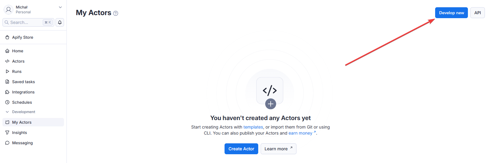
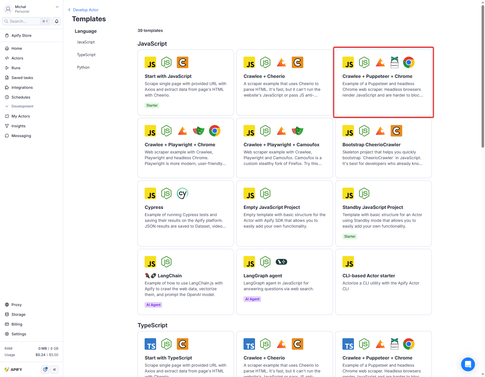
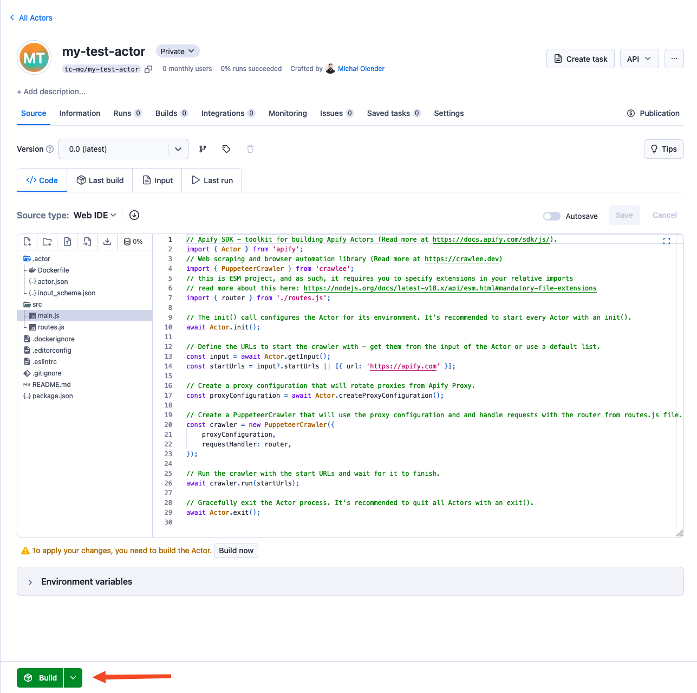
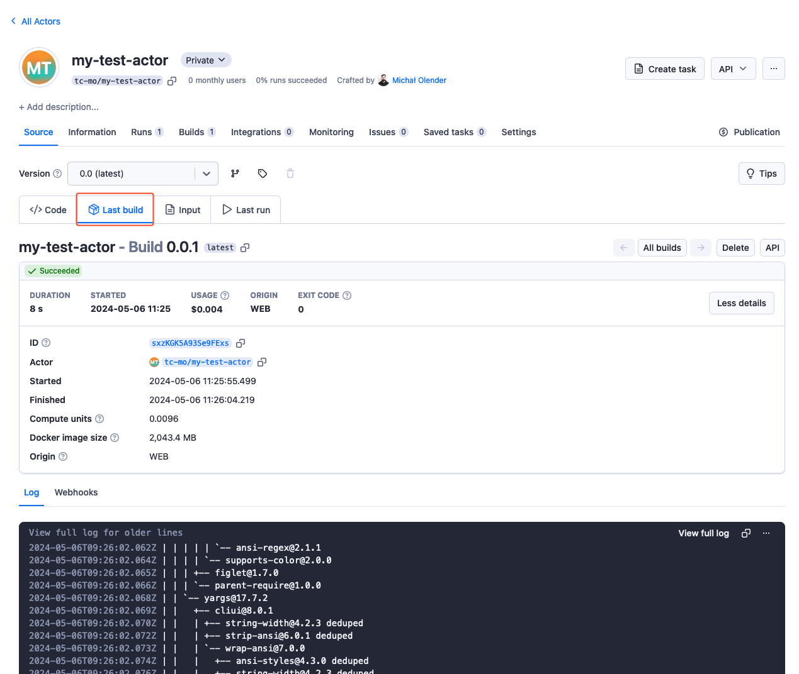
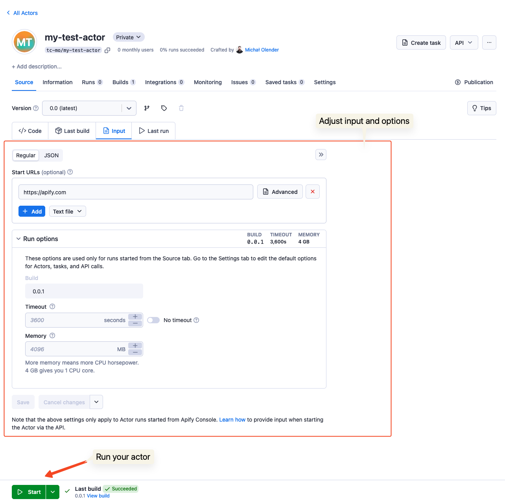
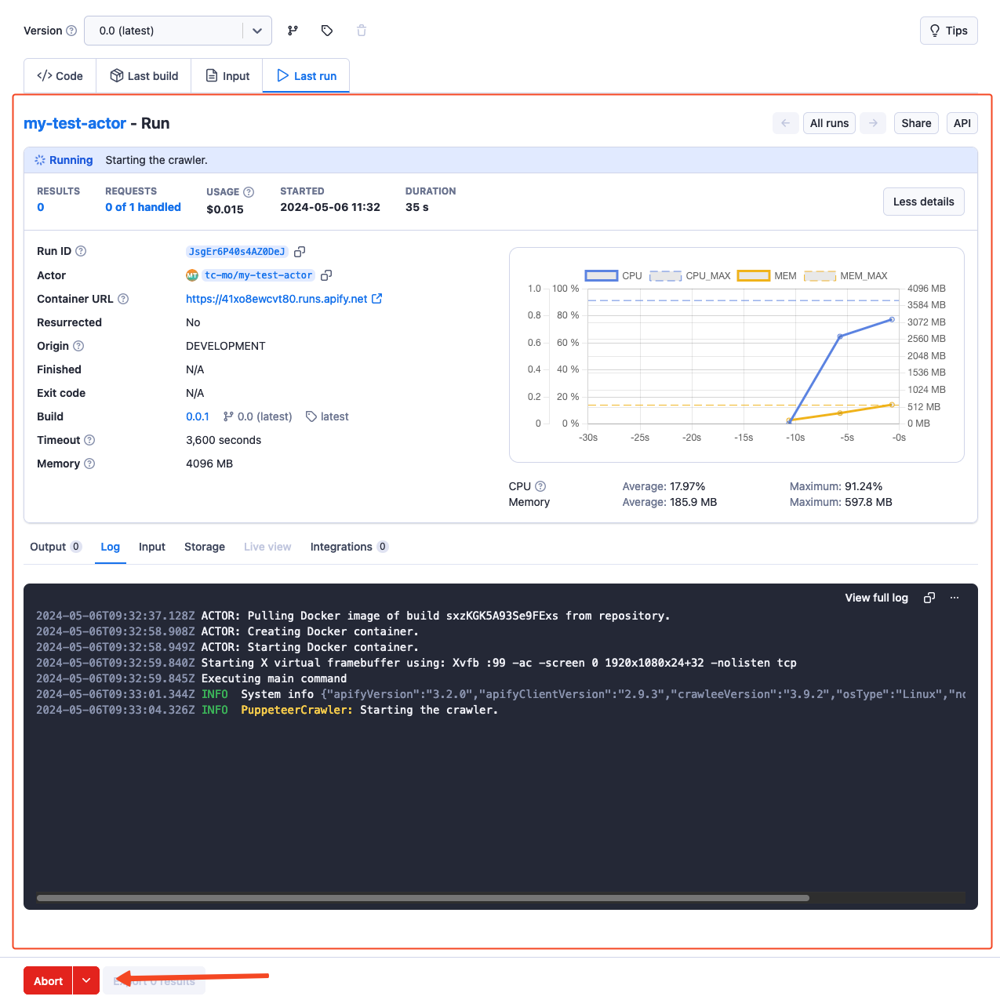

import Tabs from '@theme/Tabs';
import TabItem from '@theme/TabItem';

**Create your first Actor using the web IDE in Apify Console.**

---

## What you'll learn

This guide walks you through the full lifecycle of an Actor. You'll start by creating and running it locally with the Apify CLI, then learn to configure its input and data storage. Finally, you will deploy the Actor to the Apify platform, making it ready to run in the cloud.

### Prerequisites

- An Apify account. [Sign up for a free account](https://console.apify.com/sign-up) on the Apify website.

### Step 1: Create your Actor

Log in to [Apify Console](https://console.apify.com), navigate to [**My Actors**](https://console.apify.com/actors/development/my-actors), then click the **Develop new** button.



You'll see Actor development templates for `JavaScript`, `TypeScript`, and `Python`.

These templates provide boilerplate code and a preconfigured environment. Choose the template that best suits your needs. For the following demo, we'll proceed with **Crawlee + Puppeteer + Chrome**.

:::info Explore Actor templates

Browse the [full list of templates](https://apify.com/templates) to find the best fit for your Actor.

:::



After choosing the template, your Actor will be automatically named and you'll be redirected to its page.

### Step 2: Explore the Actor

The provided boilerplate code utilizes the [Apify SDK](https://docs.apify.com/sdk/js/) combined with [Crawlee](https://crawlee.dev/), Apify's popular open-source Node.js web scraping library.

By default, the code crawls the [apify.com](https://apify.com) website, but you can change it to any website.

:::info Crawlee

[Crawlee](https://crawlee.dev/) is an open-source Node.js library designed for web scraping and browser automation. It helps you build reliable crawlers quickly and efficiently.

:::

### Step 3: Build the Actor

To run your Actor, build it first. Click the **Build** button below the source code.



Once the build starts, the UI transitions to the **Last build** tab, showing build progress and Docker build logs.



:::note Actor creation flow

The UI includes four tabs:

- **Code**
- **Last build**
- **Input**
- **Last Run**

This represents the Actor creation flow, where you first build the Actor from the source code. Once the build is successful, you can provide input parameters and initiate an Actor run.

:::

### Step 4: Run the Actor

Once the Actor is built, you can look at its input, which consists of one field - **Start URL**, the URL where the crawling starts. Below the input, you can adjust the **Run options**:

- **Build**
- **Timeout**
- **Memory limit**



To initiate an Actor run, click the **Start** button at the bottom of the page. Once the run is created, you can monitor its progress and view the log in real-time. The **Output** tab will display the results of the Actor's execution, which will be populated as the run progresses. You can abort the run at any time using the **Abort** button.



### Step 5: Pull the Actor

To continue development locally, pull the Actor's source code to your machine.

:::note Prerequisites

Install <code>[apify-cli](https://docs.apify.com/cli/)</code> :

<Tabs>
  <TabItem value="macOS/Linux" label="macOS/Linux">

  ```bash
  brew install apify-cli
  ```

  </TabItem>
  <TabItem value="other platforms" label="Other platforms">

  ```bash
  npm -g install apify-cli
  ```

  </TabItem>
</Tabs>

:::

To pull your Actor:

1. Log in to the Apify platform

    ```bash
    apify login
    ```

2. Pull your Actor:

    ```bash
    apify pull your-actor-name
    ```

    Or with a specific version:

    ```bash
    apify pull your-actor-name --version [version_number]
    ```

    As `your-actor-name`, you can use either:

    - The unique name of the Actor (e.g., `apify/hello-world`)
    - The ID of the Actor (e.g., `E2jjCZBezvAZnX8Rb`)

You can find both by clicking on the Actor title at the top of the page, which will open a new window containing the Actor's unique name and ID.

### Step 6: It's time to iterate!

After pulling the Actor's source code to your local machine, you can modify and customize it to match your specific requirements. Leverage your preferred code editor or development environment to make the necessary changes and enhancements.

Once you've made the desired changes, you can push the updated code back to the Apify platform for deployment & execution, leveraging the platform's scalability and reliability.

## Next steps

- Visit the [Apify Academy](/academy) to access a comprehensive collection of tutorials, documentation, and learning resources.
- To understand Actors in detail, read the [Actor Whitepaper](https://whitepaper.actor/).
- Check [Continuous integration](../deployment/continuous_integration.md) documentation to automate your Actor development process.
- After you finish building your first Actor, you can [share it with other users and even monetize it](../../publishing/index.mdx).
