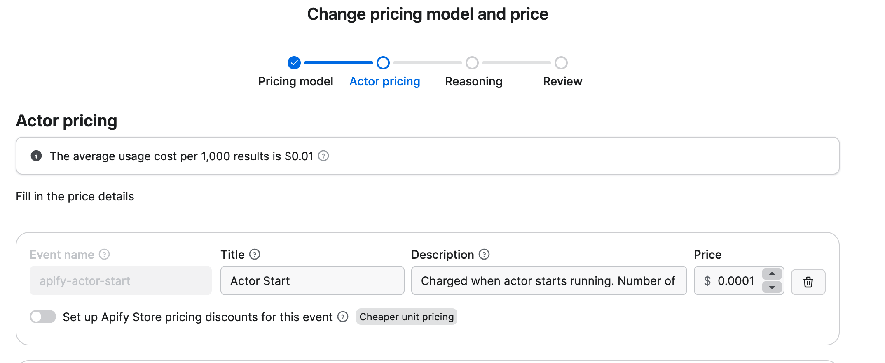

**Learn how to monetize your Actor with pay-per-event (PPE) pricing, charging users for specific actions like Actor starts, dataset items, or API calls, and understand how to set profitable, transparent event-based pricing.**

---

import Tabs from '@theme/Tabs';
import TabItem from '@theme/TabItem';

The PPE pricing model offers a flexible monetization option for Actors on Apify Store. Unlike pay per result, PPE allows you to charge users based on specific events triggered programmatically by your Actor's code.

PPE lets you define pricing for individual events. You can charge for specific events directly from your Actor using the [JS](/sdk/js/reference/class/Actor#charge)/[Python](/sdk/python/reference/class/Actor#charge) SDK, or by calling the [PPE charging API](/api/v2/post-charge-run) directly. Common events include Actor start, dataset item creation, and external API calls.

The details on how your cost is computed can be found in [Example of a PPE pricing model](#example-of-a-ppe-pricing-model).

:::tip Additional benefits

Actors that implement PPE pricing receive additional benefits, including increased visibility in Apify Store and enhanced discoverability for users looking for monetized solutions.

:::

## How is profit computed

Your profit is calculated from the mentioned formula:

`profit = (0.8 * revenue) - platform costs`

where:

- _Revenue_: The amount charged for events via the PPE charging API or through JS/Python SDK. You receive 80% of this revenue.
- _Platform costs_: The underlying platform usage costs for running the Actor, calculated in the same way as for PPR. For more details, visit the [Computing your costs for PPE and PPR Actors](#computing-your-costs-for-ppe-and-ppr-actors) section.

Only revenue and cost for Apify customers on paid plans are taken into consideration when computing your profit. Users on free plans are not reflected there.

:::note Negative profit isolation

An Actor's negative net profit does not affect the positive profit of another Actor. For aggregation purposes, any Actor with a negative net profit is considered to have a profit of $0.

- _Previously:_ `Total Profit = (-$90) + $100 = $10`
- _Now:_ `Total Profit = $0 + $100 = $100`

:::

## How to set pricing for PPE Actors

1. _Understand your costs_: Analyze resource usage (e.g CPU, memory, proxies, external APIs) and identify cost drivers
1. _Define clear events_: break your Actor's functionality into measurable, chargeable events.
1. _Common use cases_:
   1. _For scraping_: combine Actor start and dataset items pricing to reflect setup and per-result cost.
   1. _Beyond scraping_: Account for integrations with external systems or external API calls.
1. _External API costs_: Account for additional processing costs.
1. _Test your pricing_: Run your Actor and analyze cost-effectiveness using a special dataset.
1. _Communicate value_: Ensure pricing reflects the value provided and is competitive.

## Respect user spending limits

Finish the Actor run once charging reaches user-configured maximum cost per run. Apify SDKs (JS and Python) return `ChargeResult` that helps determine when to finish.

The `eventChargeLimitReached` property checks if the current event type can be charged more. If you have multiple event types, analyze the `chargeableWithinLimit` property to see if other events can still be charged before stopping the Actor.

:::info ACTOR_MAX_TOTAL_CHARGE_USD environment variable

For pay-per-event Actors, users set a spending limit through the Apify Console. This limit is available in your Actor code as the `ACTOR_MAX_TOTAL_CHARGE_USD` [environment variable](/platform/using-actors/development/programming-interface/environment-variables), which contains the user's maximum cost.

:::

<Tabs groupId="main">
<TabItem value="JavaScript" label="JavaScript">

```js
import { Actor } from 'apify';

const chargeForApiProductDetail = async () => {
  const chargeResult = await Actor.charge({ eventName: "product-detail" });

  return chargeResult;
};

await Actor.init();

// API call, or any other logic that you want to charge for
const chargeResult = await chargeForApiProductDetail();

if (chargeResult.eventChargeLimitReached) {
  await Actor.exit();
}

// Rest of the Actor logic

await Actor.exit();
```

</TabItem>
<TabItem value="Python" label="Python">

```py
from apify import Actor

async def charge_for_api_product_detail():
    charge_result = await Actor.charge(event_name='product-detail')

    return charge_result

async def main():
    await Actor.init()
    
    # API call, or any other logic that you want to charge for

    charge_result = await charge_for_api_product_detail()

    if charge_result.event_charge_limit_reached:
        await Actor.exit()

    # Rest of the Actor logic

    await Actor.exit()
```

</TabItem>
</Tabs>

:::note Crawlee integration and spending limits

When using [Crawlee](https://crawlee.dev/), use `crawler.autoscaledPool.abort()` instead of `Actor.exit()` to gracefully finish the crawler and allow the rest of your code to process normally.

:::

## Best practices for PPE Actors

Use our SDKs ([JS](/sdk/js/) and, [Python](/sdk/python/) or use [`apify actor charge`](/cli/docs/next/reference#apify-actor-charge-eventname) when using our Apify CLI) to simplify PPE implementation into your Actor. This tool can handle pricing, usage tracking, idempotency keys, API errors, and, event charging via an API.

You can also choose not to use it, but then you must handle API integration and possible edge cases manually.

### Set memory limits

Set memory limits using `minMemoryMbytes` and `maxMemoryMbytes` in your [`actor.json`](https://docs.apify.com/platform/using-actors/development/actor-definition/actor-json) file to control platform usage costs.

```json
{
    "actorSpecification": 1, 
    "name": "name-of-my-scraper",
    "version": "0.0",
    "minMemoryMbytes": 512,
    "maxMemoryMbytes": 1024,
}
```

:::note Memory requirements for browser-based scraping

When using browser automation tools like Puppeteer or Playwright for web scraping, increase the memory limits to accommodate the browser's memory usage.

:::

### Use synthetic start event `apify-actor-start`

This event is automatically charged by the Apify platform when an Actor is started or resurrected.

Users of your Actor are charged one event for each GB of memory used by the Actor (at least one event per run). We _strongly_ suggest setting the price of this event to $0.0001 to remain competitive in the Store and attractive for your customers. If you define this event, you also save 5 seconds of Actor runtime from each Actor run, which won't be deducted from your payout profits.

:::note Automatic charging of synthetic start event

You must _not_ manually charge for the synthetic start event (`apify-actor-start`) in your Actor code.

If you attempt to charge this event yourself, the operation will fail.
This event is _always_ charged automatically by the Apify platform whenever your Actor starts or is resurrected.

:::

#### Synthetic start event for new Actors

For new Actors, this event is added automatically as you can see on the following screen:



#### Synthetic start event for existing Actors

If you have existing Actors, you can add this event manually in Apify Console.

#### Synthetic start event for Actors with start event

Your Actor might already have a start event defined, such as `actor-start` or another variant of the event name. In this case, you can choose whether to use the synthetic start event or keep the existing start event.

If you want to use the synthetic start event, remove the existing start event from your Actor and add the synthetic start event in Apify Console.

### Charge for invalid input

Charge for things like URLs that appear valid but lead to errors (like 404s) since you had to open the page to discover the error. Return error items with proper error codes and messages instead of failing the entire Actor run.

<Tabs groupId="main">
<TabItem value="JavaScript" label="JavaScript">

```js
import { Actor } from 'apify';

const processUrl = async (url) => {
  const response = await fetch(url);
    
  if (response.status === 404) {
    // Charge for the work done and return error item in one call
    await Actor.pushData({
      url: url,
      error: "404",
      errorMessage: "Page not found"
    }, 'scraped-result');
    
    return;
  }

  // Rest of the process_url function
};

await Actor.init();

const input = await Actor.getInput();
const { urls } = input;
  
for (const url of urls) {
  await processUrl(url);
}

// Rest of the Actor logic

await Actor.exit();
```

</TabItem>
<TabItem value="Python" label="Python">

```py
from apify import Actor
import requests

async def process_url(url):
    response = requests.get(url)
    
    if response.status_code == 404:
      # Charge for the work done and return error item in one call
      await Actor.push_data({
          'url': url,
          'error': '404',
          'errorMessage': 'Page not found'
      }, 'scraped-result')
        
      return

    # Rest of the process_url function

async def main():
    await Actor.init()
    
    input_data = await Actor.get_input()
    urls = input_data.get('urls', [])
    
    for url in urls:
        await process_url(url)
    
    # Rest of the Actor logic
    
    await Actor.exit()
```

</TabItem>
</Tabs>

### Keep pricing simple with fewer events

Try to limit the number of events. Fewer events make it easier for users to understand your pricing and predict their costs.

### Make events produce visible results

For Actors that produce data, events should map to something concrete in the user's dataset or storage.

However, we acknowledge that some events don't produce tangible results (such as running AI workflows or processing external API calls). This flexibility gives you the freedom to charge for special operations, complex workflows, and unique value propositions.

Examples:

- _`scraped-product` event_: Each charge adds one product record to the dataset
- _`processed-image` event_: Each charge adds one processed image to the dataset  
- _`extracted-review` event_: Each charge adds one review to the dataset
- _`ai-analysis` event_: Each charge processes one document through an AI workflow (no tangible output, but valuable processing)

:::note Additional context

You can display a status message or push a record to the dataset to inform users about non-data actions performed by your Actor. This helps users understand what actions were charged for, even if those actions do not produce tangible output.

:::

### Use idempotency keys to prevent double charges

If you're not using the Apify SDKs (JS/Python), you need to handle idempotency (ensuring the same operation produces the same result when called multiple times) manually to prevent charging the same event multiple times.

## Example of a PPE pricing model

You make your Actor PPE and set the following pricing:

- _`actor-start` event_: $0.10 per start
- _`scraped-product` event_: $0.01 per product
- _`scraped-product-detail` event_: $0.05 per detail
- _`ai-analysis` event_: $0.15 per analysis

During the first month, three users use your Actor:

- _User 1 (paid plan)_: Starts Actor 5 times, scrapes 1,000 products, makes 50 product details, runs 30 AI analyses
  - Charges: 5 × $0.10 + 1,000 × $0.01 + 50 × $0.05 + 30 × $0.15 = $0.50 + $10.00 + $2.50 + $4.50 = $17.50
- _User 2 (paid plan)_: Starts Actor 2 times, scrapes 500 products, makes 20 product details, runs 10 AI analyses
  - Charges: 2 × $0.10 + 500 × $0.01 + 20 × $0.05 + 10 × $0.15 = $0.20 + $5.00 + $1.00 + $1.50 = $7.70
- _User 3 (free plan)_: Starts Actor 1 time, scrapes 100 products, makes 5 product details, runs 3 AI analyses
  - Charges: 1 × $0.10 + 100 × $0.01 + 5 × $0.05 + 3 × $0.15 = $0.10 + $1.00 + $0.25 + $0.45 = $1.80

Let's say the underlying platform usage for the first user is $3.20, for the second $1.50, and for the third $0.40.

Your profit is computed only from the first two users, since they are on Apify paid plans. The revenue breakdown is:

- _Total revenue_: $17.50 + $7.70 = $25.20
- _Total underlying cost_: $3.20 + $1.50 = $4.70
- _Your profit_: 80% of revenue minus costs = 0.8 × $25.20 - $4.70 = $15.46

## Event names

To implement PPE pricing, you need to define specific events in your Actor code. You can retrieve the list of available pricing event names using the [Get Actor](https://apify.com/docs/api/v2/act-get) API endpoint.

## Next steps

- Check out the [Pricing and costs](/platform/publishing-and-monetization/monetize/pricing-and-costs) section to learn how to compute your costs.
