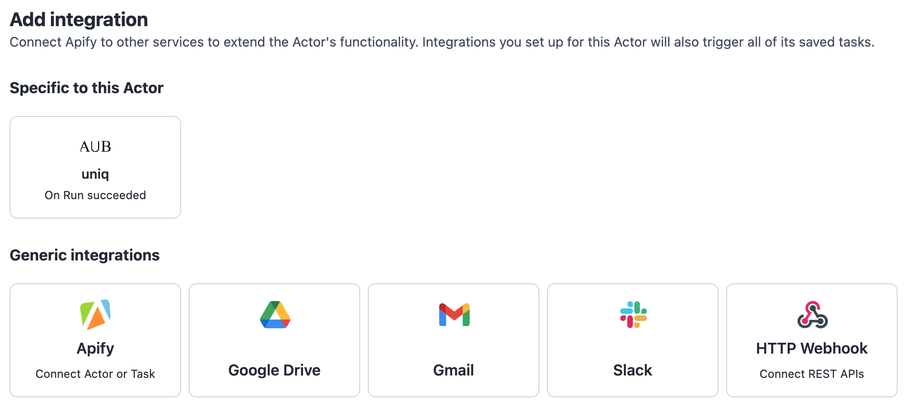

**Learn how to create Actors that are ready to be integrated with other Actors and tasks.**

---

Any Actor can be used in integrations. In order to provide a smooth experience for its users, there are few things to keep in mind.

## General guidelines

If your Actor is supposed to be used as an integration, it will most likely have an input that can be described as two groups of fields. The first group is the "static" part of the input - the fields that have the same value whenever the integration is triggered. The second, "dynamic", group are fields that are specific to the triggering event - information from the run or build that triggered the integration.

The Actor should ideally try to hide its complexity from users and take all the "dynamic" fields from the implicit `payload` field - it is attached automatically. This way, users don't have to take care of passing in variables on their own and only need to take care of the static part of the input.

An important thing to remember is that only the **dataset ID** is passed to the Actor as input, not the **dataset contents**. This means that the Actor needs to take care of getting the actual contents of the dataset. And, ideally, it should not load the full dataset while doing so, as it might be too large to fit to memory, but rather process it in batches.

## Example

To illustrate the above, here is a simplified example of an Actor that uploads a dataset to a table/collection in some database.

We would start with an input that looks something like this:

- `datasetId: string` - Id of dataset that should be uploaded
- `connectionString: string` - Credentials for the database connection
- `tableName: string` - Name of table / collection

With this input schema, users have to provide an input that looks like this:

```json
{
    "datasetId": "{{resource.defaultDatasetId}}",
    "connectionString": "****",
    "tableName": "results"
}
```

And in the Actor code, we'd use this to get the values:

```js
const { datasetId, connectionString, tableName } = await Actor.getInput();
```

To make the integration process smoother, it's possible to define an input that's going to be prefilled when your Actor is being used as an integration. You can do that in the Actor's **Settings** tab, on the **Integrations** form. In our example, we'd use:

```json
{
    "datasetId": "{{resource.defaultDatasetId}}"
}
```

This means that users will see that the `defaultDatasetId` of the triggering run is going to be used right away.

Explicitly stating what is the expected input when Actor is being used as an integration is a preferred way.

However, if the Actor is **only** supposed to be used as integration, we can use a different input schema:

- `connectionString: string` - Credentials for the database connection
- `tableName: string` - Name of table / collection


In this case, users only need to provide the "static" part of the input:

```json
{
    "connectionString": "****",
    "tableName": "results"
}
```

In the Actor's code, the `datasetId` (the dynamic part) would be obtained from the `payload` field:

```js
const { payload, connectionString, tableName } = await Actor.getInput();
const datasetId = payload.resource.defaultDatasetId;
```

It's also possible to combine both approaches, which is useful for development purposes or advanced usage. It would mean keeping the `datasetId` in the input, only hidden under an "Advanced options" section, and using it like this:

```js
const { payload, datasetId } = await Actor.getInput();
const datasetIdToProcess = datasetId || payload?.resource?.defaultDatasetId;
```

In the above example, we're focusing on accessing a run's default dataset, but the approach would be similar for any other field.

## Making your Actor available to other users

To allow other users to use your Actor as an integration, all you need to do is [publish it in Apify Store](/platform/publishing-and-monetization), so users can then integrate it using the **Connect Actor or task** button on the **Integrations** tab of any Actor. While publishing the Actor is enough, there are two ways to make it more visible to users.

For Actors that are generic enough to be used with most other Actors, it's possible to have them listed under **Generic integrations** in the **Integrations** tab. This includes (but is not limited to) Actors that upload datasets to databases, send notifications through various messaging systems, create issues in ticketing systems, etc. To have your Actor listed under our generic integrations, [contact support](mailto:support@apify.com?subject=Actor%20generic%20integration).

Some Actors can only be integrated with a few or even just one other Actor. Let's say that you have an Actor that's capable of scraping profiles from a social network. It makes sense to show it for Actors that produce usernames from the social network but not for Actors that produce lists of products. In this case, it's possible to have the Actor listed as **Specific to this Actor** under the Actor's **Integrations** tab. To have your Actor listed as specific to another Actor, [contact support](mailto:support@apify.com?subject=Actor%specific%20integration).


