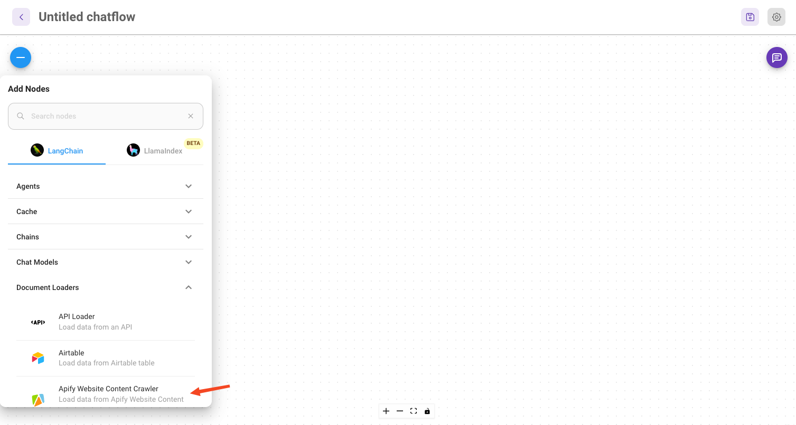
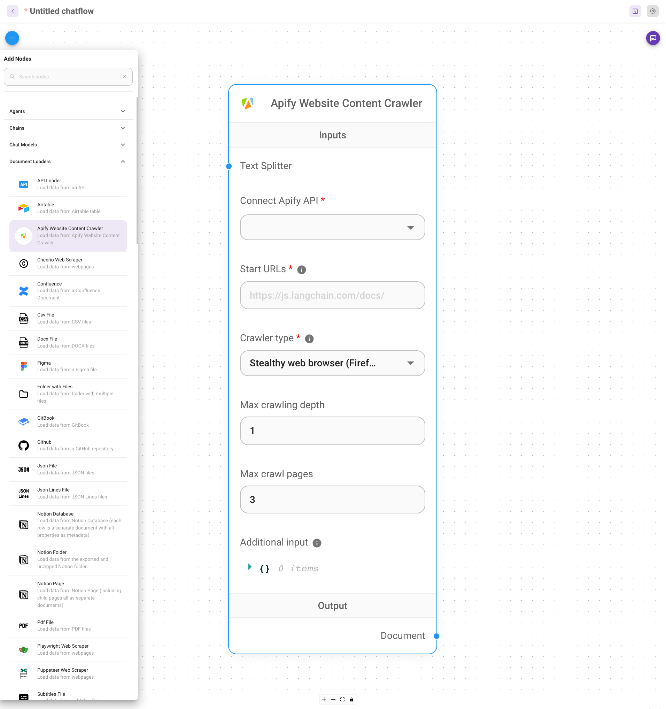
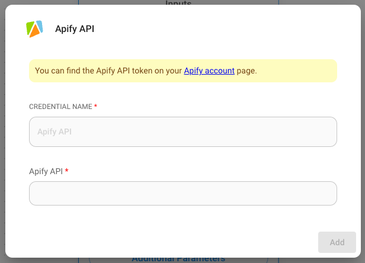
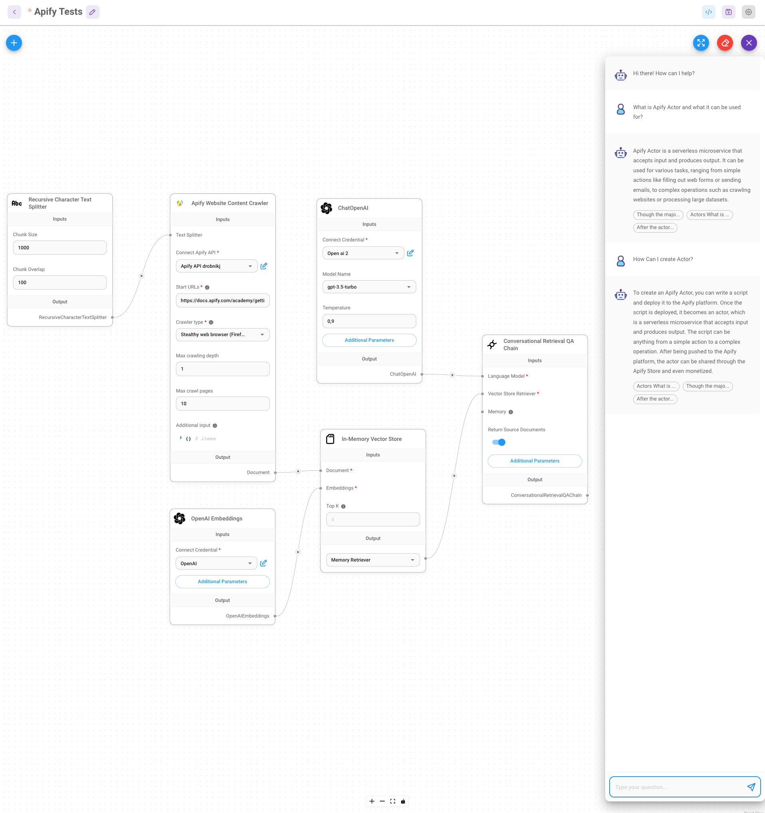

**Learn how to integrate Apify with Flowise.**

---

## What is Flowise?

Flowise is an open-source UI visual tool to build your customized LLM flow using Langchain.

## How to use Apify with Flowise

### Installation

To use Flowise you have to download and run it locally. The quickest way to do so is to use the following commands:

1. To install Flowise globally on your device:

    ```bash
    npm install -g flowise
    ```

2. To start Flowise locally:

    ```bash
    npx flowise start
    ```

It will be available on `https://localhost:3000`

Other methods of using Flowise can be found in their [documentation](https://docs.flowiseai.com/getting-started#quick-start)

### Building your flow

After running Flowise, you can start building your flow with Apify.

The first step is to create a new flow in the web UI.

In the left menu, you need to find Apify Website Content Crawler under Document Loaders.



Now you need to configure the crawler. You can find more information about at [Website Content Crawler page](https://apify.com/apify/website-content-crawler).



In the configuration, provide your Apify API token, which you can find in your [Apify account](https://console.apify.com/settings/integrations).



You can add more loaders, or you can add some processors to process the data.
In our case, we create the flow that loads data from the Apify docs using Website Content Crawler and save them into the in-memory vector database.
Connect the ChatOpenAI and the OpenAI embeddings and QA retrieval into the chatbot.

The final flow can answer questions about Apify docs.



For more information visit the Flowise [documentation](https://flowiseai.com/).

## Resources

* [Flowise](https://flowiseai.com/)
* [Flowise documentation](https://github.com/FlowiseAI/Flowise#quick-start)
