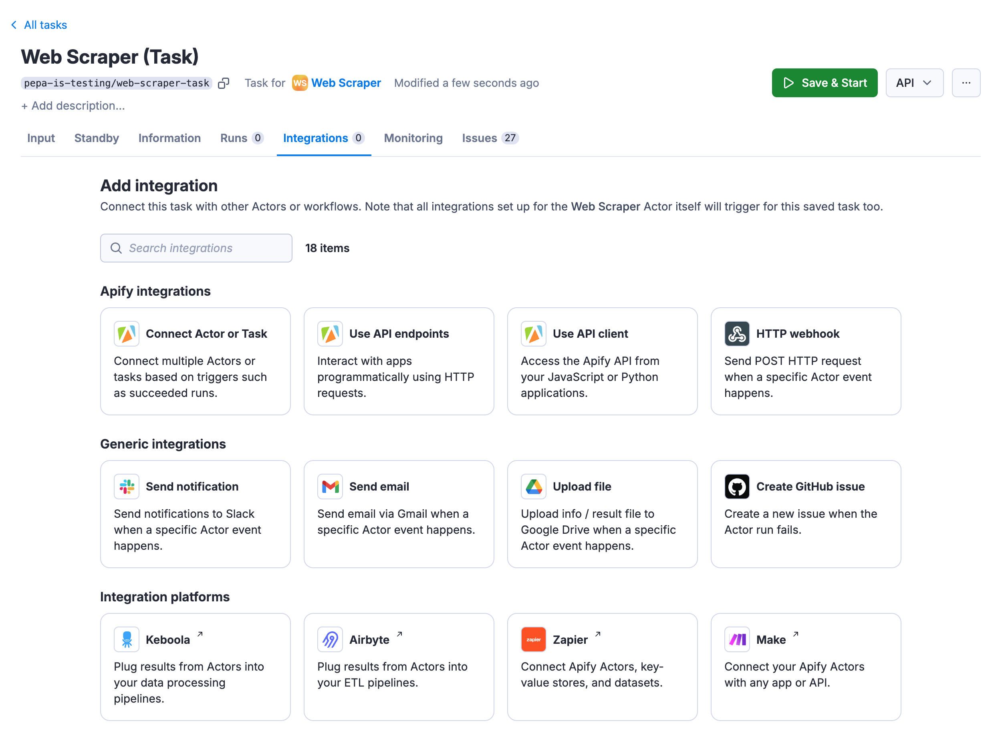
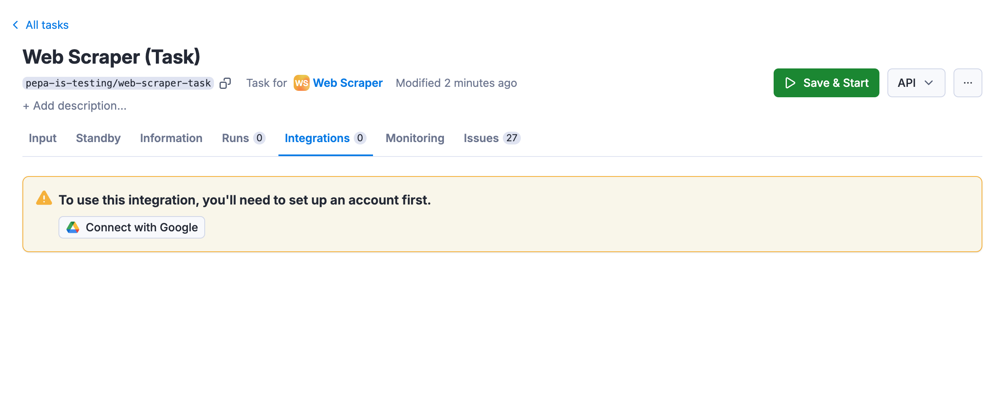
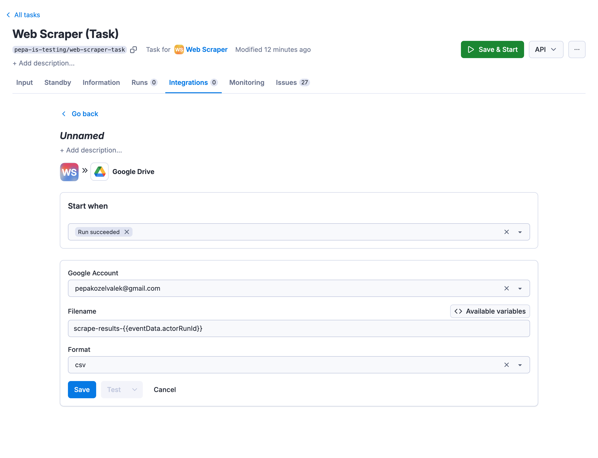
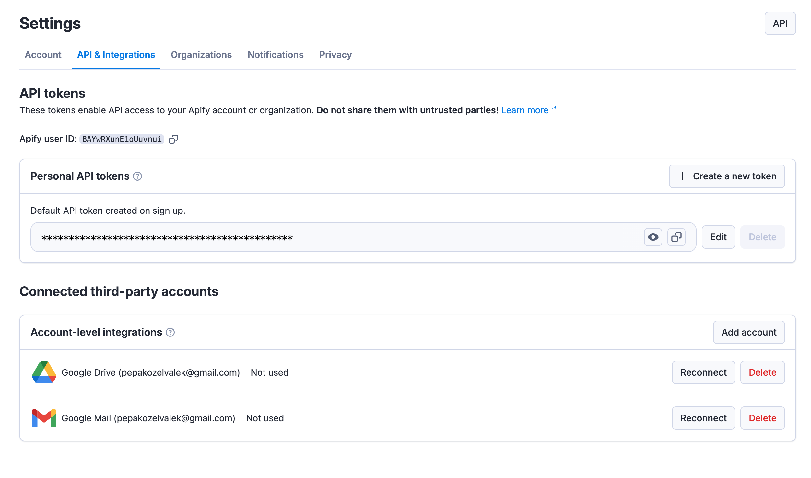

**Learn how to integrate your Apify Actors with Google Drive. This article shows you how to automatically save results to your drive when an Actor run succeeds.**

---

## Get started

To use the Apify integration for Google Drive, you will need:

- An [Apify account](https://console.apify.com/).
- A Google account
- A saved Actor Task

## Set up Google Drive integration

1. Head over to **Integrations** tab in your saved task and click on the **Upload file** integration.

    

1. Click on **Connect with Google** button and select the account with which you want to use the integration.

    

1. Set up the integration details. You can choose the **Filename** and **Format** , which can make use of available variables.
The file will be uploaded to your Google Drive account to `Apify Uploads` folder. By default, the integration is triggered by successful runs only.

    

1. Click on **Save** & enable the integration.

Once this is done, run your Actor to test whether the integration is working.

You can manage your connected accounts at **[Settings > API & Integrations](https://console.apify.com/settings/integrations)**.

