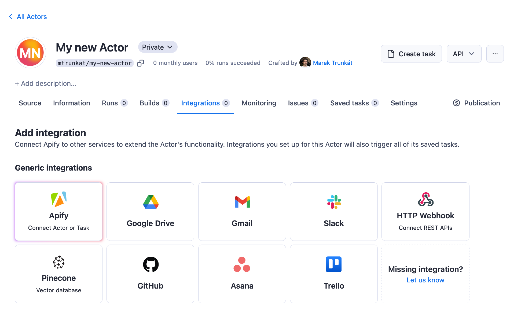
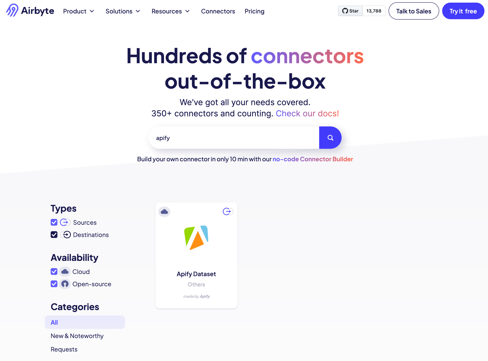

If you are building a service and your users could benefit from integrating with Apify or vice versa, we would love to hear from you! Contact us at [integrations@apify.com](mailto:integrations@apify.com) to discuss potential collaboration. We are always looking for ways to make our platform more useful and powerful for our users.

## Why integrate with Apify

Apify is the leading platform for web scraping, AI agents, and automation tools. By integrating Apify into your platform, you enable users to incorporate real-time, structured data from the web with zero scraping infrastructure on your side.

[Apify Store](https://apify.com/store) contains thousands of pre-built Actors, ready-made tools for web scraping and automation.

## Integration types

An Apify integration can be _general_, allowing users to integrate any Actor from Apify Store into their workflows (or their own Actors), or _Actor-specific_, enabling targeted automation like integrating [Instagram Scraper](https://apify.com/apify/instagram-scraper) for use cases like social media monitoring.

### General integrations

General integrations allow users to integrate Actors into their workflows by connecting Apify with other platforms. Examples include:

- [Zapier](/platform/integrations/zapier) integration allows Zapier users to enrich their automation workflows with data from the web or to add additional Actions performed by [Apify Actors](https://apify.com/store).
- [Keboola](/platform/integrations/keboola) integration enables Keboola users to easily pull data crawled from the web into their data pipelines.

### Actor-specific integrations

Actor-specific integrations are designed for targeted use cases. While they work similarly to general integrations, they help users find the right Apify tools more easily and provide a better experience. Examples include:

- [Make Instagram Scraper integration](https://www.make.com/en/integrations/apify-instagram-scraper)
- [Lindy.ai Instagram integration](https://www.lindy.ai/integrations/instagram)

For more examples both general and Actor-specific, check [integrations](/platform/integrations).

## Integrating with Apify

To integrate your service with Apify, you have two options:

- Build an external integration using the [Apify API](https://docs.apify.com/api/v2)
- Build an [Apify Actor](https://docs.apify.com/platform/using-actors) that will be used as integration within [Apify Console](https://console.apify.com)

### Building an integration Actor

One way to reach out to Apify users is directly within [Apify Console](https://console.apify.com). To do that, you need to build an integrable Actor that can be piped into other Actors to upload existing data into a database. This can then be easily configured within Apify Console. Follow the [guide on building integration-ready Actors](/platform/integrations/actors/integration-ready-actors).

### Building an external integration

An alternative way is to let your users manage the connection directly on your side using [Apify API](https://docs.apify.com/api/v2) and our API clients for [JavaScript](/api/client/js/) or [Python](/api/client/python/). This way, users can manage the connection directly from your service.

### Authentication methods

Apify supports two main authentication methods for secure API access.

_OAuth 2.0_ - Use OAuth 2.0 to allow users to authorize your integration without sharing their credentials.
<!-- TODO expand section possibly? -->

_API token_ - Apify user generates personal API token from Apify account settings page. For more information, see [API Token documentation](https://docs.apify.com///platform/integrations/api#api-token).

### API implementation

To build an integration, core API endpoints can be mapped as **actions and triggers** inside your platform.

#### Action endpoints

##### Run an Actor

Triggers the execution of any Apify Actor by ID, allowing users to start custom or public web scraping and automation Actors with specified input parameters.

Recommended features:

- Select Actor: The Actor list will be pre-populated with Actors that the user created or used, using the [List of Actors API](https://docs.apify.com/api/v2/acts-get) and enriched with Actors from the store, which the user has not run already using [API](https://docs.apify.com/api/v2/store-get).
- Synchronous vs. asynchronous run: flow will wait until the run/task finishes (consider a timeout on your platform side)
- Input UI: upon selecting an Actor, dynamically display specific Actor input and preload default example values based on the Actor Input schema. Alternatively, allow users to insert a JSON input for the Actor.
- Additionally, it should include the option to choose [Actor build](https://docs.apify.com/platform/using-actors/running/runs-and-builds), [memory](https://docs.apify.com/platform/using-actors/running/usage-and-resources#memory), and [timeout](https://docs.apify.com/platform/using-actors/running/usage-and-resources#memory).
- Field mapping: allowing users to map fields to data acquired in previous steps of the workflow.

##### Run a task

Starts a predefined task (a saved Actor configuration), making it easy for users to run recurring or templated workflows without redefining inputs each time.

Recommended features:

- _Select task_: The task list will be pre-populated with tasks that the user created, using the [List of tasks](https://docs.apify.com/api/v2/actor-tasks-get) API.
- _Synchronous vs. asynchronous run_: the flow will wait until the run/task finishes (considering timeout on your platform side)
- _JSON input field_: possibility to add a JSON input to override the task input.

##### Get dataset items

Fetches structured results (JSON, CSV, etc.) generated by a previously run Actor or task, which can be used as input for further workflow steps.

Recommended features:

- _Dataset_: Dropdown (user's datasets) or ID/String input. Populated via [Datasets API](https://docs.apify.com/api/v2/datasets-get).
- _Limit (optional)_: The maximum number of dataset items to fetch. If empty, the default limit will be used.
- _Offset (optional)_: The offset in the dataset from where to start fetching the items. If empty, it will be from the beginning.

##### Get a key-value store item

Retrieves a specific item from a key-value store, commonly used to access metadata, snapshots, logs, or one-off results generated during Actor execution.

Recommended features:

- _Key-value store_: Dropdown (user's KV stores) or ID/String input. Populated via [Key-value Stores API](https://docs.apify.com/api/v2/key-value-stores-get).
- _Record key_: value (string)

##### Scrape a single URL

Runs Apify's [Website Content Crawler](https://apify.com/apify/website-content-crawler) in synchronous mode to extract structured data from a single web page - ideal for on-demand URL scraping inside agents or automation flows.

Recommended features:

- _URL_: that you intend to scrape (string)
- _Crawler type_: Dropdown menu, allowing users to choose from the following options:
  - _Headless web browser_ - Useful for websites with anti-scraping protections and JavaScript rendering. It recognizes common blocking patterns like CAPTCHAs and automatically retries blocked requests through new sessions.
  - _Stealthy web browser (default)_ - Another headless web browser with anti-blocking measures enabled. Try this if you encounter anti-bot protections while scraping.
  - _Raw HTTP client_ - High-performance crawling mode that uses raw HTTP requests to fetch pages. It's faster and cheaper, but might not work on all websites.

##### Universal API call

A node to send API requests to Apify, allowing advanced users to configure or query Actors, tasks, datasets, or other API endpoints programmatically.

#### Trigger endpoints

##### Watch Actor runs

Monitors the status of an Actor run by ID, useful for triggering follow-up steps once a job has completed. Triggered when a specific Actor run reaches terminal status (succeeded, failed, timed out, aborted).

Recommended features:

- _Select Actor runs to watch_: Dropdown (list of user's Actors). Populated via [List Actors API](https://docs.apify.com/api/v2/acts-get)

##### Watch task runs

Similar to watching Actor runs, this tracks the progress and completion status of a specific task run to allow event-driven actions in a workflow.

Recommended features:

- _Select Actor tasks to watch_: Dropdown (list of user's tasks). Populated via [List tasks API](https://docs.apify.com/api/v2/actor-tasks-get).

### Pricing options

Choose between two pricing models based on your integration setup.

#### Direct user billing

Users create their own Apify accounts and are billed directly by Apify for their usage. This model gives users full control over their Apify usage and billing.

#### Whitelabel access

Users access Apify through your platform without needing an Apify account. Apify bills you based on consumption, and you factor costs into your pricing.

### Monitoring and tracking

To help Apify monitor and support your integration, every API request should identify your platform. You can do this in one of two ways:

- Preferred:
  - Use the `x-apify-integration-platform` header with your platform name (e.g., make.com, zapier).
  - If your platform has multiple Apify apps, also include the `x-apify-integration-app-id` header with the unique app ID.
- Alternative:
  - Set a custom `User-Agent` header that identifies your platform.

These identifiers enable better analytics and support for your integration.

## Technical resources

### Apify API

[Apify API](https://docs.apify.com/api) provides an extensive REST API that covers all the features of the Apify platform. You can download the complete OpenAPI schema of Apify API in the [YAML](https://docs.apify.com/api/openapi.yaml) or [JSON](https://docs.apify.com/api/openapi.json) formats. Apify provides official libraries for JavaScript and Python to access API.

- [Apify API Reference](https://docs.apify.com/api/v2)
- Client libraries
  - [JavaScript/TypeScript/Node.js](https://docs.apify.com/api/client/js/)
  - [Python](https://docs.apify.com/api/client/python/)

### Reference implementations

For inspiration, check out the public repositories of Apify's existing external integrations:

- Zapier
  - [Zapier integration documentation](https://docs.apify.com/platform/integrations/zapier)
  - [Source code on Github](https://github.com/apify/apify-zapier-integration)
- Make.com
  - [Make.com integration documentation](https://docs.apify.com/platform/integrations/make)
- Keboola
  - [Keboola integration documentation](https://docs.apify.com/platform/integrations/keboola)
  - [Source code on GitHub](https://github.com/apify/keboola-ex-apify/) (JavaScript)
  - [Google Maps Reviews Scraper integration](https://github.com/apify/keboola-gmrs/) (Actor-specific)
- Airbyte
  - [Source code on GitHub](https://github.com/airbytehq/airbyte/tree/master/airbyte-integrations/connectors/source-apify-dataset) (Python)
- Pipedream
  - [Source code on GitHub](https://github.com/PipedreamHQ/pipedream/tree/65e79d1d66cf0f2fca5ad20a18acd001f5eea069/components/apify)

For technical support, please contact us at [integrations@apify.com](mailto:integrations@apify.com).
