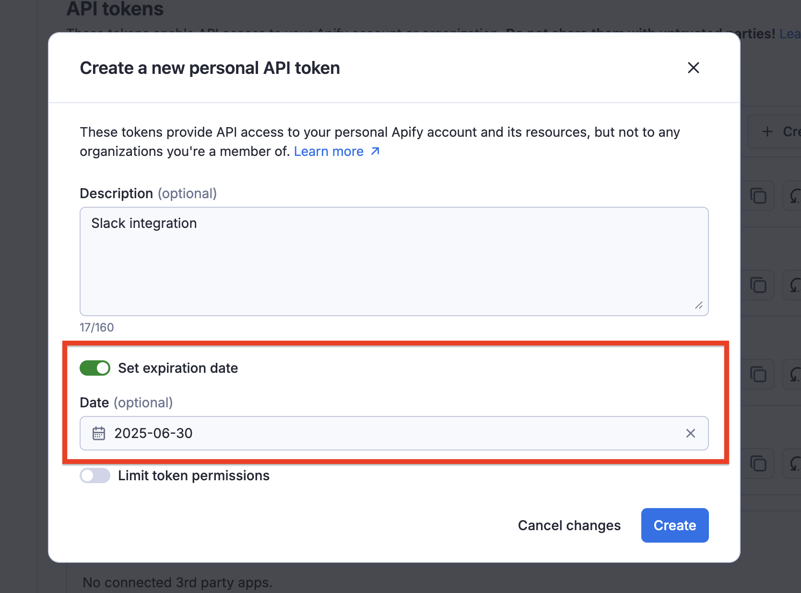
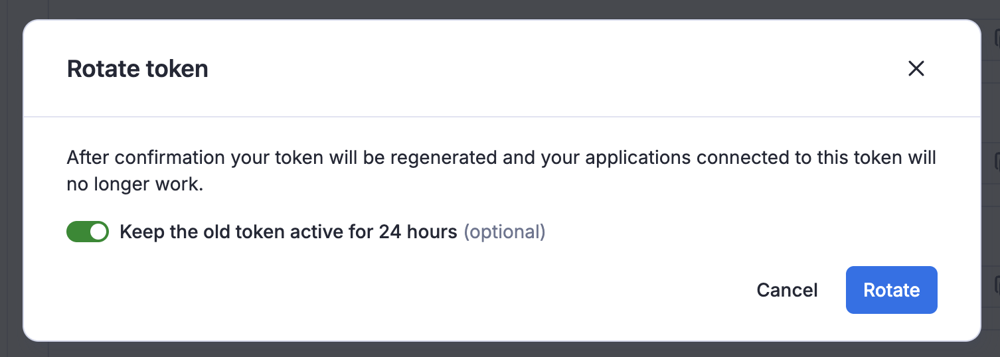
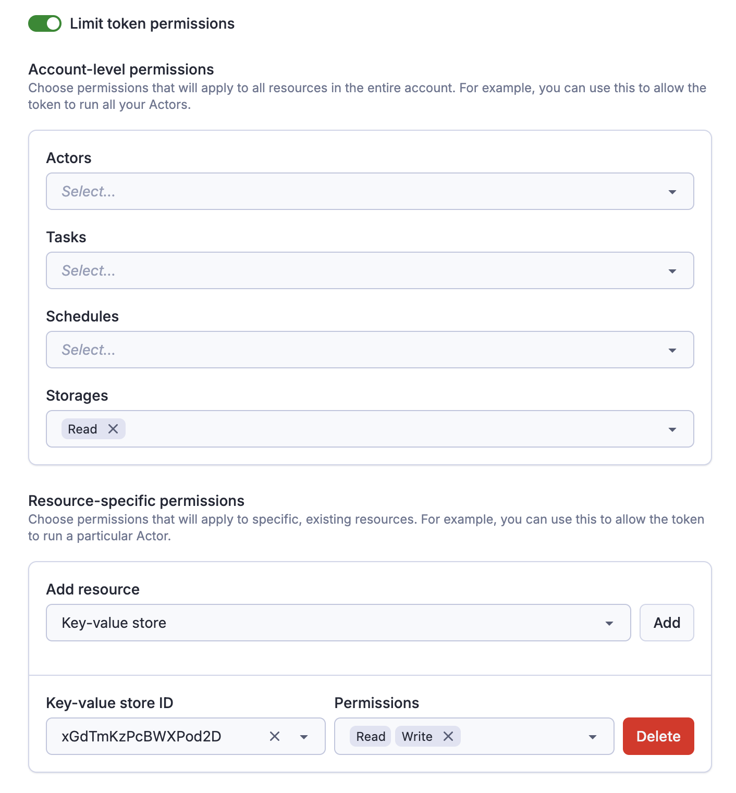
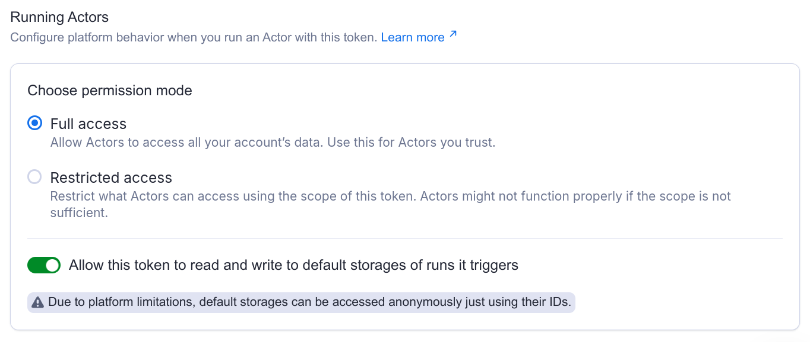
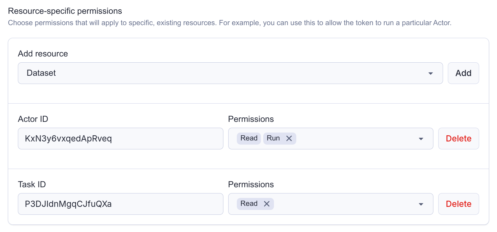
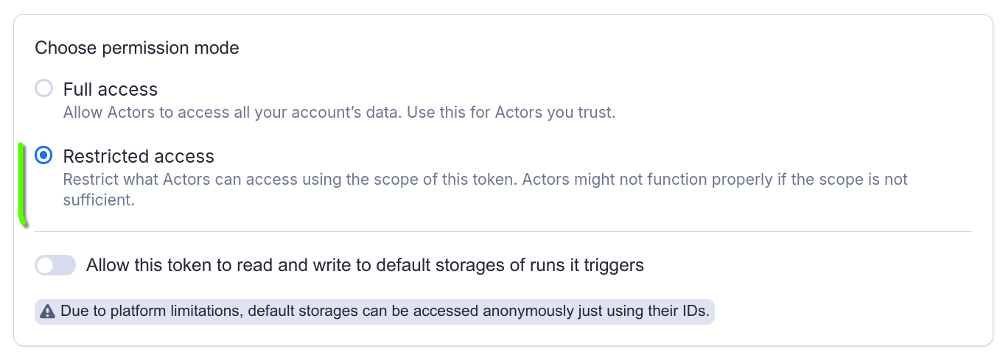

**Learn how to integrate with Apify using the REST API.**

---

All aspects of the Apify platform can be controlled via a REST API, which is described in detail in the [**API Reference**](/api/v2).
If you want to use the Apify API from JavaScript/Node.js or Python, we strongly recommend to use one of our API clients:

- [**apify-client**](/api/client/js/) `npm` package for JavaScript, supporting both browser and server
- [**apify-client**](/api/client/python/) PyPI package for Python.

You are not required to those packages—the REST API works with any HTTP client—but the official API clients implement best practices such as exponential backoff and rate limiting.

## API token

To access the Apify API in your integrations, you need to authenticate using your secret API token. You can find it on the [Integrations](https://console.apify.com/settings/integrations) page in Apify Console. Give your token a reasonable description, and never use one token for several services, much like you shouldn't use the same password for different accounts.

:::caution
Do not share the API token with untrusted parties, or use it directly from client-side code,
unless you fully understand the consequences! You can also consider  [limiting the permission scope](#limited-permissions) of the token, so that it can only access what it really needs.
:::

## Authentication

You can authenticate the Apify API in two ways. You can either pass the token via the `Authorization` HTTP header or the URL `token` query parameter. We always recommend you use the authentication via the HTTP header as this method is more secure.

Note that some API endpoints, such as [Get list of keys](/api/v2/key-value-store-keys-get),
do not require an authentication token because they contain a hard-to-guess identifier that effectively serves as an authentication key.

## Expiration

API tokens include security features to protect your account and data. You can set an expiration date for your API tokens, ensuring they become invalid after a specified period. This is particularly useful for temporary access or when working with third-party services.

## Rotation

If you suspect that a token has been compromised or accidentally exposed, you can rotate it through the Apify Console. When rotating a token, you have the option to keep the old token active for 24 hours, allowing you to update your applications with the new token before the old one becomes invalid. After the rotation period, the token will be regenerated, and any applications connected to the old token will need to be updated with the new token to continue functioning.

For better security awareness, the UI marks tokens identified as compromised, making it easy to identify and take action on them.

## Organization accounts

When working under an organization account, you will see two types of API tokens on the Integrations page.

The Personal API tokens are different from your own Personal API tokens mentioned above. If you use this token in an integration, it will have the same permissions that you have within the organization, and all the operations you use it for will be ascribed to you.

On the other hand the Organization API tokens (only visible if you are the owner or have Manage access tokens permission) have full permissions and are not tied to a specific member of the organization.

## API tokens with limited permissions

By default, tokens can access all data in your account. If that is not desirable, you can choose to limit the permissions of your token, so that it can only access data needed for the particular use case. We call these tokens **scoped**.

**A scoped token can access only those resources that you'll explicitly allow it to.**

:::info
We do not allow scoped tokens to create or modify Actors. If you do need to create or modify Actors through Apify API, use an unscoped token.
:::

### How to create a scoped token

Scoped tokens behave like standard API tokens and are managed through the [Integrations](https://console.apify.com/settings/integrations) page in Apify Console. When creating a token (or updating an existing one), simply toggle "Limit token permissions" to make the token scoped.

Once the token is scoped, you can specify the token's permissions.

### Account-level vs resource-specific permissions

We support two different types of permissions for tokens:

- **Account-level permissions**: These will apply to all resources in the entire account. For example, you can use these to allow the token to run _all_ your Actors.

- **Resource-specific permissions**: These will apply only to specific, existing resources. For example, you can use these to allow the token to read from a particular dataset.

:::tip
A single token can combine both types. You can create a token that can _read_ any data storage, but _write_ only to one specific key-value store.
:::

### Allowing tokens to create resources

If you need to create new resources with the token (for example, create a new task, or storage), you need to explicitly allow that as well.

Once you create a new resource with the token, _the token will gain full access to that resource_, regardless of other permissions. It is not possible to create a token that can create a dataset, but not write to it.

:::tip
This is useful if you want to for example create a token that can dynamically create & populate datasets, but without the need to access other datasets in your account.
:::

### Permission dependencies

Some permissions require other permissions to be granted alongside them. These are called _permission dependencies_.

#### Automatic dependencies

The form enforces certain dependencies automatically. For example, when you grant the **Write** permission for a dataset, the **Read** permission is automatically selected. This ensures that when you can write to a dataset you can also read from it.

#### Manual dependencies

Other dependencies are more complicated, so it is up to you to ensure that the token is configured correctly.

Specifically:

- To create or update a Schedule, the token needs access not only to the Schedule itself, but also to the Actor (the **Run** permission) or task (the **Read** permission) that is being scheduled.
- Similarly, to create, update or run a task, the token needs the **Run** permission on the task's Actor itself.

:::tip
Let's say that you have an Actor and you want to programmatically create schedules for that Actor. Then you can create a token that has the account level **Create** permission on schedules, but only the resource-specific **Run** permission on the Actor. Such a token has exactly the permissions it needs, and nothing more.
:::

### Actor execution

When you run an Actor, Apify creates a new, short-lived run API token, and injects it into the Actor environment. This applies to scoped tokens as well, so when you run an Actor with a scoped token, **the Actor is executed with a different token with a different scope.**

In the scoped token configuration you can choose what scope the run API token gets, effectively determining what the Actor can access during its run.

Apify currently supports two modes:

- **Full access**: Allow Actors to access all your account's data.
- **Restricted access**: Restrict what Actors can access using the scope of this Actor.

#### Full access: Allow Actors to access all your account's data

When you run an Actor with a scoped token in this mode, Apify will inject an _unscoped_ token to the Actor runtime.

This way you can be sure that once you give a token the permission to run an Actor, it will just work, and you don't have to worry about the exact permissions the Actor might need. However, this also means that you need to trust the Actor.

:::tip
Use this mode if you want to integrate with a 3rd-party service to run your Actors. Create a scoped token that can only run the Actor you need, and share it with the service. Even if the token is leaked, it can't be used to access your other data.
:::

#### Restricted access: Restrict what Actors can access using the scope of this Actor

When you run an Actor with a scoped token in this mode, Apify will inject a token with the same scope as the scope of the original token.

This way you can be sure that Actors won't accidentally—or intentionally—access any data they shouldn't. However, Actors might not function properly if the scope is not sufficient.

:::caution
Restricted access mode is not supported for Actors running in [Standby mode](/platform/actors/running/standby). While you can send standby requests using a scoped token configured with restricted access, functionality is not guaranteed.

:::tip
This restriction is _transitive_, which means that if the Actor runs another Actor, its access will be restricted as well.
:::

#### Default run storages

When Apify [runs an Actor](/platform/actors/running/runs-and-builds#runs), it automatically creates a set of default storages (a dataset, a key-value store and request queue) that the Actor can use in runtime.

You can configure whether the scoped token you are going use to run the Actor should get **Write**
access to these default storages.

:::tip
Let's say your Actor produces a lot of data that you want to delete just after the Actor finishes. If you enable this toggle, your scoped token will be allowed to do that.
:::

:::caution
Even if you disable this option, **the default storages can still be accessed anonymously using just their ID** (which can be obtained via the [run object](https://docs.apify.com/api/v2#tag/Actor-runsRun-object-and-its-storages)).

Moreover, if a scoped token can run an Actor, it can also list all its runs, including their storage IDs, ultimately exposing their content as well. If this is not desirable, change your Actor to output data into an existing named storage, or have it create a new storage.
:::

### Schedules

You can use scoped tokens to schedule Actor and Tasks. Each schedule invocation triggers a new Actor run, creating and injecting a new run API token into the Actor.

However, **this token is always unscoped, which means that the scheduled Actor has access to all your account data**, regardless of the scope of the token that scheduled it.

### Webhooks configuration

If you allow a token to run an Actor, it'll also be able to manage the Actor's webhooks (similarly for tasks).

If you set up a webhook pointing to the Apify API, the Apify platform will automatically inject a token when dispatching that webhook. However, if you set up such a webhook with a scoped token, **that webhook will be dispatched with a token with the same limited permissions**.

Therefore, you need to make sure the token has sufficient permissions not only to set up the webhook, but also to perform the actual operation.

:::tip
Let's say you want to create a webhook that pushes an item to a dataset every time an Actor successfully finishes. Then such a scoped token needs to be allowed to both run the Actor (to create the webhook), and write to that dataset.
:::

### Troubleshooting

#### How do I allow a token to run a task?

Tasks don't have a dedicated **Run** permission. Instead, you should configure the token with the following permissions:

- **Run** on the Actor that the task is executing
- **Read** on the task

See the following example:

Refer to [this section](#permission-dependencies) to understand how permission dependencies work.

#### My run failed and I can see `insufficient permissions` in the logs

When a run fails with insufficient permissions in the logs, it typically means the Actor is using a scoped token with **Restricted access** configured.

What is happening is that the Actor is trying to access a resource (such as a dataset, or a key-value store) or perform an operation that it does not have sufficient permissions for.

If you know what it is, you can add the permission to the scope of your token. If you don't, you can switch the permission mode on the token to **Full access**. This means that the Actor will be able to access all your account data.

Refer to [Actor execution](#actor-execution) section to understand how executing Actors with scoped tokens works.
