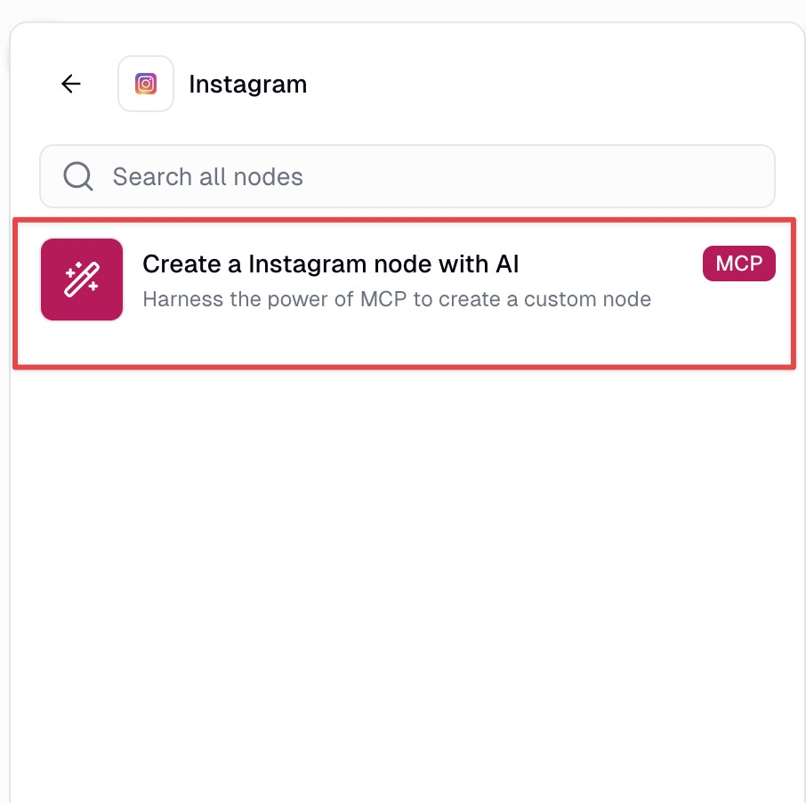
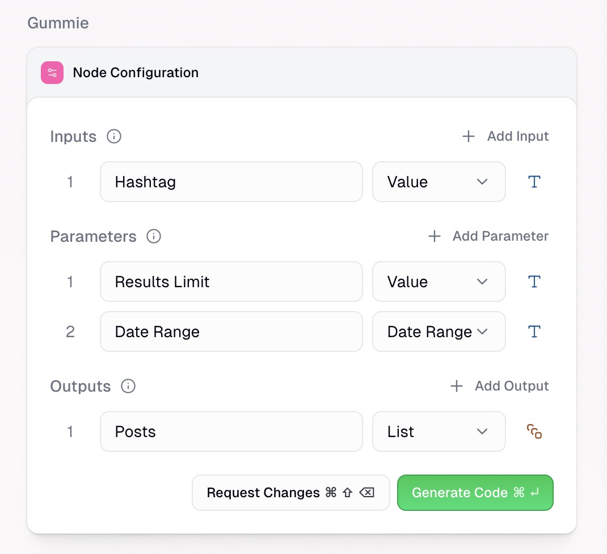
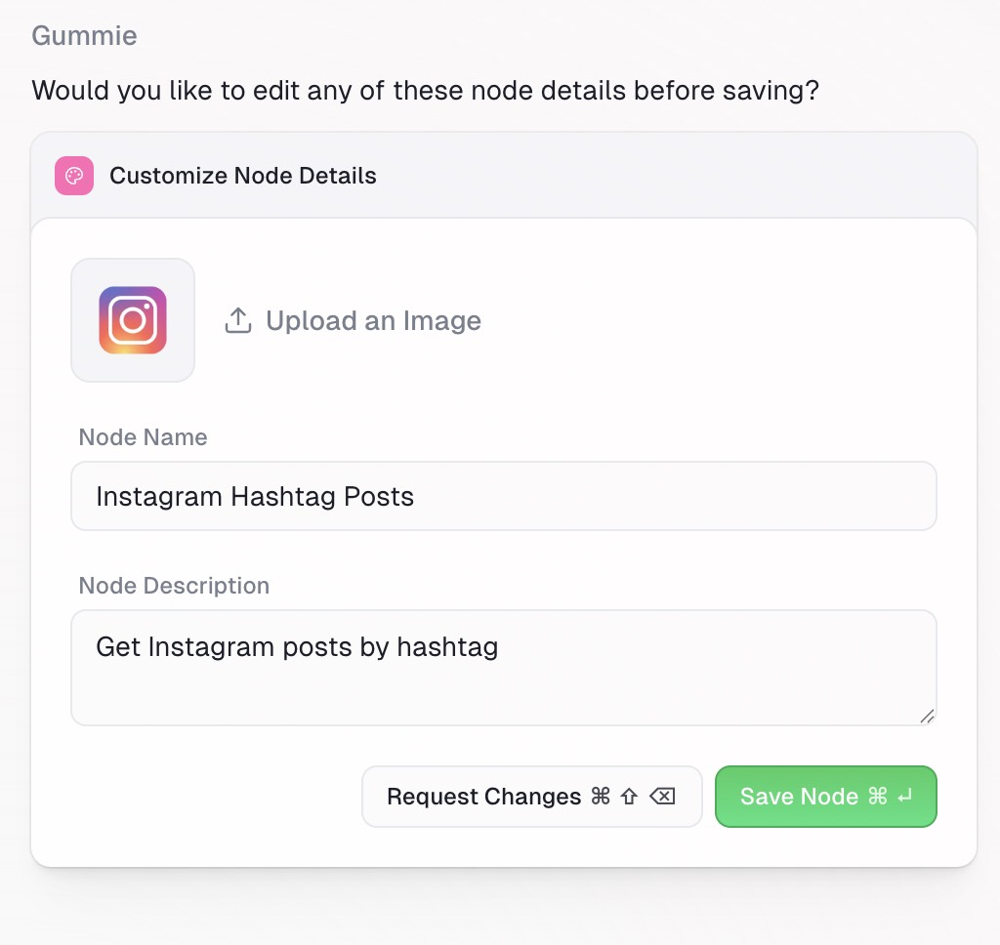

Get Instagram profile posts, details, stories, reels, post comments and hashtags, users, and tagged posts in Gumloop.

---

The Gumloop integration for Instagram provides a direct interface for running Apify’s Instagram scrapers directly in your workflows. No API tokens or manual polling required. All you need is a Gumloop account.

Using the Gumloop Instagram MCP node, you can prompt the Instagram data you need and Gumloop will retrieve it from relevant Apify Actors. From there you can connect this data to other tools and AI models to process the information.

## Available actions

You can pull the following types of data from public Instagram accounts using Gumloop’s Instagram node (via Apify). Each action has a credit cost.

| Tool/Action | Description | Credit Cost |
| :---- | :---- | :---- |
| Get profile posts | Fetch posts from a public Instagram profile, including captions, images, like and comment counts, and metadata. | 3 credits per item |
| Get post comments | Retrieve all comments on a specific post, with author info, timestamps, and like counts. | 3 credits per item |
| Get hashtag posts | Search by hashtag and return matching posts with full details. | 3 credits per item |
| Find users | Look up Instagram users by name or handle and return profile metadata like bio, follower/following counts, etc. | 3 credits per item |
| Get profile details | Extract detailed metadata from a profile, including follower count, bio, and verification status. | 5 credits per item |
| Get profile stories | Get media URLs, timestamps, and view counts from an Instagram profile’s stories. | 3 credits per item |
| Get profile reels | Fetch reels with captions, engagement metrics, play counts, and music info. | 3 credits per item |
| Get tagged posts | Return posts where a specific user is tagged, with full post details. | 3 credits per item |

## Retrieve Instagram data in Gumloop

1. _Add the Gumloop Instagram MCP node_

    First, add the Instagram node from the node library to your workflow canvas.

    

1. _Prompt the data you need._

    In the node's configuration panel, write a clear, specific prompt that describes the data you want to retrieve.

    

    :::tip Prompting tips

    - MCP nodes only have access to the tools listed so your prompt should be scoped to Instagram.
    - You can mix and match different tools (get 10 latest videos for a hashtag and retrieve profile data for each post).

    :::

1. _Define the inputs and outputs_

    Once you’ve entered your prompt, you will go through the AI assisted node creation process starting with defining inputs, parameters and outputs of your Instagram node.

    Gummie (Gumloop’s AI assistant) will suggest inputs (information coming from previous steps, ie hashtag to scrape), parameters (user defined choices, ie number of posts to retrieve) and outputs (information used in future steps, ie number of followers of users and list of recent videos).

    

1. _Generate and test the node_

    With inputs, parameters and outputs defined, Gummie will generate the code to retrieve the data from the Apify Instagram node. There is no requirement for you to review or understand the code, Gummie takes care of it.

    After the code is written, enter test values to confirm the outputs of the node and save.

    Once saved, you can access this node in any of your flows.

    

## Other integrations

- [TikTok](/platform/integrations/gumloop/tiktok)
- [YouTube](/platform/integrations/gumloop/youtube)
- [Google Maps](/platform/integrations/gumloop/maps)
