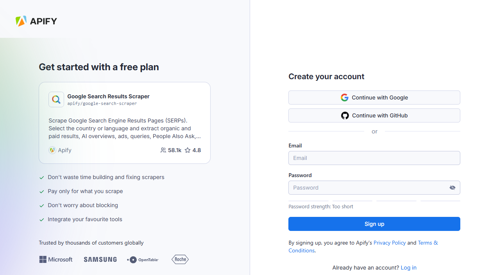

## Apify Scraper for Google Search

The Google search modules from [Apify](https://apify.com) allows you to crawl Google Search Results Pages (SERPs) and extract data from those web pages in structured format such as JSON, XML, CSV, or Excel.

To use the module, you need an [Apify account](https://console.apify.com) and an [API token](https://docs.apify.com/platform/integrations/api#api-token), which you can find in the Apify Console under **Settings > Integrations**. After connecting, you can automate data extraction and incorporate the results into your workflows.

## Connect Apify Scraper for Google Search  modules to Make

1. Create an account at [Apify](https://console.apify.com/). You can sign up using your email, Gmail, or GitHub account.



1. To connect your Apify account to Make, you can use an OAuth connection (recommended) or an Apify API token. To get the Apify API token, navigate to **[Settings > API & Integrations](https://console.apify.com/settings/integrations)** in the Apify Console.


1. Find your token under **Personal API tokens** section. You can also create a new API token with multiple customizable permissions by clicking on **+ Create a new token**.
1. Click the **Copy** icon next to your API token to copy it to your clipboard. Then, return to your Make scenario interface.

    

1. On Make, click **Add** to open the **Create a connection** dialog of the chosen Apify Scraper module.
1. In the **API token** field, paste the API token you copied from Apify. Provide a clear **Connection name**, and click **Save**.


Once connected, you can build workflows to automate Google Search extraction and integrate results into your applications.

## Apify Scraper for Google Search Data modules

After connecting the app, you can use one of the primary modules as native scrapers to extract public Google Search data:

### Extract Google Search Results

Get comprehensive search results via [Apify’s Google Search Scraper](https://apify.com/apify/google-search-scraper). Enter your search terms or Google Search URLs, one per line.

For each Google Search query, you will extract:

- _Organic results_: comprehensive listings with titles, descriptions, URLs, and position data.
- _Paid results_: sponsored listings and advertisements that appear in search results.
- _AI Overviews_: Google’s AI-generated summaries that appear at the top of results.
- _People Also Ask_: related questions and their expandable answers.
- _Related queries_: suggested search terms related to your original query.
- _Featured snippets_: highlighted content that directly answers search queries.
- _Additional data_: prices, review ratings, product information, and more where available.

```json title="Search results data, shortened sample"
{
  "searchQuery": {
    "term": "javascript",
    "page": 1,
    "type": "SEARCH",
    "countryCode": "us",
    "languageCode": "en",
    "locationUule": null,
    "device": "DESKTOP"
  },
  "url": "https://www.google.com/search?q=javascript&hl=en&gl=us&num=10",
  "hasNextPage": true,
  "resultsCount": 13600000000,
  "organicResults": [
    {
      "title": "JavaScript Tutorial",
      "url": "https://www.w3schools.com/js/",
      "displayedUrl": "https://www.w3schools.com › js",
      "description": "JavaScript is the world's most popular programming language. JavaScript is the programming language of the Web. JavaScript is easy to learn.",
      "position": 1,
      "emphasizedKeywords": ["JavaScript", "JavaScript", "JavaScript", "JavaScript"],
      "siteLinks": []
    }
  ],
  "paidResults": [
    {
      "title": "JavaScript Online Course - Start Learning JavaScript",
      "url": "https://www.example-ad.com/javascript",
      "displayedUrl": "https://www.example-ad.com",
      "description": "Learn JavaScript from scratch with our comprehensive online course. Start your coding journey today!",
      "position": 1,
      "type": "SHOPPING"
    }
  ],
  "peopleAlsoAsk": [
    {
      "question": "What is JavaScript used for?",
      "answer": "JavaScript is used for creating interactive elements on websites, browser games, frontend of web applications, mobile applications, and server applications...",
      "url": "https://www.example.com/javascript-uses"
    }
  ]
}
```

#### Advanced Search Capabilities

Customize your searches with powerful filtering options:

- _Regional targeting_: Select specific countries and languages for localized results
- _Device simulation_: Get results as they would appear on desktop or mobile devices
- _Site filtering_: Restrict results to specific domains with `site:example.com`
- _Exclusion operators_: Remove unwanted sources with `site:reddit.com`
- _Exact phrase matching_: Search for precise phrases with quotation marks
- _Date filtering_: Limit results to specific time periods
- _File type filtering_: Target specific document formats like PDF, DOC, or XLSX
- _Content location targeting_: Find keywords in specific parts of pages with `intext:`, `intitle:`, and `inurl:`
- _UULE parameters_: Target searches to exact geographic locations

The scraper exports data in various formats including JSON, CSV, Excel, and XML, enabling integration with your workflows and applications.

There are other native Make Apps powered by Apify. You can check out Apify Scraper for:

- [TikTok Data](/platform/integrations/make/tiktok)
- [Google Maps Emails Data](/platform/integrations/make/maps)
- [YouTube Data](/platform/integrations/make/youtube)
- [AI crawling](/platform/integrations/make/ai-crawling)
- [Amazon Data](/platform/integrations/make/amazon)

And more! Because you can access any of thousands of our scrapers on Apify Store by using the [general Apify connections](https://www.make.com/en/integrations/apify).
