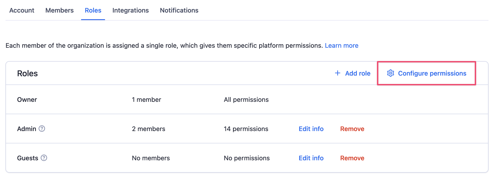
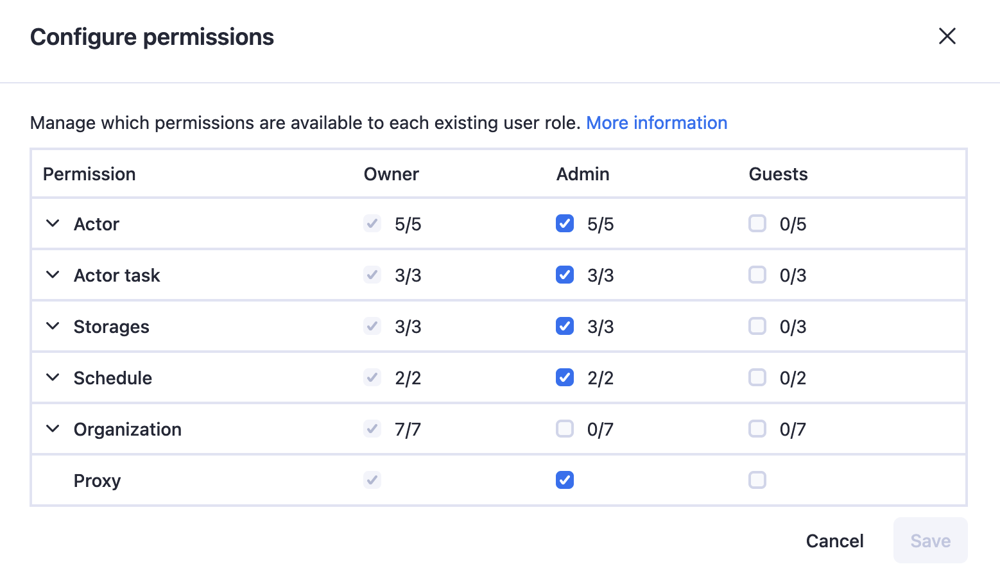

**Configure your organization account by inviting new members and assigning their roles. Manage team members' access permissions to the organization's resources.**

---

After creating your organization, you can configure its settings. The **Account** tab allows you to:

- Set the organization's email address
- Change the username
- Configure security settings
- Delete the account.

The **Members** tab lets you to update your organization's members and set its owner.

In the **Account** tab's **Security** section, you can set security requirements for organization members. These include:

- Maximum session lifespan
- Two-factor authentication requirement

**[See our video tutorial](https://www.youtube.com/watch?v=BIL6HqtnvKk) on organization accounts.**

## Add users to your organization

You can add members to your organization in the **Members** tab. You can use their **User ID**, **username**, or **email**. When adding a member to the organization, you must assign them a **Role** so their permissions are known right away.

## Define roles and permissions

Roles allow you to define permissions to your organization's resources by group. Every new organization comes with three pre-defined roles, which you can customize or remove.

To edit the permissions for each role, click on the **Configure permissions** button in the top-right corner.

> Each member can only have one role to avoid conflicting permissions.

You can configure individual permissions for each resource type such as Actors, Actor tasks or storage. Bear in mind that if a user has the **read** permission for [storages](/platform/core-concepts/storage), you cannot prevent them from accessing a particular storage (e.g. a certain [dataset](/platform/core-concepts/storage)) - they will have access to all of the organization's storages.

**Some permissions have dependencies**. For example, if someone has the **Actor run** permission, it is likely they will also need the **storage write** permission, so they can store the results from their Actor runs.

[See the full list of permissions](/platform/collaboration/list-of-permissions) that can be granted to Apify resources.
