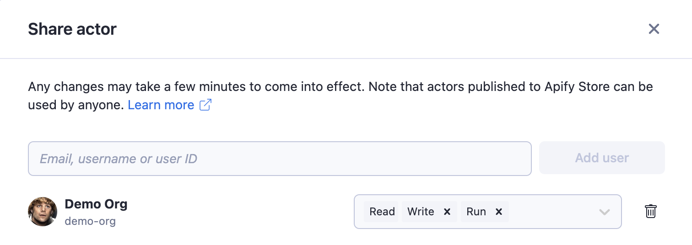
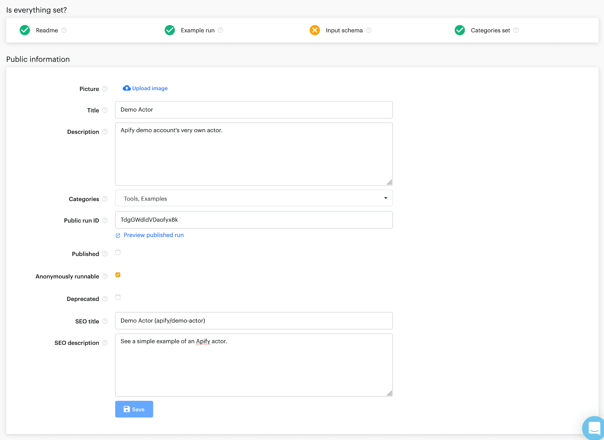

# Access rights {#access-rights}

**Manage permissions for organizations or private resources such as actors, actor runs and storages. Allow other users to read, run, modify or build new versions.**

---

By default, each system resource (actor, key-value store, run, ...) you create is only available to you, the owner. There are three ways you can grant access to your resources: the [access rights](#granting-access-rights) system, using the [organization account](#organization-account) or by [publishing your actor](#publishing-in-apify-store) in [Apify Store](https://apify.com/store).

## Granting access rights {#granting-access-rights}

You can easily and securely share your own resources - actors, tasks, key-value stores, datasets and request queues using a [granular](https://www.google.com/search?client=firefox-b-d&q=define+granular+permissions) permissions system. This enables you to, for example, allow your colleague to run an [actor](../actors/index.md) or view a [dataset](../storage/dataset.md), but not to modify them.

You can also grant permission to update an actor and build a new version.
[Storages](../storage/index.md) (key-value stores, request queues and datasets) are sharable the same way with, for example, just **read** permission, or a combination of both **read** and **write** permissions.

> To be able to grant access rights to another user you must have a **username** set in [account settings](https://console.apify.com/account?tab=settings).

To share an actor, task, key-value store, request queue, or dataset, click on the **Actions** button in the top-right corner and select **Share**. You can add a collaborator using their **user ID**, **email**, or **username**. Once you have added the collaborator, you can configure their permissions.

## Organization account {#organization-account}

Apify's organization account allows you to grant role-specific access permissions to members of your team. For more details, see the organization account [documentation](./organization_account/index.md).

## Publishing in Apify Store {#publishing-in-apify-store}

Another way to share your actor is to [publish](../actors/publishing.md) it in [Apify Store](https://apify.com/store). The published actor appears in Apify Store, which means that **any user will be able to view its source code and run it**.

> When you publish an actor, you give every Apify user the **read** and **run** permissions.

However, **without the relevant permissions (e.g. write, build, delete), no one except the author can modify an actor**.

If a user runs the actor, it gets billed to their account, and the actor run will be available only to them.

To publish an actor, open it in the [Apify Console](https://console.apify.com), go to the **Publication** tab and follow the instructions below.

## Permissions {#permissions}

Below are the permissions you can grant via the [access rights](#granting-access-rights) system, [organization account](./organization_account/index.md) and [publishing in Apify store](../actors/publishing.md).

* The access rights system allows you to manage a **specific** user's permissions for a **specific** resource.
* The organization account allows you to manage **each** member's permissions for **all** of an organization's resources.
* By publishing your actor in Apify Store, you grant **all** of its users **read** (view its source code) and **run** [permissions](./list_of_permissions.md).

For a full list of permissions available for resources on the Apify platform, see the [List of permissions](./list_of_permissions.md).
