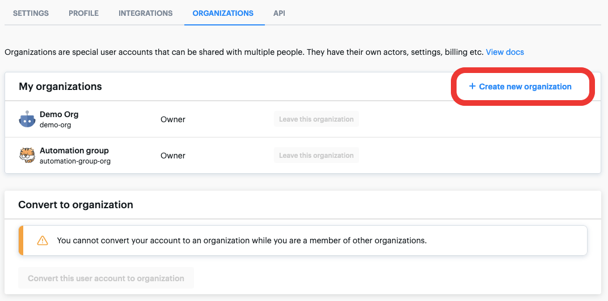
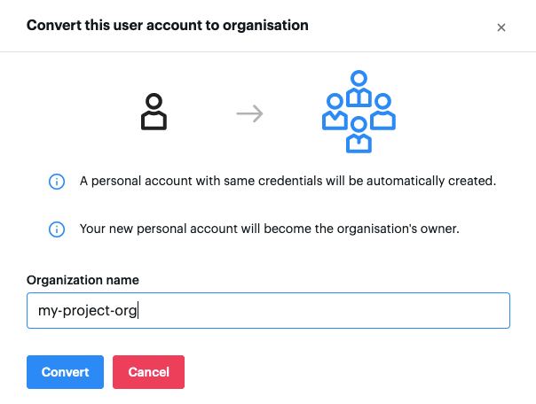
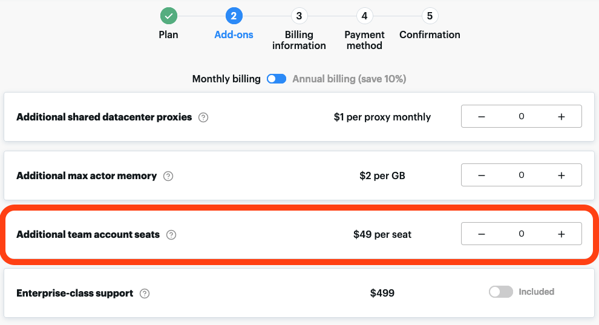

# Organization account

**Create a specialized account for your organization to encourage collaboration and manage permissions. Convert an existing account, or create one from scratch.**

---

Organization accounts allow groups to collaborate on projects. It enables you to manage your team members' [permissions](../list_of_permissions.md) and to centralize your billing without having to share the credentials of a single personal account.

You can [switch](./how_to_use.md) between your personal and organization accounts in just two clicks: in the [Apify Console](https://console.apify.com), click the account button in the top-left corner, then select the organization.

You can set up an organization in two ways.

* [Create a new organization](#create-a-new-organization). If you don't have integrations set up yet, or if they are easy to change, you can create a new organization, preserving your personal account.
* [Convert an existing account](#convert-an-existing-account) into an organization. If your actors and [integrations](../../integrations/index.md) are set up in a personal account, it is probably best to convert that account into an organization. This will preserve all your integrations but means you will have a new personal account created for you.

> Prefer video to reading? [See our video tutorial](https://www.youtube.com/watch?v=BIL6HqtnvKk) for organization accounts.

## Availability and pricing {#availability-and-pricing}

The organization account is available on all our plans. [Visit our pricing page](https://apify.com/pricing) for more information.

## Create a new organization {#create-a-new-organization}

You can create a new organization by clicking the **Create new organization** button under the **Organizations** tab in your [account](https://console.apify.com/account#/myorganizations). If you want the organization to have a separate email address (used for notifications), enter it here. Otherwise, leave the **email** field empty and the owner's email will be used for notifications.

**You can own up to 5 and be a member of as many organizations as you need.**

## Convert an existing account {#convert-an-existing-account}

> **When you convert an existing user account into an organization,**
>
> * **You will no longer be able to sign in to the converted user account.**
> * **An organization cannot be converted back to a personal account.**
> * **During conversion, a new account (with the same login credentials) will be created for you. You can then use that account to [set up](./setup.md) the organization.**

Before converting your personal account into an organization, make sure it has a **username**.

An organization can't be a member of other organizations. If you want to convert your account to one, you'll first need to **leave all the organizations you are a part of**.

Then, under the **Organizations** [tab](https://console.apify.com/account#/myorganizations), click the **Convert this user account to an organization** button.

Next, set the organization's name and click **Convert**.

And that's it! Your personal account becomes the organization, and you will be logged out automatically. You can now log into your new personal account with the same credentials as you are currently logged in with. This applies to both **password** and **OAuth** methods.

For information on [adding members and assigning roles](./setup.md), see the Setup page.

## Billing {#billing}

Actor and task runs are billed to the account they are started from. **Always make sure you start your runs from the correct account** to avoid having an organization's runs billed to your personal account.

The Free and Personal plans are [restricted to 9 seats](https://apify.com/pricing), while the Team plan comes with 9, which you can increase later. If you are on the Team plan and want to add some more seats to the 9 it comes with, head over to your [Billing page and click on Subscriptions](https://console.apify.com/billing-new#/subscription). Click on **Upgrade**, and, in the **Add-ons** section, and add as many additional seats as you need. Then, just complete the upgrade process, and you're done.

To find out about organization pricing, get in touch at [support@apify.com](mailto:support@apify.com?subject=Organization%20account%20pricing) or [visit the pricing page](https://apify.com/pricing).

