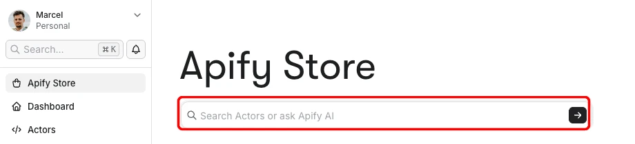
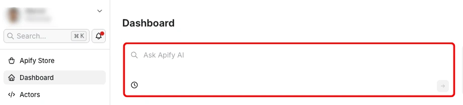

Apify AI is a conversational AI interface inside [Apify Console](https://console.apify.com) that lets you find and run [Actors](/actors) using natural language. It uses the same search and execution backend as [Apify Store](https://apify.com/store) search and the [Apify MCP server](/integrations/mcp).

:::note Apify AI is in beta

Apify AI is currently focused on finding and running Actors. Its capabilities and entry points will expand as it evolves.

:::

## Access Apify AI

Apify AI has two entry points in Apify Console:

- _Apify Store search bar_ - long, intent-heavy queries go to Apify AI automatically, and short keyword queries stay on the regular Apify Store search. The suggestions below the bar always let you choose either option yourself.

  

- _Dashboard widget_ - a chat widget on the Console dashboard.

  

## What you can do with Apify AI

Apify AI currently supports the following actions:

- Search Apify Store for an Actor that matches your goal.
- View an Actor's details, including its [input schema](/actors/development/actor-definition/input-schema) and [pricing](/actors/running/actors-in-store).
- Run an Actor with inputs that Apify AI fills in from your description.
- Fetch results from the Actor's default [dataset](/storage/dataset).
- Summarize the results or answer questions about them, right in the chat.

Apify AI always asks for your confirmation before it runs an Actor. Nothing is charged without your approval. To help improve Apify AI, you can also rate its responses with a thumbs up or down.

## Excluded Actors

Apify AI can run most Actors in Apify Store, but excludes two categories:

- _Full-permission Actors_ - excluded for security. A [full-permission Actor](/actors/running/permissions#full-permission-actors) can access your entire account and all its data. In Apify Console, you stay in control and decide every run yourself. In Apify AI, the LLM chooses and runs Actors for you, so Apify doesn't let it run Actors that have full access to your account.
- _Rental Actors_ - excluded because their subscription-based model doesn't fit the sporadic, on-demand way Apify AI runs Actors.

## Out of current scope

Apify AI focuses on finding and running Actors, so some capabilities aren't in the chat yet. Use Apify Console directly for operations such as:

- Creating or running [tasks](/actors/running/tasks)
- Setting up [schedules](/actors/running/schedules)
- [Publishing](/actors/publishing) Actors
- Configuring external [integrations](/integrations)

Apify AI also has no chat history or long-term memory, and it can't access account data such as your billing usage.

## Daily usage limit

Apify AI has a daily token limit per user:

- [Free plan](https://apify.com/pricing) users get a lower daily allowance.
- Users on paid plans share the same higher daily allowance.

The limit applies to the chat itself. Actors you run from Apify AI are billed like any other Actor run.

If you hit the limit, wait until the next day or upgrade to a paid plan for the higher allowance.

## Search ranking

Search ranking in Apify AI uses parameters similar to those evaluated by the [Actor quality score](/actors/publishing/quality-score), as with Apify Store search and the MCP server `search-actors` tool. The two are separate systems that correlate strongly: Actors with higher quality scores tend to rank higher in search. To improve your Actor's visibility, focus on improving its quality score.

## Related

- [Apify MCP server](/integrations/mcp) - the programmatic interface to the same backend for external AI agents and CLIs.
- [Actor quality score](/actors/publishing/quality-score) - the metric that correlates with search ranking across surfaces.
- [Apify Console](/account/console) - the web application where Apify AI lives, in the Apify Store search bar and the dashboard widget.
