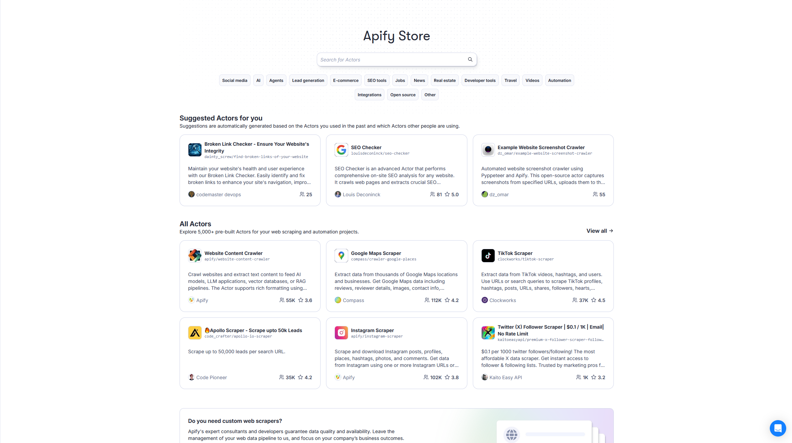

Apify Store is a place where you can explore a variety of Actors, both created and maintained by Apify or the community.
Use the search box at the top of the page to find Actors by service names, such as TikTok, Google, Facebook, or by their authors.
Alternatively, you can explore Actors grouped under predefined categories below the search box.
You can also organize the results from the store by different criteria, including:

* Category
* Pricing model
* Developers
* Relevance

Once you select an Actor from the store, you'll be directed to its specific page. Here, you can configure the settings for your future Actor run, save these configurations for later use, or run the Actor immediately.

For more information on Actors in Apify Store, visit the [Apify Store documentation](/sources/platform/actors/running/store.md).
