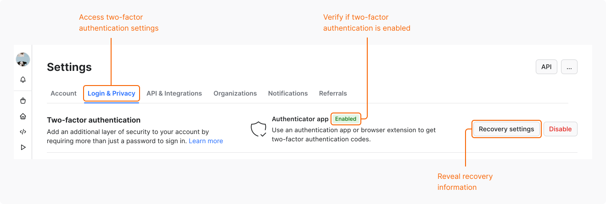

Two-factor authentication (2FA) provides an extra layer of security that helps protect your Apify account. With 2FA enabled, logging into your account consists of two steps:

1. Providing your username and password.
1. Providing a unique code generated by an authenticator app installed on your phone or by a browser extension.

Thanks to this additional second step, it’s more difficult for an unauthorized person to gain access to your data even if they know your credentials.

## Configure 2FA for your account

Before you start setting up 2FA, download and configure an authenticator app on your phone. We recommend [Google Authenticator](https://play.google.com/store/apps/details?id=com.google.android.apps.authenticator2&hl=en_US) or [Authy](https://www.authy.com/).

### 1. Enable 2FA in Apify Console

The first step is to enable two-factor authentication for your account:

1. Log in to [Apify Console](https://console.apify.com).
1. In the left-side panel, go to **Settings**.
1. Select the **Login & Privacy** tab.
1. In **Two-factor authentication**, select **Enable**.

At this point, you see a modal window with a QR code and a request for a 6-digit code.

### 2. Configure an authenticator app

Next, connect your authenticator app to your Apify account:

1. On your phone, open the authenticator app and tap the option to add a QR code.
1. Use your phone camera to scan the QR code displayed in Apify Console.
1. In the **Verify the code from the app** field, enter the 6-digit code generated by your app.
1. Select **Continue**.

Configure 2FA without a QR code

If you can't scan the QR code or prefer to use a browser extension instead, configure 2FA manually:

1. In the modal window, select the **Setup key** link.
1. Copy the two-factor secret.
1. Use the secret to connect the app or a browser extension to your Apify account.

You can also use the two-factor secret to set up your authenticator app on multiple devices.

### 3. Save recovery codes

If you lose access to your authenticator app, you can still log in to your Apify account using a recovery code. To continue the 2FA setup, download or copy the recovery codes.

We recommend saving the recovery codes in a safe place, for example, in a password manager. You can also print them and store them away from your device.

### 4. Configure recovery information

The last step is to configure recovery information. If you lose access to your authenticator app or recovery codes, the support team will ask you for this information to help you recover your account.

To provide recovery information, complete the following fields:

- **Phone number**. Apify will only use your phone number to verify your identity during the recovery process.
- **Personal information**. Make sure the information you provide is secure and easy to remember. For example, if you use the name of your pet or the title of your favorite book, make sure that information isn't publicly available, for example on social media.

Once you complete both fields, select **Continue**. You've configured two-factor authentication for your account.

## Log in with 2FA enabled

To log in to Apify Console with 2FA enabled:

1. On the login page, provide your email address and password.
1. Enter the code from your authenticator app.

### Use recovery codes

If you lose access to your authenticator app, you can still log in to your account using the recovery codes:

1. On the login page, provide your email address and password.
1. Select the **recovery code or begin 2FA account recovery** link.
1. Enter one of the 16 recovery codes you received during the setup process.

You can use each recovery code only once. After you log in, we recommend that you disable 2FA and enable it again with a new authenticator app.

### View recovery information

To view the recovery information that you provided during the 2FA configuration:

1. Log in to [Apify Console](https://console.apify.com).
1. In the left-side panel, go to **Settings**.
1. Select the **Login & Privacy** tab.
1. In **Two-factor authentication**, select **Recovery settings**.
1. To reveal the recovery information, provide a code from your authenticator app.

## Disable 2FA

To disable 2FA for your account:

1. Log in to [Apify Console](https://console.apify.com).
1. In the left-side panel, go to **Settings**.
1. Select the **Login & Privacy** tab.
1. In **Two-factor authentication**, select **Disable**.
1. To confirm your choice, enter the code from your authenticator app or one of your recovery codes.
1. Select **Remove app**.

After you disable 2FA, logging in to your account will require only your email and password.

## Recover access to your account

If you lose access to your authenticator app and have no recovery codes left, you can't log in to your account. To recover access to your account, contact Apify support at [apify.com/contact](https://apify.com/contact).

During the recovery process, the support team will ask you for the recovery information that you have configured during the 2FA setup.
