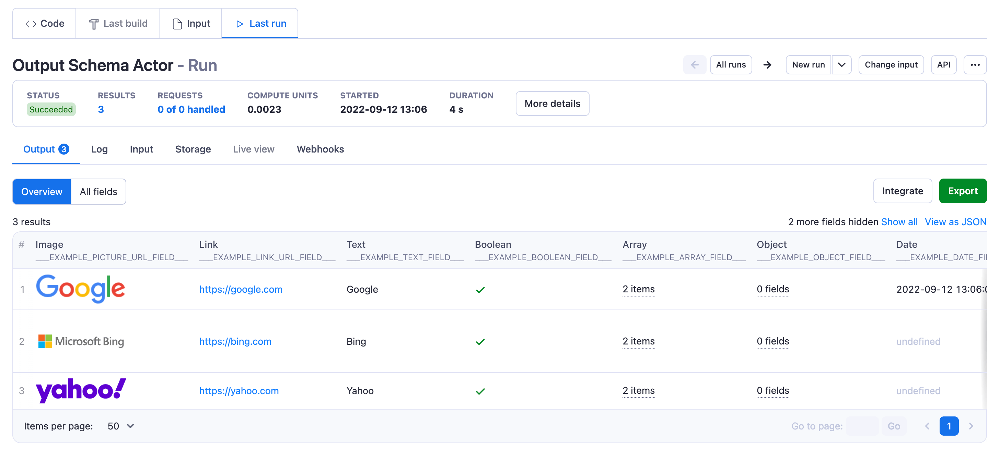

The dataset schema defines the structure and presentation of data produced by an Actor. It controls what fields each dataset item contains and how that data appears in the Output tab.

## Schema components

A dataset schema has two components:

- `views` _(required)_ - Display configurations for how data appears in the Output tab. Each view can show different fields, ordering, and formatting.
- `fields` _(optional)_ - JSON Schema describing each dataset item. Enables validation and provides metadata for AI agents.

```json title=".actor/dataset_schema.json"
{
    "actorSpecification": 1,
    "fields": {
        "type": "object",
        "properties": {
            "title": { "type": "string" },
            "price": { "type": "number" }
        }
    },
    "views": {
        "overview": {
            "title": "Overview",
            "transformation": { "fields": ["title", "price"] },
            "display": { "component": "table" }
        }
    }
}
```

## File structure

Place the dataset schema in the `.actor` folder in your Actor's root directory. You can organize it in two ways:

### Inline in `actor.json`

```json title=".actor/actor.json"
{
    "actorSpecification": 1,
    "name": "my-scraper",
    "title": "My Scraper",
    "version": "1.0.0",
    "storages": {
        "dataset": {
            "actorSpecification": 1,
            "fields": {},
            "views": {
                "overview": {
                    "title": "Overview",
                    "transformation": {},
                    "display": { "component": "table" }
                }
            }
        }
    }
}
```

### Separate file

```json title=".actor/actor.json"
{
    "actorSpecification": 1,
    "name": "my-scraper",
    "title": "My Scraper",
    "version": "1.0.0",
    "storages": {
        "dataset": "./dataset_schema.json"
    }
}
```

```json title=".actor/dataset_schema.json"
{
    "actorSpecification": 1,
    "fields": {},
    "views": {
        "overview": {
            "title": "Overview",
            "transformation": {},
            "display": { "component": "table" }
        }
    }
}
```

Use a separate file when your schema is complex or you want to keep `actor.json` concise.

## Views

Views control how data appears in the Output tab. Each view defines which fields to show, their order, their formatting.

### Why use views

Dataset views are like database views - different perspectives on the same data. Instead of showing all fields at once, views present focused subsets.

[Google Maps Scraper](https://apify.com/compass/crawler-google-places) uses views to separate place details from review data.

### When to use views

- Control field order and formatting - Without views, fields appear in JSON property order. Views let you order fields logically and format URLs as links, images inline, etc.
- Expand nested data with `unwind` - Arrays of nested objects appear collapsed by default. Use `unwind` to expand them into readable rows.
- Create focused perspectives - A scraper with 50+ fields can offer an "Overview" view and a "Details" view. Same data, different focus.

A single view is fine for simple Actors with fewer than 10 fields where all fields are equally relevant.

### Organize views by use case

The same data often serves different purposes. An e-commerce scraper could offer a "Marketing" view (name, image, description) and a "Pricing" view (price, discount, competitor price). The first view defined becomes the default.

### What views are not for

Views show the same data from different angles. Don't use views for:

- Separating unrelated data types - Storing posts, comments, and profiles in one dataset, then using views to separate them. Use separate datasets for unrelated data types.
- Controlling export formats - Views don't change how data exports to JSON, CSV, or Excel. Export format is set in download options or the [Dataset API `format` parameter](/api/v2/dataset-items-get). Views only affect Console UI display.

### Basic view example

This Actor stores data using `Actor.pushData()`:

```javascript title="main.js"
import { Actor } from 'apify';
await Actor.init();

await Actor.pushData({
    numericField: 10,
    pictureUrl: 'https://www.google.com/images/branding/googlelogo/2x/googlelogo_color_92x30dp.png',
    linkUrl: 'https://google.com',
    textField: 'Google',
    booleanField: true,
    dateField: new Date(),
    arrayField: ['#hello', '#world'],
    objectField: {},
});

await Actor.exit();
```

Configure the Output tab with a dataset schema:

```json title=".actor/actor.json"
{
    "actorSpecification": 1,
    "name": "Actor Name",
    "title": "Actor Title",
    "version": "1.0.0",
    "storages": {
        "dataset": {
            "actorSpecification": 1,
            "views": {
                "overview": {
                    "title": "Overview",
                    "transformation": {
                        "fields": [
                            "pictureUrl",
                            "linkUrl",
                            "textField",
                            "booleanField",
                            "arrayField",
                            "objectField",
                            "dateField",
                            "numericField"
                        ]
                    },
                    "display": {
                        "component": "table",
                        "properties": {
                            "pictureUrl": {
                                "label": "Image",
                                "format": "image"
                            },
                            "linkUrl": {
                                "label": "Link",
                                "format": "link"
                            },
                            "textField": {
                                "label": "Text",
                                "format": "text"
                            },
                            "booleanField": {
                                "label": "Boolean",
                                "format": "boolean"
                            },
                            "arrayField": {
                                "label": "Array",
                                "format": "array"
                            },
                            "objectField": {
                                "label": "Object",
                                "format": "object"
                            },
                            "dateField": {
                                "label": "Date",
                                "format": "date"
                            },
                            "numericField": {
                                "label": "Number",
                                "format": "number"
                            }
                        }
                    }
                }
            }
        }
    }
}
```

Each view has two parts:

1. `transformation` - Which fields to fetch and how to transform them
1. `display` - How to visually present the data in the UI

The Output tab displays fields from `transformation.fields` in the specified order:



### Multiple views example

Create multiple views for different use cases. This e-commerce scraper offers Marketing and Pricing views:

```json title=".actor/dataset_schema.json"
{
    "actorSpecification": 1,
    "views": {
        "marketing": {
            "title": "Marketing",
            "description": "Fields for marketing and content creation",
            "transformation": {
                "fields": ["productName", "imageUrl", "description", "price"]
            },
            "display": {
                "component": "table",
                "properties": {
                    "imageUrl": {
                        "label": "Image",
                        "format": "image"
                    }
                }
            }
        },
        "pricing": {
            "title": "Pricing analysis",
            "description": "Fields for competitive pricing analysis",
            "transformation": {
                "fields": [
                    "productName",
                    "price",
                    "currency",
                    "discountPercent",
                    "competitorPrice",
                    "priceDifference"
                ]
            },
            "display": {
                "component": "table",
                "properties": {
                    "discountPercent": {
                        "label": "Discount %",
                        "format": "number"
                    },
                    "priceDifference": {
                        "label": "vs. Competitor",
                        "format": "number"
                    }
                }
            }
        }
    }
}
```

## Fields

The `fields` property defines the structure of each dataset item using [JSON Schema](https://json-schema.org/). It enables validation and provides metadata that help humans and AI agents understand the data in your dataset.

### Why define fields

When AI agents interact with Actors through the MCP server or API, they rely on field metadata to understand the data in your dataset. Including `title`, `description`, and `example` properties lets agents:

- Understand the meaning of each output field
- Chain Actors together by matching inputs to outputs
- Generate appropriate queries and handle responses correctly

Without this metadata, agents must infer field meanings from names alone, which leads to errors.

### Field properties

Each field in your schema can include standard JSON Schema properties:

| Property | Type | Description |
| --- | --- | --- |
| `type` | string | The data type (`string`, `number`, `boolean`, `array`, `object`, `null`). |
| `title` | string | A human-readable name for the field. |
| `description` | string | Explains what the field contains and how to interpret it. |
| `example` | any | A sample value that demonstrates the expected format. |
| `enum` | array | A list of allowed values for the field. |

### Field metadata example

```json title=".actor/dataset_schema.json"
{
    "actorSpecification": 1,
    "fields": {
        "$schema": "https://json-schema.org/draft/2020-12/schema",
        "type": "object",
        "properties": {
            "productName": {
                "type": "string",
                "title": "Product name",
                "description": "The full name of the product as displayed on the product page.",
                "example": "Wireless Bluetooth Headphones"
            },
            "price": {
                "type": "number",
                "title": "Price",
                "description": "The current price in USD. Does not include shipping or taxes.",
                "example": 49.99
            },
            "currency": {
                "type": "string",
                "title": "Currency code",
                "description": "Three-letter ISO 4217 currency code.",
                "example": "USD",
                "enum": ["USD", "EUR", "GBP"]
            },
            "inStock": {
                "type": "boolean",
                "title": "In stock",
                "description": "Whether the product is currently available for purchase.",
                "example": true
            },
            "url": {
                "type": "string",
                "title": "Product URL",
                "description": "Direct link to the product page.",
                "example": "https://example.com/products/wireless-headphones"
            }
        },
        "required": ["productName", "price", "url"]
    },
    "views": {
        "overview": {
            "title": "Overview",
            "transformation": {
                "fields": ["productName", "price", "inStock", "url"]
            },
            "display": {
                "component": "table",
                "properties": {
                    "url": { "format": "link" },
                    "inStock": { "format": "boolean" }
                }
            }
        }
    }
}
```

:::tip Naming convention

Use `camelCase` for field names. This matches the convention used in input schemas and ensures consistency across your Actor's configuration.

:::

See [Dataset validation](./validation.md) for validation options and error handling.

## Handle nested structures

Tabular formats (Output tab table, Excel, CSV) require flat data. If your Actor produces nested JSON structures, transform them using these options:

### Flatten nested objects

Use `transformation.flatten` to convert nested objects into flat key-value pairs:

```json
{
    "transformation": {
        "flatten": ["address"],
        "fields": ["name", "address.street", "address.city"]
    }
}
```

With `flatten: ["address"]`, the object `{"address": {"street": "Main St", "city": "NYC"}}` becomes `{"address.street": "Main St", "address.city": "NYC"}`.

Use the flattened property names (e.g., `address.street`) in both `transformation.fields` and `display.properties`.

### Unwind arrays

Use `transformation.unwind` to expand arrays of nested objects into separate rows:

```json
{
    "transformation": {
        "unwind": ["reviews"],
        "fields": ["productName", "reviewText", "rating"]
    }
}
```

With `unwind: ["reviews"]`, a product with five reviews becomes five rows in the output, each containing the product name plus one review's data.

Alternatively, flatten nested structures in your Actor code before calling `Actor.pushData()`.

## Reference

### `DatasetSchema` object

| Property | Type | Required | Description |
| --- | --- | --- | --- |
| `actorSpecification` | integer | true | Version of the dataset schema structure. Only version 1 is available. |
| `fields` | JSONSchema object | false | Schema of one dataset object using JSON Schema Draft 2020-12 or compatible format. |
| `views` | Object | true | An object containing view definitions. Each key is a view ID, each value is a DatasetView object. |

### `DatasetView` object

| Property | Type | Required | Description |
| --- | --- | --- | --- |
| `title` | string | true | The title shown in the Output tab and API. |
| `description` | string | false | Description of the view. Only available in API responses. |
| `transformation` | ViewTransformation | true | Defines how to fetch and transform data from the Dataset API. |
| `display` | ViewDisplay | true | Defines how to render data in the Output tab. |

### `ViewTransformation` object

| Property | Type | Required | Description |
| --- | --- | --- | --- |
| `fields` | string[] | true | Fields to include in the output. Order determines column order in the UI. Missing field values display as `undefined`. |
| `unwind` | string[] | false | Array fields to expand into parent objects. With `unwind: ["foo"]`, `{"foo": {"bar": "hello"}}` becomes `{"bar": "hello"}`. |
| `flatten` | string[] | false | Object fields to flatten. With `flatten: ["foo"]`, `{"foo": {"bar": "hello"}}` becomes `{"foo.bar": "hello"}`. |
| `omit` | string[] | false | Fields to exclude from output. Supports nested field names. |
| `limit` | integer | false | Maximum number of results. Default is all results. |
| `desc` | boolean | false | Sort order. Default is ascending (oldest first). Set `true` for descending (newest first). |

### `ViewDisplay` object

| Property | Type | Required | Description |
| --- | --- | --- | --- |
| `component` | string | true | Display component. Only `table` is available. |
| `properties` | Object | false | Field display settings. Keys match `transformation.fields`, values are ViewDisplayProperty objects. If not set, fields render as strings, arrays, or objects automatically. |

### `ViewDisplayProperty` object

| Property | Type | Required | Description |
| --- | --- | --- | --- |
| `label` | string | false | Column header text in the table view. |
| `format` | string | false | Display format: `text`, `number`, `date`, `link`, `boolean`, `image`, `array`, or `object`. |
