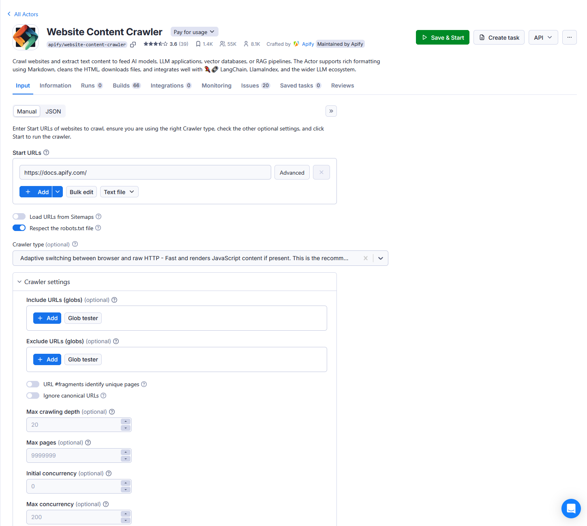

The input schema defines the input parameters for an Actor. It's a `JSON` object comprising various field types supported by the Apify platform. Based on the input schema, the Apify platform automatically generates a user interface for the input and passes the input object to the Actor when it is run.

The following is an example of an auto-generated UI for the [Website Content Crawler](https://apify.com/apify/website-content-crawler) Actor.



With an input schema defined as follows:

```json5
{
    "title": "Input schema for Website Content Crawler",
    "description": "Enter the start URL(s) of the website(s) to crawl, configure other optional settings, and run the Actor to crawl the pages and extract their text content.",
    "type": "object",
    "schemaVersion": 1,
    "properties": {
        "startUrls": {
            "title": "Start URLs",
            "type": "array",
            "description": "One or more URLs of the pages where the crawler will start. Note that the Actor will additionally only crawl sub-pages of these URLs. For example, for the start URL `https://www.example.com/store`, the Actor will crawl pages like `https://www.example.com/store/something`, but not `https://www.example.com/about`.",
            "editor": "requestListSources",
            "prefill": [{ "url": "https://docs.apify.com/" }]
        },
        "crawlerType": {
            "sectionCaption": "Crawler settings",
            "title": "Crawler type",
            "type": "string",
            "enum": ["playwright:chrome", "cheerio", "jsdom"],
            "enumTitles": ["Headless web browser (Chrome+Playwright)", "Raw HTTP client (Cheerio)", "Raw HTTP client with JS execution (JSDOM) (experimental!)"],
            "description": "Select the crawling engine:\n- **Headless web browser** (default) - Useful for modern websites with anti-scraping protections and JavaScript rendering. It recognizes common anti-scraping techniques and can handle website blocking by using browser fingerprinting and proxies.\n- **Raw HTTP client** - Fast and efficient for simpler websites or API endpoints with straightforward HTML or JSON responses. It requires fewer resources and can handle high-scale crawling.\n- **Raw HTTP client with JS execution** - Similar to the Raw HTTP client but can execute JavaScript using JSDOM. It is useful for websites that require basic JavaScript execution but don't need a full browser. This option is experimental and may not work for all sites.",
            "default": "playwright:chrome"
        },
        "maxCrawlDepth": {
            "title": "Max crawling depth",
            "type": "integer",
            "description": "The maximum number of links starting from the start URL that the crawler will recursively descend. The start URLs have a depth of 0, the pages linked directly from the start URLs have a depth of 1, and so on.",
            "minimum": 0,
            "default": 20
        },
        "maxCrawlPages": {
            "title": "Max pages",
            "type": "integer",
            "description": "The maximum number pages to crawl. It includes the start URLs, pagination pages, pages with no content, etc. The crawler will automatically finish after reaching this number. Setting this value too high may result in unwanted behaviour and API rate limiting.",
            "minimum": 0,
            "default": 9999999
        },
        // ...
    }
}
```

The actual input object passed from the autogenerated input UI to the Actor then looks like this:

```json
{
    "debugMode": false,
    "proxyConfiguration": {
        "useApifyProxy": true
    },
    "saveHtml": false,
    "saveMarkdown": false,
    "saveScreenshots": false,
    "startUrls": [
        {
            "url": "https://docs.apify.com/"
        }
    ]
}
```

## Secret input fields

You can mark sensitive inputs, such as passwords, using the `isSecret` property. These values will be hidden and encrypted in the UI.

```json
{
  "properties": {
    "password": {
      "title": "Password",
      "type": "string",
      "description": "A secret, encrypted input field",
      "editor": "textfield",
      "isSecret": true
    }
  }
}
```

Next, let's take a look at [input schema specification](./specification.md), the possibility of using input schema to enable users to pass [secrets](./secret_input.md), and how to define [custom editors](./custom_input_ui.md).