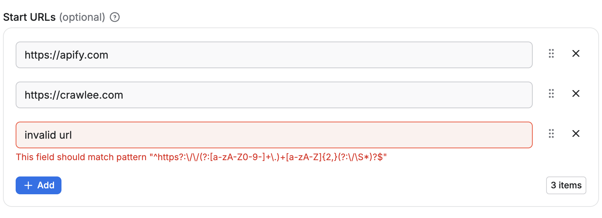

**Learn how to define and validate a schema for your Actor's input with code examples. Provide an autogenerated input UI for your Actor's users.**

---

The Actor input schema serves three main purposes:

- It ensures the input data supplied to the Actor adhere to specified requirements and validation rules.
- It is used by the Apify platform to generate a user-friendly interface for configuring and running your Actor.
- It simplifies invoking your Actors from external systems by generating calling code and connectors for integrations.

To define an input schema for an Actor, set `input` field in the `.actor/actor.json` file to an input schema object (described below), or path to a JSON file containing the input schema object.
For backwards compatibility, if the `input` field is omitted, the system looks for an `INPUT_SCHEMA.json` file either in the `.actor` directory or the Actor's top-level directory—but note that this functionality is deprecated and might be removed in the future. The maximum allowed size for the input schema file is 500 kB.

When you provide an input schema, the Apify platform will validate the input data passed to the Actor on start (via the API or Apify Console) to ensure compliance before starting the Actor.
If the input object doesn't conform the schema, the caller receives an error and the Actor is not started.

:::note Validation aid

You can use our [visual input schema editor](https://apify.github.io/input-schema-editor-react/) to guide you through the creation of the `INPUT_SCHEMA.json` file.

To ensure the input schema is valid, here's a corresponding [JSON schema file](https://github.com/apify/apify-shared-js/blob/master/packages/json_schemas/schemas/input.schema.json).

You can also use the [`apify validate-schema`](/cli/docs/reference#apify-validate-schema-path) command in the Apify CLI.

:::

## Example

Imagine a simple web crawler that accepts an array of start URLs and a JavaScript function to execute on each visited page. The input schema for such a crawler could be defined as follows:

```json5
{
    "title": "Cheerio Crawler input",
    "description": "To update crawler to another site, you need to change startUrls and pageFunction options!",
    "type": "object",
    "schemaVersion": 1,
    "properties": {
        "startUrls": {
            "title": "Start URLs",
            "type": "array",
            "description": "URLs to start with",
            "prefill": [
                { "url": "http://example.com" },
                { "url": "http://example.com/some-path" }
            ],
            "editor": "requestListSources"
        },
        "pageFunction": {
            "title": "Page function",
            "type": "string",
            "description": "Function executed for each request",
            "prefill": "async () => { return $('title').text(); }",
            "editor": "javascript"
        }
    },
    "required": ["startUrls", "pageFunction"]
}
```

The generated input UI will be:


If you switch the input to the **JSON** display using the toggle, then you will see the entered input stringified to `JSON`, as it will be passed to the Actor:

```json
{
    "startUrls": [
    {
        "url": "http://example.com"
    },
    {
        "url": "http://example.com/some-path"
    }
    ],
    "pageFunction": "async () => { return $('title').text(); }"
}
```

## Structure

```json
{
    "title": "Cheerio Crawler input",
    "type": "object",
    "schemaVersion": 1,
    "properties": { /* define input fields here */ },
    "required": []
}
```

| Property | Type | Required | Description |
| --- | --- | --- | --- |
| `title` | String | Yes | Any text describing your input schema. |
| `description` | String | No | Help text for the input that will be <br/>displayed above the UI fields. |
| `type` | String | Yes | This is fixed and must be set <br/>to string `object`. |
| `schemaVersion` | Integer | Yes | The version of the input schema <br/>specification against which <br/>your schema is written. <br/>Currently, only version `1` is out. |
| `properties` | Object | Yes | This is an object mapping each field key <br/>to its specification. |
| `required` | String | No | An array of field keys that are required. |
| `additionalProperties` | Boolean | No | Controls if properties not listed in `properties` are allowed. Defaults to `true`. <br/>Set to `false` to make requests with extra properties fail. |

:::note Input schema differences

Even though the structure of the Actor input schema is similar to JSON schema, there are some differences. We cannot guarantee that JSON schema tooling will work on input schema documents. For a more precise technical understanding of the matter, feel free to browse the code of the [@apify/input_schema](https://github.com/apify/apify-shared-js/tree/master/packages/input_schema/src) package.

:::

## Fields

Each field of your input is described under its key in the `inputSchema.properties` object. The field might have `integer`, `string`, `array`, `object`, or `boolean` type, and its specification contains the following properties:

| Property | Value | Required | Description |
| --- | --- | --- | --- |
| `type` | One of <ul><li>`string`</li><li>`array`</li><li>`object`</li><li>`boolean`</li><li>`integer`</li></ul> | Yes | Allowed type for the input value. <br/>Cannot be mixed. |
| `title` | String | Yes | Title of the field in UI. |
| `description` | String | Yes | Description of the field that will be <br/>displayed as help text in Actor input UI. |
| `default` | Must match `type` property. | No | Default value that will be <br/>used when no value is provided. |
| `prefill` | Must match `type` property. | No | Value that will be prefilled <br/>in the Actor input interface. |
| `example` | Must match `type` property. | No | Sample value of this field <br/>for the Actor to be displayed when <br/>Actor is published in Apify Store. |
| `sectionCaption` | String | No | If this property is set, <br/>then all fields following this field <br/>(this field included) will be separated <br/>into a collapsible section <br/>with the value set as its caption. <br/>The section ends at the last field <br/>or the next field which has the <br/> `sectionCaption` property set. |
| `sectionDescription` | String | No | If the `sectionCaption` property is set, <br/>then you can use this property to <br/>provide additional description to the section. <br/>The description will be visible right under <br/>the caption when the section is open. |

### Prefill vs. default vs. required

Here is a rule of thumb for whether an input field should have a `prefill`, `default`, or be required:

- **Prefill** - Use for fields that don't have a reasonable default. The provided value is prefilled for the user to show them an example of using the field and to make it easy to test the Actor (e.g., search keyword, start URLs). In other words, this field is only used in the user interface but does not affect the Actor functionality and API. Note that if you add a new input option to your Actor, the Prefill value won't be used by existing integrations such as Actor tasks or API calls, but the Default will be if specified. This is useful for keeping backward compatibility when introducing a new flag or feature that you prefer new users to use.
- **Required** - Use for fields that don't have a reasonable default and MUST be entered by the user (e.g., API token, password).
- **Default** - Use for fields that MUST be set for the Actor run to some value, but where you don't need the user to change the default behavior (e.g., max pages to crawl, proxy settings).
  If the user omits the value when starting the Actor via any means (API, CLI, scheduler, or user interface), the platform automatically passes the Actor this default value.
- **No particular setting** - Use for purely optional fields where it makes no sense to prefill any value (e.g., flags like debug mode or download files).

In summary, you can use each option independently or use a combination of **Prefill + Required** or **Prefill + Default**, but the combination of **Default + Required** doesn't make sense to use.


## Additional properties

Most types also support additional properties defining, for example, the UI input editor.

### String

#### Code input

Example of a code input:

```json
{
    "title": "Page function",
    "type": "string",
    "description": "Function executed for each request",
    "editor": "javascript",
    "prefill": "async () => { return $('title').text(); }"
}
```

Rendered input:


#### Country selection

Example of country selection using a select input:

```json
{
    "title": "Country",
    "type": "string",
    "description": "Select your country",
    "editor": "select",
    "default": "us",
    "enum": ["us", "de", "fr"],
    "enumTitles": ["USA", "Germany", "France"]
}
```

Rendered input:


#### `datepicker` editor

Example of date selection using absolute and relative `datepicker` editor:

```json
{
    "absoluteDate": {
        "title": "Date",
        "type": "string",
        "description": "Select absolute date in format YYYY-MM-DD",
        "editor": "datepicker",
        "pattern": "^(\\d{4})-(0[1-9]|1[0-2])-(0[1-9]|[12]\\d|3[01])$"
    },
    "relativeDate": {
        "title": "Relative date",
        "type": "string",
        "description": "Select relative date in format: {number} {unit}",
        "editor": "datepicker",
        "dateType": "relative",
        "pattern": "^(\\d+)\\s*(day|week|month|year)s?$"
    },
    "anyDate": {
        "title": "Any date",
        "type": "string",
        "description": "Select date in format YYYY-MM-DD or {number} {unit}",
        "editor": "datepicker",
        "dateType": "absoluteOrRelative",
        "pattern": "^(\\d{4})-(0[1-9]|1[0-2])-(0[1-9]|[12]\\d|3[01])$|^(\\d+)\\s*(day|week|month|year)s?$"
    }
}
```

The `absoluteDate` property renders a date picker that allows selection of a specific date and returns string value in `YYYY-MM-DD` format. Validation is ensured thanks to `pattern` field. In this case the `dateType` property is omitted, as it defaults to `"absolute"`.


The `relativeDate` property renders an input field that enables the user to choose the relative date and returns the value in `{number} {unit}` format, for example `"2 days"`. The `dateType` parameter is set to `"relative"` to restrict input to relative dates only.


The `anyDate` property renders a date picker that accepts both absolute and relative dates. The Actor author is responsible for parsing and interpreting the selected date format.


#### `fileupload` editor

The `fileupload` editor enables users to specify a file as input. The input is passed to the Actor as a string. It is the Actor author's responsibility to interpret this string, including validating its existence and format.

The editor makes it easier to users to upload the file to a key-value store of their choice.


The user provides either a URL or uploads the file to a key-value store (existing or new).


Properties:

| Property | Value | Required | Description                                                                                                                                                                                                                                                                                                                                                                                                                                                                                                                                                                                                                                                                                                                                                                                                                                                                                                                                                                                              |
|----------|--------|-----------|----------------------------------------------------------------------------------------------------------------------------------------------------------------------------------------------------------------------------------------------------------------------------------------------------------------------------------------------------------------------------------------------------------------------------------------------------------------------------------------------------------------------------------------------------------------------------------------------------------------------------------------------------------------------------------------------------------------------------------------------------------------------------------------------------------------------------------------------------------------------------------------------------------------------------------------------------------------------------------------------------------|
| `editor` | One of:<br/>- `textfield`<br/>- `textarea`<br/>- `javascript`<br/>- `python`<br/>- `select`<br/>- `datepicker`<br/>- `fileupload`<br/>- `hidden` | Yes | Visual editor used for the input field.                                                                                                                                                                                                                                                                                                                                                                                                                                                                                                                                                                                                                                                                                                                                                                                                                                                                                                                                                                  |
| `pattern` | String | No | Regular expression that will be used to validate the input. If validation fails, the Actor will not run.                                                                                                                                                                                                                                                                                                                                                                                                                                                                                                                                                                                                                                                                                                                                                                                                                                                                                                 |
| `minLength` | Integer | No | Minimum length of the string.                                                                                                                                                                                                                                                                                                                                                                                                                                                                                                                                                                                                                                                                                                                                                                                                                                                                                                                                                                            |
| `maxLength` | Integer | No | Maximum length of the string.                                                                                                                                                                                                                                                                                                                                                                                                                                                                                                                                                                                                                                                                                                                                                                                                                                                                                                                                                                            |
| `enum` | [String] | Required if `editor` is `select` | Using this field, you can limit values to the given array of strings. Input will be displayed as select box.                                                                                                                                                                                                                                                                                                                                                                                                                                                                                                                                                                                                                                                                                                                                                                                                                                                                                             |
| `enumTitles` | [String] | No | Titles for the `enum` keys described.                                                                                                                                                                                                                                                                                                                                                                                                                                                                                                                                                                                                                                                                                                                                                                                                                                                                                                                                                                    |
| `nullable` | Boolean | No | Specifies whether `null` is an allowed value.                                                                                                                                                                                                                                                                                                                                                                                                                                                                                                                                                                                                                                                                                                                                                                                                                                                                                                                                                            |
| `isSecret` | Boolean | No | Specifies whether the input field will be stored encrypted. Only available with `textfield`, `textarea` and `hidden` editors.                                                                                                                                                                                                                                                                                                                                                                                                                                                                                                                                                                                                                                                                                                                                                                                                                                                                             |
| `dateType` | One of <ul><li>`absolute`</li><li>`relative`</li><li>`absoluteOrRelative`</li></ul> | No | This property, which is only available with `datepicker` editor, specifies what date format should visual editor accept (The JSON editor accepts any string without validation.).<br/><br/><ul><li>`absolute` value enables date input in `YYYY-MM-DD` format. To parse returned string regex like this can be used: `^(\d{4})-(0[1-9]\|1[0-2])-(0[1-9]\|[12]\d\|3[01])$`.</li><br/><li>`relative` value enables relative date input in <br/>`{number} {unit}` format. <br/>Supported units are: days, weeks, months, years.<br/><br/>The input is passed to the Actor as plain text (e.g., "3 weeks"). To parse it, regex like this can be used: `^(\d+)\s*(day\|week\|month\|year)s?$`.</li><br/><li>`absoluteOrRelative` value enables both absolute and relative formats and user can switch between them. It's up to Actor author to parse a determine actual used format - regexes above can be used to check whether the returned string match one of them.</li></ul><br/>Defaults to `absolute`. |

:::note Regex escape

When using escape characters `\` for the regular expression in the `pattern` field, be sure to escape them to avoid invalid JSON issues. For example, the regular expression
`https:\/\/(www\.)?apify\.com\/.+` would become `https:\\/\\/(www\\.)?apify\\.com\\/.+`.

:::

#### Advanced date and time handling

While the `datepicker` editor doesn't support setting time values visually, you can allow users to handle more complex datetime formats and pass them via JSON. The following regex allows users to optionally extend the date with full ISO datetime format or pass `hours` and `minutes` as a relative date:

`"pattern": "^(\\d{4})-(0[1-9]|1[0-2])-(0[1-9]|[12]\\d|3[01])(T[0-2]\\d:[0-5]\\d(:[0-5]\\d)?(\\.\\d+)?Z?)?$|^(\\d+)\\s*(minute|hour|day|week|month|year)s?$"`

When implementing time-based fields, make sure to explain to your users through the description that the time values should be provided in UTC. This helps prevent timezone-related issues.

### Boolean

Example options with group caption:

```json5
{
    "verboseLog": {
        "title": "Verbose log",
        "type": "boolean",
        "description": "Debug messages will be included in the log.",
        "default": true,
        "groupCaption": "Options",
        "groupDescription": "Various options for this Actor"
    },
    "lightspeed": {
        "title": "Lightspeed",
        "type": "boolean",
        "description": "If checked then actors runs at the
            speed of light.",
        "prefill": true
    }
}
```

Rendered input:


Properties:

| Property | Value | Required | Description |
| --- | --- | --- | --- |
| `editor` | One of <ul><li>`checkbox`</li><li>`hidden`</li></ul> | No | Visual editor used for the input field. |
| `groupCaption` | String | No | If you want to group <br/>multiple checkboxes together, <br/>add this option to the first <br/>of the group. |
| `groupDescription` | String | No | Description displayed as help text <br/>displayed of group title. |
| `nullable` | Boolean | No | Specifies whether null is <br/>an allowed value. |

### Numeric types

There are two numeric types supported in the input schema: `integer` and `number`.

- The `integer` type represents whole numbers.
- The `number` type can represent both integers and floating-point numbers.

Example:

```json
{
    "title": "Memory",
    "type": "integer",
    "description": "Select memory in megabytes",
    "default": 64,
    "maximum": 1024,
    "unit": "MB"
}
```

Rendered input:


Properties:

| Property   | Value                                               | Required | Description                                                                   |
|------------|-----------------------------------------------------|----------|-------------------------------------------------------------------------------|
| `type`     | One of <ul><li>`integer`</li><li>`number`</li></ul> | Yes      | Defines the type of the field — either an integer or a floating-point number.                                                                          |
| `editor`   | One of: <ul><li>`number`</li><li>`hidden`</li></ul> | No       | Visual editor used for input field.                                           |
| `maximum`  | Integer or Number <br/>(based on the `type`)        | No       | Maximum allowed value.                                                        |
| `minimum`  | Integer or Number <br/>(based on the `type`)             | No       | Minimum allowed value.                                                        |
| `unit`     | String                                              | No       | Unit displayed next to the field in UI, <br/>for example _second_, _MB_, etc. |
| `nullable` | Boolean                                             | No       | Specifies whether null is an allowed value.                                   |

### Object

Example of proxy configuration:

```json
{
    "title": "Proxy configuration",
    "type": "object",
    "description": "Select proxies to be used by your crawler.",
    "prefill": { "useApifyProxy": true },
    "editor": "proxy"
}
```

Rendered input:


The object where the proxy configuration is stored has the following structure:

```json5
{
    // Indicates whether Apify Proxy was selected.
    "useApifyProxy": Boolean,

    // Array of Apify Proxy groups. Is missing or null if
    // Apify Proxy's automatic mode was selected
    // or if proxies are not used.
    "apifyProxyGroups": String[],

    // Array of custom proxy URLs.
    // Is missing or null if custom proxies were not used.
    "proxyUrls": String[],
}
```

Example of a black box object:

```json
{
    "title": "User object",
    "type": "object",
    "description": "Enter object representing user",
    "prefill": {
        "name": "John Doe",
        "email": "janedoe@gmail.com"
    },
    "editor": "json"
}
```

Rendered input:


Properties:

| Property               | Value                                                                                  | Required | Description                                                                                                                                                                                                                      |
|------------------------|----------------------------------------------------------------------------------------|----------|----------------------------------------------------------------------------------------------------------------------------------------------------------------------------------------------------------------------------------|
| `editor`               | One of <ul><li>`json`</li><li>`proxy`</li><li>`schemaBased`</li><li>`hidden`</li></ul> | Yes      | UI editor used for input.                                                                                                                                                                                                        |
| `patternKey`           | String                                                                                 | No       | Regular expression that will be used <br/>to validate the keys of the object.                                                                                                                                                    |
| `patternValue`         | String                                                                                 | No       | Regular expression that will be used <br/>to validate the values of object.                                                                                                                                                      |
| `maxProperties`        | Integer                                                                                | No       | Maximum number of properties <br/>the object can have.                                                                                                                                                                           |
| `minProperties`        | Integer                                                                                | No       | Minimum number of properties <br/>the object can have.                                                                                                                                                                           |
| `nullable`             | Boolean                                                                                | No       | Specifies whether null is <br/>an allowed value.                                                                                                                                                                                 |
| `isSecret`             | Boolean                                                                                | No       | Specifies whether the input field will be stored encrypted. Only available with `json` and `hidden` editors.                                                                                                                     |
| `properties`           | Object                                                                                 | No       | Defines the sub-schema properties for the object used for validation and UI rendering (`schemaBased` editor). See more info below.                                                                                               |
| `additionalProperties` | Boolean                                                                                | No       | Controls if sub-properties not listed in `properties` are allowed. Defaults to `true`. Set to `false` to make requests with extra properties fail.                                                                               |
| `required`             | String array                                                                           | No       | An array of sub-properties keys that are required. <br />Note: This applies only if the object field itself is present. If the object field is optional and not included in the input, its required subfields are not validated. |

#### Object fields validation

Like root-level input schemas, you can define a schema for sub-properties of an object using the `properties` field.

Each sub-property within this sub-schema can define the same fields as those available at the root level of the input schema, except for the fields that apply only at the root level: `sectionCaption` and `sectionDescription`.

Validation is performed both in the UI and during Actor execution via the API. Sub-schema validation works independently of the editor selected for the parent object. It also respects the `additionalProperties` and `required` fields, giving you precise control over whether properties not defined in `properties` are permitted and which properties are mandatory.

:::note Recursive nesting

Object sub-properties can define their own sub-schemas recursively with no nesting depth limit.

:::

```json title="Example of an object property with sub-schema properties"
{
    "title": "Configuration",
    "type": "object",
    "description": "Advanced configuration options",
    "editor": "json",
    "properties": {
        "locale": {
            "title": "Locale",
            "type": "string",
            "description": "Locale identifier.",
            "pattern": "^[a-z]{2,3}-[A-Z]{2}$"
        },
        "timeout": {
            "title": "Timeout",
            "type": "integer",
            "description": "Request timeout in seconds",
            "minimum": 1,
            "maximum": 300
        },
        "debugMode": {
            "title": "Debug Mode",
            "type": "boolean",
            "description": "Enable verbose logging during scraping"
        }
    },
    "required": ["locale", "timeout"],
    "additionalProperties": false
}
```

Rendered input:


In this example, the object has validation rules for its properties:

- The `timeout` property must be an integer between 1 and 300
- The `locale` property must be a string matching the pattern `^[a-z]{2,3}-[A-Z]{2}$`
- The `debugMode` property is optional and can be either `true` or `false`
- The `timeout` and `locale` properties are required
- No additional properties beyond those defined are allowed

##### Handling default and prefill values for object sub-properties

When defining object with sub-properties, it's possible to set `default` and `prefill` values in two ways:

1. _At the parent object level_: You can provide a complete object as the `default` or `prefill` value, which will set values for all sub-properties at once.
2. _At the individual sub-property level_: You can specify `default` or `prefill` values for each sub-property separately within the `properties` definition.

When both methods are used, the values defined at the parent object level take precedence over those defined at the sub-property level.
For example, in the input schema like this:

```json
{
    "title": "Configuration",
    "type": "object",
    "description": "Advanced configuration options",
    "editor": "schemaBased",
    "default": {
        "timeout": 60
    },
    "properties": {
        "locale": {
            "title": "Locale",
            "type": "string",
            "description": "Locale identifier.",
            "pattern": "^[a-z]{2,3}-[A-Z]{2}$",
            "editor": "textfield",
            "default": "en-US"
        },
        "timeout": {
            "title": "Timeout",
            "type": "integer",
            "description": "Request timeout in seconds",
            "minimum": 1,
            "maximum": 300,
            "editor": "number",
            "default": 120
        }
    }
}
```

The `timeout` sub-property will have a default value of `60` (from the parent object), while the `locale` sub-property will have a default value of `"en-US"` (from its own definition).

#### `schemaBased` editor

Object with sub-schema defined can use the `schemaBased` editor, which provides a user-friendly interface for editing each property individually.
It renders all properties based on their type (and `editor` field), providing a user-friendly interface for complex objects.
This feature works for objects (and arrays of objects), enabling each property to have its own input field in the UI.

Objects with a defined sub-schema can use the `schemaBased` editor, which provides a user-friendly interface for editing each property individually.
It renders all properties based on their type (and optionally the `editor` field), making it ideal for visually managing complex object structures.
This editor supports both single objects and arrays of objects (see [below](#array)), allowing each property to be represented with an appropriate input field in the UI.

```json title="Example of an object property with sub-schema properties using schemaBased editor"
{
    "title": "Configuration",
    "type": "object",
    "description": "Advanced configuration options",
    "editor": "schemaBased",
    "properties": {
        "locale": {
            "title": "Locale",
            "type": "string",
            "description": "Locale identifier.",
            "pattern": "^[a-z]{2,3}-[A-Z]{2}$",
            "editor": "textfield"
        },
        "timeout": {
            "title": "Timeout",
            "type": "integer",
            "description": "Request timeout in seconds",
            "minimum": 1,
            "maximum": 300,
            "editor": "number"
        },
        "debugMode": {
            "title": "Debug Mode",
            "type": "boolean",
            "description": "Enable verbose logging during scraping",
            "editor": "checkbox"
        }
    },
    "required": ["locale", "timeout"],
    "additionalProperties": false
}
```

Rendered input:


Each sub-property is rendered with its own input field according to its type and `editor` configuration:

- The `locale` property is rendered as a text field.
- The `timeout` property is rendered as a numeric input with validation limits.
- The `debugMode` property is rendered as a checkbox toggle.

##### Limitations

The `schemaBased` editor supports only **top-level sub-properties** (level 1 nesting).
While deeper nested properties can still define sub-schemas for validation, they cannot use the `schemaBased` editor for rendering.
For example, if the Configuration object above included a property that was itself an object with its own sub-properties, those deeper levels would need to use a different editor, such as `json`.

### Array

Example of request list sources configuration:

```json
{
    "title": "Start URLs",
    "type": "array",
    "description": "URLs to start with",
    "prefill": [{ "url": "https://apify.com" }],
    "editor": "requestListSources"
}
```

Rendered input:


Example of an array:

```json
{
    "title": "Colors",
    "type": "array",
    "description": "Enter colors you know",
    "prefill": ["Red", "White"],
    "editor": "json"
}
```

Rendered input:


Properties:

| Property           | Value                                                                                                                                                                                                                  | Required | Description                                                                                                                                                 |
|--------------------|------------------------------------------------------------------------------------------------------------------------------------------------------------------------------------------------------------------------|----------|-------------------------------------------------------------------------------------------------------------------------------------------------------------|
| `editor`           | One of <ul><li>`json`</li><li>`requestListSources`</li><li>`pseudoUrls`</li><li>`globs`</li><li>`keyValue`</li><li>`stringList`</li><li>`fileupload`</li><li>`select`</li><li>`schemaBased`</li><li>`hidden`</li></ul> | Yes      | UI editor used for input.                                                                                                                                   |
| `placeholderKey`   | String                                                                                                                                                                                                                 | No       | Placeholder displayed for <br/>key field when no value is specified. <br/>Works only with `keyValue` editor.                                                |
| `placeholderValue` | String                                                                                                                                                                                                                 | No       | Placeholder displayed in value field <br/>when no value is provided. <br/>Works only with `keyValue` and <br/>`stringList` editors.                         |
| `patternKey`       | String                                                                                                                                                                                                                 | No       | Regular expression that <br/>will be used to validate <br/>the keys of items in the array. <br/>Works only with `keyValue` <br/>editor.                     |
| `patternValue`     | String                                                                                                                                                                                                                 | No       | Regular expression that <br/>will be used to validate the values <br/>of items in the array. <br/>Works only with `keyValue` and <br/>`stringList` editors. |
| `maxItems`         | Integer                                                                                                                                                                                                                | No       | Maximum number of items <br/>the array can contain.                                                                                                         |
| `minItems`         | Integer                                                                                                                                                                                                                | No       | Minimum number of items <br/>the array can contain.                                                                                                         |
| `uniqueItems`      | Boolean                                                                                                                                                                                                                | No       | Specifies whether the array <br/>should contain only unique values.                                                                                         |
| `nullable`         | Boolean                                                                                                                                                                                                                | No       | Specifies whether null is <br/>an allowed value.                                                                                                            |
| `items`            | object                                                                                                                                                                                                                 | No       | Specifies format of the items of the array, useful mainly for multiselect and for `schemaBased` editor (see below).                                         |
| `isSecret`         | Boolean                                                                                                                                                                                                                | No       | Specifies whether the input field will be stored encrypted. Only available with `json` and `hidden` editors.                                                |


Usage of this field is based on the selected editor:

- `requestListSources` - value from this field can be used as input for the [RequestList](https://crawlee.dev/api/core/class/RequestList) class from Crawlee.
- `pseudoUrls` - is intended to be used with a combination of the [PseudoUrl](https://crawlee.dev/api/core/class/PseudoUrl) class and the [enqueueLinks()](https://crawlee.dev/api/core/function/enqueueLinks) function from Crawlee.

Editor type `requestListSources` supports input in formats defined by the [sources](https://crawlee.dev/api/core/interface/RequestListOptions#sources) property of [RequestListOptions](https://crawlee.dev/api/core/interface/RequestListOptions).

Editor type `globs` maps to the Crawlee's [GlobInput](https://crawlee.dev/api/core#GlobInput) used by the [UrlPatterObject](https://crawlee.dev/api/core#UrlPatternObject).

Editor type `fileupload` enables users to specify a list of files as input. The input is passed to the Actor as an array of strings. The Actor author is responsible for interpreting the strings, including validating file existence and format. This editor simplifies the process for users to upload files to a key-value store of their choice.
Editor type `select` allows the user to pick items from a select, providing multiple choices. Please check this example of how to define the multiselect field:

```json
{
    "title": "Multiselect field",
    "description": "My multiselect field",
    "type": "array",
    "editor": "select",
    "items": {
        "type": "string",
        "enum": ["value1", "value2", "value3"],
        "enumTitles": ["Label of value1", "Label of value2", "Label of value3"]
    }
}
```

To correctly define options for multiselect, you need to define the `items` property and then provide values and (optionally) labels in `enum` and `enumTitles` properties.

#### Array items validation

Arrays in the input schema can define an `items` field to specify the type and validation rules for each item.
Each array item is validated according to its `type` and inside the `items` field it's also possible to define additional validation rules such as `pattern`, `minimum`, `maximum`, etc., depending on the item type.

If the item type is an `object`, it can define its own `properties`, `required`, and `additionalProperties` fields,
working in the same way as a single object field (see [Object fields validation](#object-fields-validation)).

Validation is performed both in the UI and during Actor execution via the API.
Array items can themselves be objects with sub-schemas, and objects within objects, recursively, without any limit on nesting depth.

```json title="Example of an array of objects property with sub-schema"
{
    "title": "Request Headers",
    "type": "array",
    "description": "List of custom HTTP headers",
    "editor": "json",
    "items": {
        "type": "object",
        "properties": {
            "name": {
                "title": "Header Name",
                "description": "Name of the HTTP header",
                "type": "string",
                "minLength": 1
            },
            "value": {
                "title": "Header Value",
                "description": "Value of the HTTP header",
                "type": "string",
                "minLength": 1
            }
        },
        "required": ["name", "value"],
        "additionalProperties": false
    },
    "minItems": 1,
    "maxItems": 20
}
```

Rendered input:


In this example:

- The array must contain between 1 and 20 items.
- Each item must be an object with `name` and `value` properties.
- Both `name` and `value` are required.
- No additional properties beyond those defined are allowed.
- The validation of each object item works the same as for a single object field (see [Object fields validation](#object-fields-validation)).

##### Handling default and prefill values array with object sub-properties

When defining an array of objects with sub-properties, it's possible to set `default` and `prefill` values in two ways:

1. _At the parent array level_: You can provide an array of complete objects as the `default` or `prefill` value, which will be used only if there is no value specified for the field.
2. _At the individual sub-property level_: You can specify `default` or `prefill` values for each sub-property within the `properties` definition of the object items. These values will be applied to each object in the array value.

For example, having an input schema like this:

```json
{
    "title": "Requests",
    "type": "array",
    "description": "List of HTTP requests",
    "editor": "schemaBased",
    "default": [
        { "url": "https://apify.com", "port": 80 }
    ],
    "items": {
        "type": "object",
        "properties": {
            "url": {
                "title": "URL",
                "type": "string",
                "description": "Request URL",
                "editor": "textfield"
            },
            "port": {
                "title": "Port",
                "type": "integer",
                "description": "Request port",
                "editor": "number",
                "default": 8080
            }
        },
        "required": ["url", "port"],
        "additionalProperties": false
    }
}
```

If there is no value specified for the field, the array will default to containing one object:

```json
[
    { "url": "https://apify.com", "port": 80 }
]
```

However, if the user adds a new item to the array, the `port` sub-property of that new object will default to `8080`, as defined in the sub-property itself.

#### `schemaBased` editor

Arrays can use the `schemaBased` editor to provide a user-friendly interface for editing each item individually.
It works for arrays of primitive types (like strings or numbers) as well as arrays of objects, rendering each item according to its type and optional `editor` configuration.

This makes it easy to manage complex arrays in the UI while still enforcing validation rules defined in the items field.

```json title="Example of an array of strings property with sub-schema"
{
    "title": "Start URLs",
    "type": "array",
    "description": "List of URLs for the scraper to visit",
    "editor": "schemaBased",
    "items": {
        "type": "string",
        "pattern": "^https?:\\/\\/(?:[a-zA-Z0-9-]+\\.)+[a-zA-Z]{2,}(?:\\/\\S*)?$"
    },
    "minItems": 1,
    "maxItems": 50,
    "uniqueItems": true
}
```

Rendered input:


- Each item is rendered as a text field.
- The array must contain between 1 and 50 items.
- Duplicate values are not allowed.

```json title="Example of an array of objects property with sub-schema"
{
    "title": "Request Headers",
    "type": "array",
    "description": "List of custom HTTP headers",
    "editor": "schemaBased",
    "items": {
        "type": "object",
        "properties": {
            "name": {
                "title": "Header Name",
                "description": "Name of the HTTP header",
                "type": "string",
                "minLength": 1,
                "editor": "textfield"
            },
            "value": {
                "title": "Header Value",
                "description": "Value of the HTTP header",
                "type": "string",
                "minLength": 1,
                "editor": "textfield"
            }
        },
        "required": ["name", "value"],
        "additionalProperties": false
    },
    "minItems": 1,
    "maxItems": 20
}
```

Rendered input:


- Each array item is represented as a group of input fields (`name` and `value`).
- Validation ensures all required sub-properties are filled and no extra properties are allowed.
- New items can be added up to the `maxItems` limit, and each item is validated individually.

##### Limitations

As with objects, the sub-schema feature for arrays only works for level 1 sub-properties. While the objects in the array can have properties with their own schema definitions, those properties cannot themselves use the `schemaBased` editor.

### Resource type

Resource type identifies what kind of Apify Platform object is referred to in the input field. For example, the Key-value store resource type can be referred to using a string ID.
Currently, it supports storage resources only, allowing the reference of a Dataset, Key-Value Store or Request Queue.

For Actor developers, the resource input value is a string representing either the resource ID or (unique) name.
The type of the property is either `string` or `array`. In case of `array` (for multiple resources) the return value is an array of IDs or names.
In the user interface, a picker (`resourcePicker` editor) is provided for easy selection, where users can search and choose from their own resources or those they have access to.

Example of a Dataset input:

```json
{
    "title": "Dataset",
    "type": "string",
    "description": "Select a dataset",
    "resourceType": "dataset"
}
```

Rendered input:


The returned value is resource reference, in this example it's the dataset ID as can be seen in the JSON tab:


Example of multiple datasets input:

```json
{
    "title": "Datasets",
    "type": "array",
    "description": "Select multiple datasets",
    "resourceType": "dataset",
    "resourcePermissions": ["READ"]
}
```

Rendered input:


#### Single value properties

| Property       | Value                                                                             | Required | Description                                                                                              |
|----------------|-----------------------------------------------------------------------------------|----------|----------------------------------------------------------------------------------------------------------|
| `type`         | `string`                                                                          | Yes      | Specifies the type of input - `string` for single value.                                                 |
| `editor`       | One of <ul><li>`resourcePicker`</li><li>`textfield`</li><li>`hidden`</li></ul>    | No       | Visual editor used for <br/>the input field. Defaults to `resourcePicker`.                               |
| `resourceType` | One of <ul><li>`dataset`</li><li>`keyValueStore`</li><li>`requestQueue`</li></ul> | Yes      | Type of Apify Platform resource                                                                          |
| `resourcePermissions` | Array of strings; allowed values: <ul><li>`READ`</li><li>`WRITE`</li></ul> | Yes      | Permissions requested for the referenced resource(s). Use [\"READ\"] for read-only access, or [\"READ\", \"WRITE\"] to allow writes.|
| `pattern`      | String                                                                            | No       | Regular expression that will be used to validate the input. If validation fails, the Actor will not run. |
| `minLength`    | Integer                                                                           | No       | Minimum length of the string.                                                                            |
| `maxLength`    | Integer                                                                           | No       | Maximum length of the string.                                                                            |

#### Multiple values properties

| Property       | Value                                                                             | Required | Description                                                                |
|----------------|-----------------------------------------------------------------------------------|----------|----------------------------------------------------------------------------|
| `type`         | `array`                                                                           | Yes      | Specifies the type of input - `array` for multiple values.                   |
| `editor`       | One of <ul><li>`resourcePicker`</li><li>`hidden`</li></ul>                        | No       | Visual editor used for <br/>the input field. Defaults to `resourcePicker`. |
| `resourceType` | One of <ul><li>`dataset`</li><li>`keyValueStore`</li><li>`requestQueue`</li></ul> | Yes      | Type of Apify Platform resource                                            |
| `resourcePermissions` | Array of strings; allowed values: <ul><li>`READ`</li><li>`WRITE`</li></ul> | Yes      | Permissions requested for the referenced resources. Use [\"READ\"] for read-only access, or [\"READ\", \"WRITE\"] to allow writes. Applies to each selected resource. |
| `minItems`     | Integer                                                                           | No       | Minimum number of items the array can contain.                             |
| `maxItems`     | Integer                                                                           | No       | Maximum number of items the array can contain.                             |

#### Resource permissions

If your actor actor runs with limited permissions it needs to declare what kind of access needs to the resources supplied via the input.  The `resourcePermissions` field expresses **what operations your Actor needs on the user-selected storage(s)**. It is evaluated at run start and used to expand a [Limited-permissions Actor's](../../permissions/index.md#) scope to be able to access the resource sent via Actor's input.

- `["READ"]` — the Actor may read from the referenced resource(s).
- `["READ", "WRITE"]` — the Actor may read and write to the referenced resource(s).

:::note Keep in mind

- This setting does not change field visibility or it being required in the UI; it only defines runtime access for the selected resource(s).
- For array fields (`type: array`), the same permissions apply to **each** selected resource.
- If your Actor attempts an operation without the requested permission (e.g., attempts to write with a read-only access), the run will fail with an insufficient-permissions error.
- Your users will [see what permissions you require in the input's tooltip](../../../running/permissions.md#recognizing-permission-levels-in-console-and-store)

:::