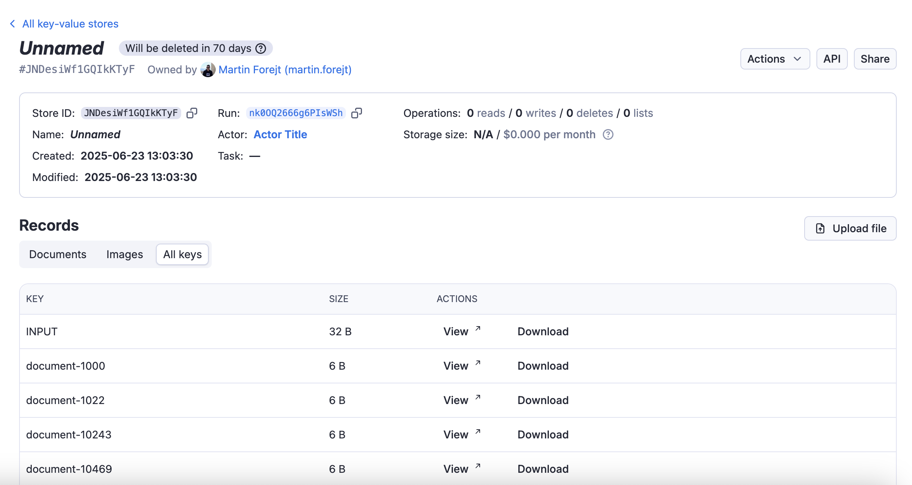

# Key-value Store Schema Specification

**Learn how to define and present your key-value store schema to organize records into collections.**

---

The key‑value store schema organizes keys into logical groups called collections, which can be used to filter and categorize data both in the API and the visual user interface. This organization helps users navigate and find specific data more efficiently, while schema‑defined rules (such as content types and JSON schema) ensure that stored values remain consistent and valid.

## Example

Consider an example Actor that calls `Actor.setValue()` to save a record into the key-value store:

```javascript title="main.js"
import { Actor } from 'apify';
// Initialize the JavaScript SDK
await Actor.init();

/**
 * Actor code
 */
await Actor.setValue('document-1', 'my text data', { contentType: 'text/plain' });

// ...

await Actor.setValue(`image-${imageID}`, imageBuffer, { contentType: 'image/jpeg' });

// Exit successfully
await Actor.exit();
```

To configure the key-value store schema, use the following template for the `.actor/actor.json` configuration:

```json title=".actor/actor.json"
{
    "actorSpecification": 1,
    "name": "Actor Name",
    "title": "Actor Title",
    "version": "1.0.0",
    "storages": {
        "keyValueStore": {
            "actorKeyValueStoreSchemaVersion": 1,
            "title": "Key-Value Store Schema",
            "collections": {
                "documents": {
                    "title": "Documents",
                    "description": "Text documents stored by the Actor.",
                    "keyPrefix": "document-"
                },
                "images": {
                    "title": "Images",
                    "description": "Images stored by the Actor.",
                    "keyPrefix": "image-",
                    "contentTypes": ["image/jpeg"]
                }
            }
        }
    }
}
```

The template above defines the configuration for the default key-value store.
Each collection can define its member keys using one of the following properties:

- `keyPrefix` - All keys starting with the specified prefix will be included in the collection (e.g., all keys starting with "document-").
- `key` - A specific individual key that will be included in the collection.

You must use either `key` or `keyPrefix` for each collection, but not both.

Once the schema is defined, tabs for each collection will appear in the **Storage** tab of the Actor's run:


The tabs also appear in the storage detail view:



### API Example

With the key-value store schema defined, you can use the API to list keys from a specific collection by using the `collection` query parameter when calling the [Get list of keys](https://docs.apify.com/api/v2/key-value-store-keys-get) endpoint:

```http title="Get list of keys from a collection"
GET https://api.apify.com/v2/key-value-stores/{storeId}/keys?collection=documents
```

Example response:

```json
{
  "data": {
    "items": [
      {
        "key": "document-1",
        "size": 254
      },
      {
        "key": "document-2",
        "size": 368
      }
    ],
    "count": 2,
    "limit": 1000,
    "exclusiveStartKey": null,
    "isTruncated": false
  }
}
```

You can also filter by key prefix using the `prefix` parameter:

```http title="Get list of keys with prefix"
GET https://api.apify.com/v2/key-value-stores/{storeId}/keys?prefix=document-
```

### Schema Validation

When you define a key-value store schema with specific `contentTypes` for collections, the Apify platform validates any data being stored against these specifications. For example, if you've specified that a collection should only contain JSON data with content type `application/json`, attempts to store data with other content types in that collection will be rejected.

The validation happens automatically when you call `Actor.setValue()` or use the [Put record](https://docs.apify.com/api/v2/reference/key-value-stores/record/put-record) API endpoint.

If you've defined a `jsonSchema` for a collection with content type `application/json`, the platform will also validate that the JSON data conforms to the specified schema. This helps ensure data consistency and prevents storing malformed data.

## Structure

Output configuration files need to be located in the `.actor` folder within the Actor's root directory.

You have two choices of how to organize files within the `.actor` folder.

### Single configuration file

```json title=".actor/actor.json"
{
    "actorSpecification": 1,
    "name": "this-is-book-library-scraper",
    "title": "Book Library scraper",
    "version": "1.0.0",
    "storages": {
        "keyValueStore": {
            "actorKeyValueStoreSchemaVersion": 1,
            "title": "Key-Value Store Schema",
            "collections": { /* Define your collections here */ }
        }
    }
}
```

### Separate configuration files

```json title=".actor/actor.json"
{
    "actorSpecification": 1,
    "name": "this-is-book-library-scraper",
    "title": "Book Library scraper",
    "version": "1.0.0",
    "storages": {
        "keyValueStore": "./key_value_store_schema.json"
    }
}
```

```json title=".actor/key_value_store_schema.json"
{
    "actorKeyValueStoreSchemaVersion": 1,
    "title": "Key-Value Store Schema",
    "collections": { /* Define your collections here */ }
}
```

Choose the method that best suits your configuration.

## Key-value store schema structure definitions

The key-value store schema defines the collections of keys and their properties. It allows you to organize and validate data stored by the Actor, making it easier to manage and retrieve specific records.

### Key-value store schema object definition

| Property                          | Type                          | Required | Description                                                                                                     |
|-----------------------------------|-------------------------------|----------|-----------------------------------------------------------------------------------------------------------------|
| `actorKeyValueStoreSchemaVersion` | integer                       | true     | Specifies the version of key-value store schema structure document. <br/>Currently only version 1 is available. |
| `title`                           | string                        | true     | Title of the schema                                                               |
| `description`                     | string                        | false    | Description of the schema                                                         |
| `collections`                     | Object                        | true     | An object where each key is a collection ID and its value is a collection definition object (see below).        |

### Collection object definition

| Property       | Type         | Required     | Description                                                                                                                                     |
|----------------|--------------|--------------|-------------------------------------------------------------------------------------------------------------------------------------------------|
| `title`        | string       | true         | The collection’s title, shown in the run's storage tab and in the storage detail view, where it appears as a tab for filtering records.    |
| `description`  | string       | false        | A description of the collection that appears in UI tooltips.  |
| `key`          | string       | conditional* | Defines a single specific key that will be part of this collection.                                                                             |
| `keyPrefix`    | string       | conditional* | Defines a prefix for keys that should be included in this collection.                                                                           |
| `contentTypes` | string array | false        | Allowed content types for records in this collection. Used for validation when storing data.                                                    |
| `jsonSchema`   | object       | false        | For collections with content type `application/json`, you can define a JSON schema to validate structure. <br/>Uses JSON Schema Draft 07 format. |

\* Either `key` or `keyPrefix` must be specified for each collection, but not both.
