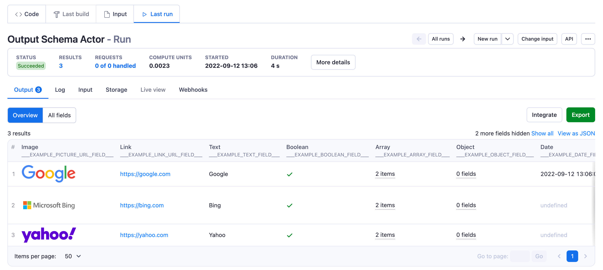

**Output schema is designed to help Actor developers present the results to users in an attractive and comprehensive output UI.**

---

 It is recommended to show the most important fields in a curated Overview visualization configured using output schema specification, while all available fields are automatically available in the “All fields” view.

In the future, output schema will also help with strict output data format validation, which will make integrations more solid and easier to set up.

## Specification version 1

An actor's output schema defines the structure and both API and visual representation of data produced by an actor. Output configuration files have to be located in the `.actor` folder in the actor's root directory.

## How to organize files in the .actor folder: two options

**A)** all config options are being set in a **.actor/actor.json** file, e.g.:

```json
//file: .actor/actor.json
{
    "actorSpecification": 1,
    "name": "this-is-book-library-scraper",
    "title": "Book Library scraper",
    "version": "1.0.0",
    "storages": {
        "dataset": {
            "actorSpecification": 1,
            "fields": {},
            "views": {
                "overview": {
                    "title": "Overview",
                    "transformation": {},
                    "display": {}
                }
            }
        }
    }
}
```

**B)** **.actor/actor.json** links to other sub-config files in the same folder, e.g.:

```json
//file: .actor/actor.json
{
    "actorSpecification": 1,
    "name": "this-is-book-library-scraper",
    "title": "Book Library scraper",
    "version": "1.0.0",
    "storages": {
        "dataset": "./dataset_schema.json"
    }
}
```

```json
//file: .actor/dataset_schema.json
{
    "actorSpecification": 1,
    "fields": {},
    "views": {
        "overview": {
            "title": "Overview",
            "transformation": {},
            "display": {}
        }
    }
}
```

Both options are valid. The user can choose based on their own needs.

## Basic Template

Imagine there is an actor that calls `Actor.pushData()` to store data into dataset e.g.

```json
//file: main.js
import { Actor } from 'apify';
// Initialize the Apify SDK
await Actor.init();

/**
 * Actor code
 */
await Actor.pushData({
    "___EXAMPLE_NUMERIC_FIELD___": 10,
    "___EXAMPLE_PICTURE_URL_FIELD___": "https://www.google.com/images/branding/googlelogo/2x/googlelogo_color_92x30dp.png",
    "___EXAMPLE_LINK_URL_FIELD___": "https://google.com",
    "___EXAMPLE_TEXT_FIELD___": "Google",
    "___EXAMPLE_BOOLEAN_FIELD___": true,
    "___EXAMPLE_DATE_FIELD___": new Date(),
    "___EXAMPLE_ARRAY_FIELD___": ['#hello', "#world"],
    "___EXAMPLE_OBJECT_FIELD___": {},
})

// Exit successfully
await Actor.exit();
```

Let’s say we are going to use a single file to set up an actor’s output tab UI. The following template can be used as a `.actor/actor.json` configuration.

```json
//file: .actor/actor.json
{
    "actorSpecification": 1,
    "name": "___ENTER_ACTOR_NAME____",
    "title": "___ENTER_ACTOR_TITLE____",
    "version": "1.0.0",
    "storages": {
        "dataset": {
            "actorSpecification": 1,
            "views": {
                "overview": {
                    "title": "Overview",
                    "transformation": {
                        "fields": [
                            "___EXAMPLE_PICTURE_URL_FIELD___",
                            "___EXAMPLE_LINK_URL_FIELD___",
                            "___EXAMPLE_TEXT_FIELD___",
                            "___EXAMPLE_BOOLEAN_FIELD___",
                            "___EXAMPLE_ARRAY_FIELD___",
                            "___EXAMPLE_OBJECT_FIELD___",
                            "___EXAMPLE_DATE_FIELD___",
                            "___EXAMPLE_NUMERIC_FIELD___"
                        ]
                    },
                    "display": {
                        "component": "table",
                        "properties": {
                            "___EXAMPLE_PICTURE_URL_FIELD___": {
                                "label": "Image",
                                "format": "image"
                            },
                            "___EXAMPLE_LINK_URL_FIELD___": {
                                "label": "Link",
                                "format": "link"
                            },
                            "___EXAMPLE_TEXT_FIELD___": {
                                "label": "Text",
                                "format": "text"
                            },
                            "___EXAMPLE_BOOLEAN_FIELD___": {
                                "label": "Boolean",
                                "format": "boolean"
                            },
                            "___EXAMPLE_ARRAY_FIELD___": {
                                "label": "Array",
                                "format": "array"
                            },
                            "___EXAMPLE_OBJECT_FIELD___": {
                                "label": "Object",
                                "format": "object"
                            },
                            "___EXAMPLE_DATE_FIELD___": {
                                "label": "Date",
                                "format": "date"
                            },
                            "___EXAMPLE_NUMERIC_FIELD___": {
                                "label": "Number",
                                "format": "number"
                            }
                        }
                    }
                }
            }
        }
    }
}
```

The template above defines the configuration for the default dataset output view. Under the **views** property, there is one view with the title **Overview**. The view configuration consists of two basic steps: 1) set up how to fetch the data, aka **transformation,** and 2) set up how to **display** the data fetched in step 1). The default behaviour is that the Output tab UI table will display **all the fields** from `transformation.fields` **in that same order**. So, theoretically, there should be no need to set up `[**display.properties**](http://display.properties)` at all. However, it can be customized in case it is visually worth setting up some specific display format or column labels. The customization is carried out by using one of the `transformation.fields` names inside `display.properties` and overriding either the label or the format, as demonstrated in the basic template above.

A 2-step configuration (transform & display) was implemented to provide a way to fetch data in the format presented in both API and UI consistently. Consistency between API data and UI data is crucial for actor end-users for them to experience the same results in both API and UI. Thus for the best end-user experience, we recommend overriding as few display properties as possible.

Example of an actor output UI generated using basic template:


## Example with inline comments

```json
//file: .actor/actor.json
{
    "actorSpecification": 1,                //mandatory
    "name": "this-is-book-library-scraper", //mandatory, unique name of an actor
    "title": "Book Library scraper",        //mandatory, the human readable name of an actor
    "version": "1.0.0",                     //mandatory
    "storages": {                           //mandatory
        "dataset": {                        //mandatory
            "actorSpecification": 1,        //mandatory
            "fields": {},                   //mandatory, but it can be an empty object for now
            "views": {                      //mandatory
                "overview": {               //mandatory, but it does not have to be "overview", one can choose any name, multiple views are possible within views object
                    "title": "Overview",    //mandatory, one can choose any other title
                    "transformation": {     //mandatory
                        "fields": [         //mandatory, fields property supports basic JSONPath selectors
                            "isbn",         //important, an order of fields in this array matches the order of columns in visualisation UI
                            "picture",
                            "title",
                            "buyOnlineUrl",
                            "author",
                            "longBookDescription",
                            "anObjectWithDeepStructure.pageCount",
                            "anObjectWithDeepStructure.buyOnlineUrl",
                            "anObjectWithDeepStructure.isRead",
                            "anObjectWithDeepStructure.lastReadTime",
                            "anArray",
                            "anObject"
                        ],
                        "flatten": [        //optional, flattened objects are easily available for as display.properties keys
                            "anObjectWithDeepStructure"
                        ]
                    },
                    "display": {                      //mandatory
                        "component": "table",         //mandatory
                        "properties": {               //mandatory
                            "isbn": {                 //optional, use transformation.fields values there as keys
                                "label": "ISBN",      //optional, define "label" only in case you would like to overide the basic field name capitalisation in table UI
                                // "format": "text"   //optional, "text" format is default, use only in case you would like to overide the default format settings
                            },
                            "picture": {
                                "label": "Cover",
                                "format": "image"     //optional, in this case the format is overriden to show "image" instead of image link "text". "image" format only works with .jpeg, .png or other image format urls.
                            },
                            // "title": {             //does not have to be specified, default behaviour will show the field correctly
                            //    "label": "Title",
                            //    "format": "text"
                            // },
                            "buyOnlineUrl": {
                                "label": "URL",
                                "format": "link"
                            },
                            // "author": {
                            //     "label": "Author",
                            //     "format": "text"
                            // },
                            "longBookDescription": {
                                "label": "Description"
                            },
                            "anObjectWithDeepStructure.pageCount": {   //use "." for sub-keys of flattened objects
                                "label": "# pages",
                                "format": "number"
                            },
                            "anObjectWithDeepStructure.isRead": {
                                "label": "Have been read?",
                                "format": "boolean"
                            },
                            "anObjectWithDeepStructure.lastReadTime": {
                                "label": "Last read time",
                                "format": "date"
                            },
                            "anObjectExample": {
                                "label": "Some Object"
                            },
                            "anArrayExample": {
                                "label": "Some Array"
                            }
                        }
                    }
                }
            }
        }
    }
}
```

### Nested structures

The most frequently used data formats present the data in a tabular format (Output tab table, Excel, CSV). In case an actor produces nested JSON structures, there is a need to transform the nested data into a flat tabular format. There are three ways to flatten the data:

**1)** use `transformation.flatten` to flatten the nested structure of specified fields. Flatten transforms the nested object into a flat structure. e.g. with `flatten:[”foo”]`, the object `{”foo”:{”bar”:”hello”}}` is turned into `{’foo.bar”:”hello”}`. Once the structure is flattened, it is necessary to use the flattened property name in both `transformation.fields` and [`display.properties`](http://display.properties), otherwise, fields might not be fetched or configured properly in the UI visualization.
**2)** use `transformation.unwind` to deconstruct the nested children into parent objects.
**3)** change the output structure in an actor from nested to flat before the results are saved in the dataset.

## Dataset schema structure definitions

### DatasetSchema object definition

| Property           | Type                         | Required | Description                                                                                        |
| ------------------ | ---------------------------- | -------- | -------------------------------------------------------------------------------------------------- |
| actorSpecification | integer                      | true     | Specifies the version of dataset schema <br/>structure document. <br/>Currently only version 1 is available. |
| fields             | JSONSchema compatible object | true     | Schema of one dataset object. <br/>Use JsonSchema Draft 2020-12 or <br/>other compatible formats.             |
| views              | DatasetView object           | true     | An object with a description of an API <br/>and UI views.                                                  |

### DatasetView object definition

| Property       | Type                      | Required | Description                                                                                           |
| -------------- | ------------------------- | -------- | ----------------------------------------------------------------------------------------------------- |
| title          | string                    | true     | The title is visible in UI in the Output tab <br/>as well as in the API.                                       |
| description    | string                    | false    | The description is only available in the API response. <br/>The usage of this field is optional.                       |
| transformation | ViewTransformation object | true     | The definition of data transformation <br/>is applied when dataset data are loaded from <br/>Dataset API. |
| display        | ViewDisplay object        | true     | The definition of Output tab UI visualization.                                                        |

### ViewTransformation object definition

| Property | Type     | Required | Description                                                                                                                                                                                                         |
| -------- | -------- | -------- | ------------------------------------------------------------------------------------------------------------------------------------------------------------------------------------------------------------------- |
| fields   | string[] | true     | Selects fields that are going to be presented in the output. <br/>The order of fields matches the order of columns <br/>in visualization UI. In case the fields value <br/>is missing, it will be presented as “undefined” in the UI. |
| unwind   | string   | false    | Deconstructs nested children into parent object, <br/>e.g.: with unwind:[”foo”], the object `{”foo”:{”bar”:”hello”}}`  <br/> is turned into `{’bar”:”hello”}`.                                                                     |
| flatten  | string[] | false    | Transforms nested object into flat structure. <br/>eg: with flatten:[”foo”] the object `{”foo”:{”bar”:”hello”}}` <br/> is turned into `{’foo.bar”:”hello”}`.                                                                    |
| omit     | string   | false    | Removes the specified fields from the output. <br/>Nested fields names can be used there as well.                                                                                                                           |
| limit    | integer  | false    | The maximum number of results returned. <br/>Default is all results.                                                                                                                                                         |
| desc     | boolean  | false    | By default, results are sorted in ascending based <br/>on the write event into the dataset. desc:true param <br/>will return the newest writes to the dataset first.                                                                      |

### ViewDisplay object definition

| Property   | Type                                                                                                               | Required | Description                                                                                                                  |
| ---------- | ------------------------------------------------------------------------------------------------------------------ | -------- | ---------------------------------------------------------------------------------------------------------------------------- |
| component  | string                                                                                                             | true     | Only component “table” is available.                                                                                         |
| properties |  Object | false    | Object with keys matching the `transformation.fields` <br/> and ViewDisplayProperty as values. In case properties are not set <br/>the table will be rendered automatically with fields formatted as Strings, <br/>Arrays or Objects. |

### ViewDisplayProperty object definition

| Property | Type                                                    | Required | Description                                                                                    |
| -------- | ------------------------------------------------------- | -------- | ---------------------------------------------------------------------------------------------- |
| label    | string                                                  | false    | In case the data are visualized as in Table view. <br/>The label will be visible table column’s header. |
| format   | enum(text, number, date, link, <br/>boolean, image, array, object) | false    | Describes how output data values are formatted <br/>in order to be rendered in the output tab UI.       |
