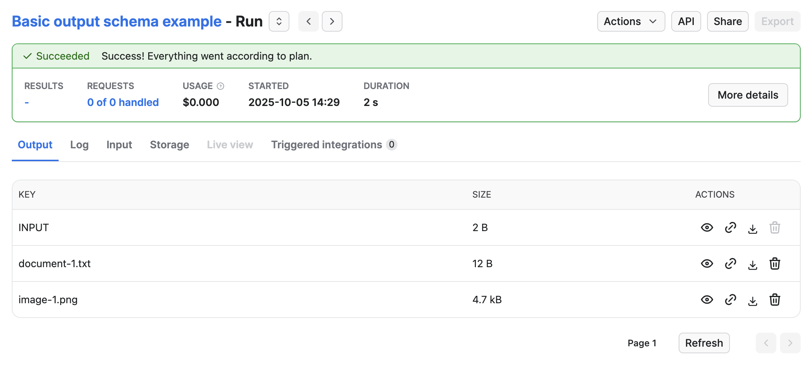
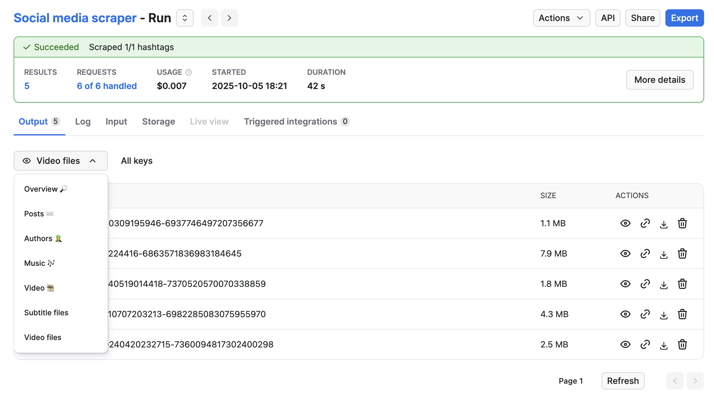
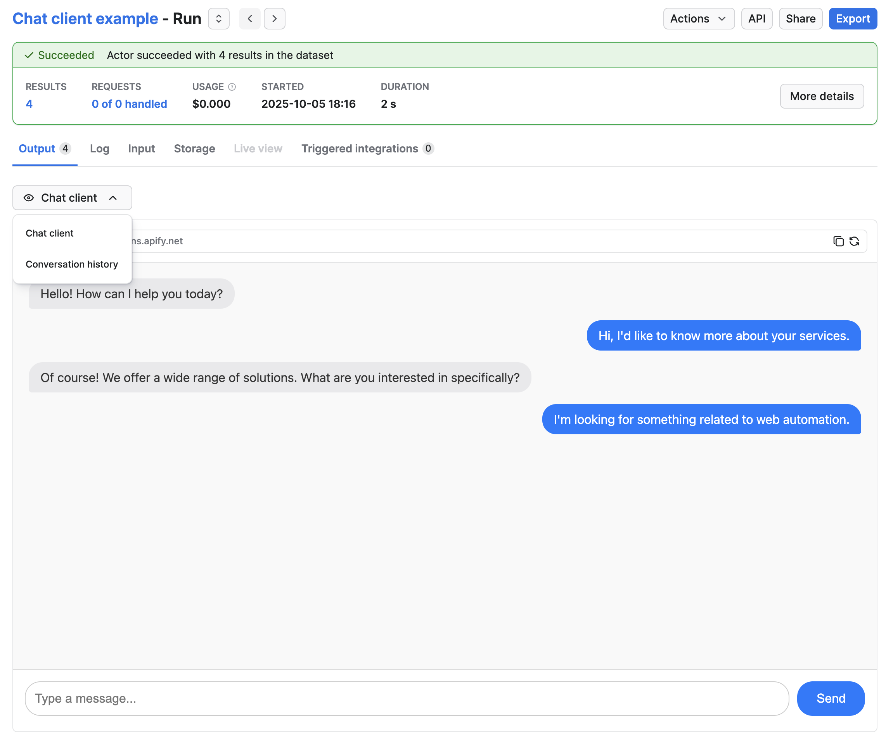

**Quick start your output schema definition with example solutions.**

---

The output schema's `template` property support various Actor types. The following examples show common use cases:

## Basic example of output schema

The following example Actor calls `Actor.setValue()` to save two files to the key-value store:

```javascript title="main.js"
import { Actor } from 'apify';
// Initialize the JavaScript SDK
await Actor.init();

/**
 * Store data in key-value store
 */
await Actor.setValue('document-1.txt', 'my text data', { contentType: 'text/plain' });

await Actor.setValue(`image-1.jpeg`, imageBuffer, { contentType: 'image/jpeg' });

// Exit successfully
await Actor.exit();
```

To specify that the Actor is using output schema, update the `.actor/actor.json` file:

```json title=".actor/actor.json"
{
    "actorSpecification": 1,
    "name": "Actor Name",
    "title": "Actor Title",
    "version": "1.0.0",
    "output": "./output_schema.json"
}
```

Then to specify that output is stored in the key-value store, update `.actor/output_schema.json`:

```json title=".actor/output_schema.json"
{
    "actorOutputSchemaVersion": 1,
    "title": "Output schema of the Actor",
    "properties": {
        "files": {
            "type": "string",
            "title": "Files",
            "template": "{{links.apiDefaultKeyValueStoreUrl}}/keys"
        }
    }
}
```

To show, that the output is stored in the default key-value store, the schema defines a property called `files`.

The `type` of the property must always be a `string` because the value generated from the `template` is a URL string.

The `title` is a human-readable name for the output, shown in the Apify Console.

The `template` uses a variable `{{links.apiDefaultKeyValueStoreUrl}}`, which is replaced with the URL of the default key-value store when the Actor run finishes.

Apify Console uses this configuration to display key-value store data

The **Output** tab will then display the contents of the key-value store:



The `GET Run` API endpoint response will include an `output` property.

```json
"output": {
    "files": "https://api.apify.com/v2/key-value-stores/<key-value-store-id>/keys"
}
```

### Linking dataset views and key-value store collections

This example shows a schema definition for a basic social media scraper. The scraper downloads post data into the dataset, and video and subtitle files into the key-value store.

After you define `views` and `collections` in `dataset_schema.json` and `key_value_store.json`, you can use them in the output schema.

```json title=".actor/output_schema.json"
{
    "actorOutputSchemaVersion": 1,
    "title": "Output schema of Social media scraper",
    "properties": {
        "overview": {
            "type": "string",
            "title": "Overview 🔎",
            "template": "{{links.apiDefaultDatasetUrl}}/items?view=overview"
        },
        "posts": {
            "type": "string",
            "title": "Posts ✉️",
            "template": "{{links.apiDefaultDatasetUrl}}/items?view=posts"
        },
        "author": {
            "type": "string",
            "title": "Authors 🧑‍🎤",
            "template": "{{links.apiDefaultDatasetUrl}}/items?view=author"
        },
        "music": {
            "type": "string",
            "title": "Music 🎶",
            "template": "{{links.apiDefaultDatasetUrl}}/items?view=music"
        },
        "video": {
            "type": "string",
            "title": "Video 🎞️",
            "template": "{{links.apiDefaultDatasetUrl}}/items?view=video"
        },
        "subtitleFiles": {
            "type": "string",
            "title": "Subtitle files",
            "template": "{{links.apiDefaultKeyValueStoreUrl}}/keys?collection=subtitles"
        },
        "videoFiles": {
            "type": "string",
            "title": "Video files",
            "template": "{{links.apiDefaultKeyValueStoreUrl}}/keys?collection=videos"
        }
    }
}
```

The schema above defines five dataset outputs and two key-value store outputs. The dataset outputs link to views, and the key-value store output link to collections, both defined in their respective schema files.

When a user runs the Actor in the Console, the UI will look like this:



### Using container URL to display chat client

In this example, an Actor runs a web server that provides a chat interface to an LLM.
The conversation history is then stored in the dataset.

```json title=".actor/output_schema.json"
{
    "actorOutputSchemaVersion": 1,

    "title": "Chat client output",
    "description": "Chat client provides interactive view to converse with LLM and chat history in dataset",
    "type": "object",

    "properties": {
        "clientUrl": {
            "type": "string",
            "title": "Chat client",
            "template": "{{run.containerUrl}}"
        },
        "chatHistory": {
            "type": "string",
            "title": "Conversation history",
            "template": "{{links.apiDefaultDatasetUrl}}/items"
        }
    }
}
```

In the schema above we have two outputs.
The `clientUrl` output will return a link to the web server running inside the run.
The `chatHistory` links to the default dataset and contains the history of the whole conversation, with each message as a separate item.

When the run in the Console, the user will then see this:



### Custom HTML as Actor run output

This example shows an output schema of an Actor that runs Cypress tests. When the run finishes, the Actor generates an HTML report and store it in the key-value store. You can link to this file and show it as an output:

```json title=".actor/output_schema.json"
{
    "actorOutputSchemaVersion": 1,

    "title": "Cypress test report output",
    "description": "Test report from Cypress",
    "type": "object",

    "properties": {
        "reportUrl": {
            "type": "string",
            "title": "HTML Report",
            "template": "{{links.apiDefaultKeyValueStoreUrl}}/records/report.html"
        }
    }
}
```

The `reportUrl` in this case links directly to the key-value store record stored in the default key-value store.

When the run finishes, Apify Console displays the HTML report in an iframe:


### Actor with no output

If your Actor produces no output (for example, an integration Actor that performs an action), users might see the empty **Output** tab and think the Actor failed. To avoid this, specify that the Actor produces no output.

You can specify that the Actor produces no output and define an output schema with no properties:

```json title=".actor/output_schema.json"
{
    "actorOutputSchemaVersion": 1,

    "title": "Send mail output",
    "description": "Send mail Actor does not generate any output.",
    "type": "object",
    "properties": {}
}
```

When the output schema contains no properties, Apify Console displays the **Log** tab instead of the **Output** tab.
