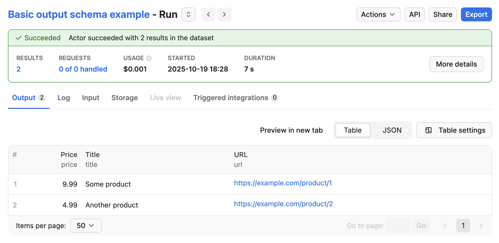
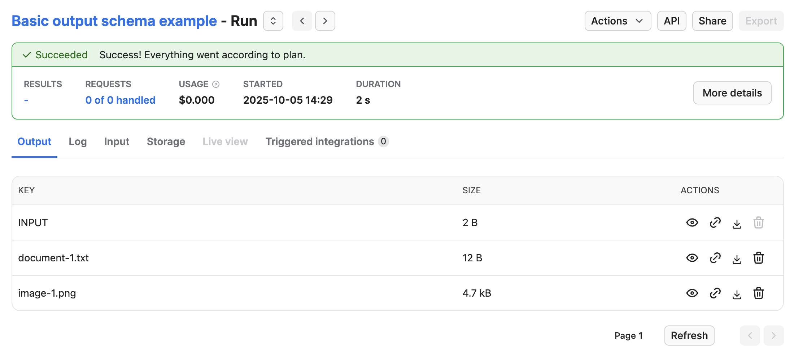
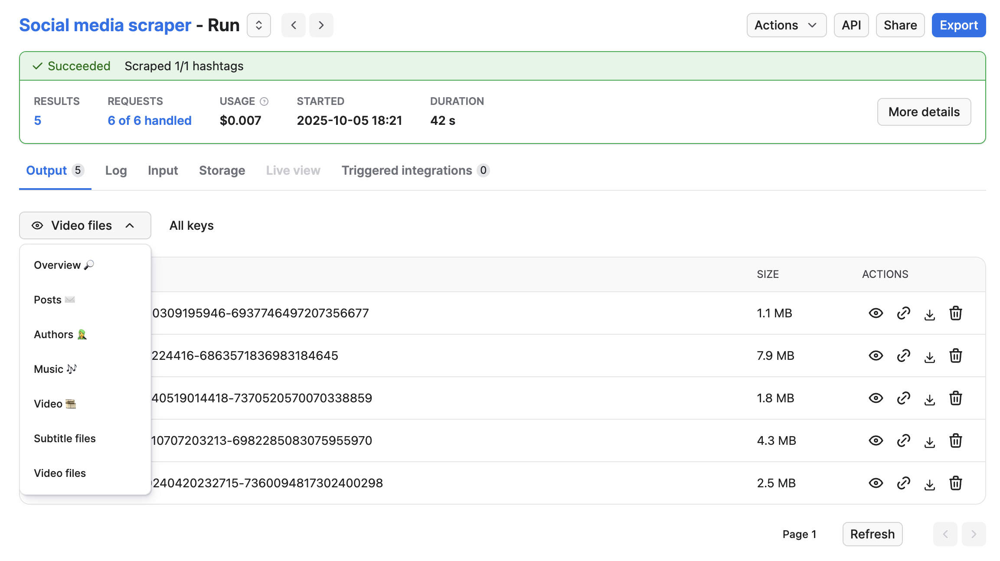
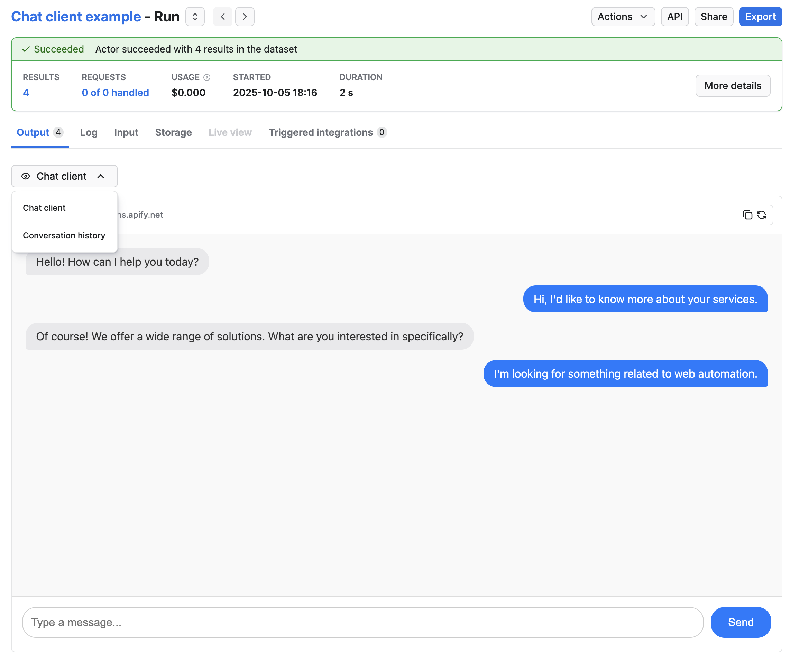
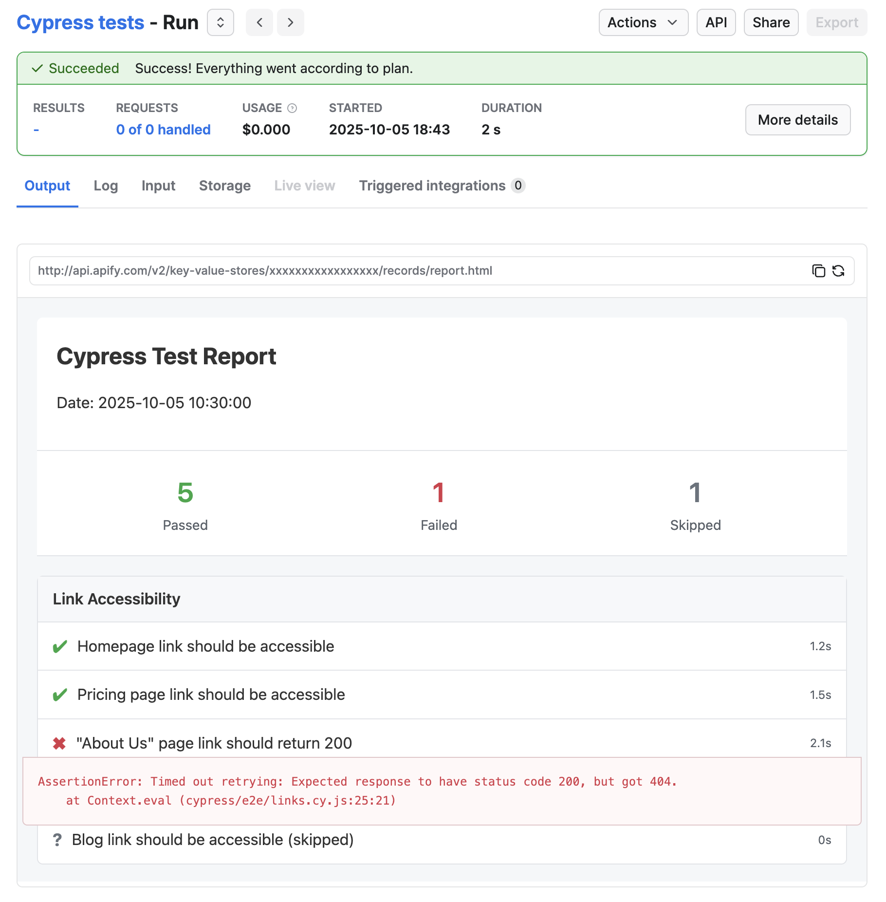

**Learn how to define and present the output of your Actor.**

---

The Actor output schema builds upon the schemas for the [dataset](/platform/actors/development/actor-definition/dataset-schema) and [key-value store](/platform/actors/development/actor-definition/key-value-store-schema). It specifies where an Actor stores its output and defines templates for accessing that output. Apify Console uses these output definitions to display run results, and the Actor run's `GET` endpoint includes them in the output property.

## Structure

Place the output configuration files in the `.actor` folder in the Actor's root directory.

You can organize the files using one of these structures:

### Single configuration file

```json title=".actor/actor.json"
{
    "actorSpecification": 1,
    "name": "files-scraper",
    "title": "Files scraper",
    "version": "1.0.0",
    "output": {
        "actorOutputSchemaVersion": 1,
        "title": "Output schema of the files scraper",
        "properties": { /* define your outputs here */ }
    }
}
```

### Separate configuration files

```json title=".actor/actor.json"
{
    "actorSpecification": 1,
    "name": "files-scraper",
    "title": "Files scraper",
    "version": "1.0.0",
    "output": "./output_schema.json"
}
```

```json title=".actor/output_schema.json"
{
    "actorOutputSchemaVersion": 1,
    "title": "Output schema of the files scraper",
    "properties": { /* define your outputs here */ }
}
```

## Definitions

The output schema defines the collections of keys and their properties. It allows you to organize and validate data stored by the Actor, making it easier to manage and retrieve specific records.

### Output schema object definition

| Property                          | Type                          | Required | Description                                                                                                     |
|-----------------------------------|-------------------------------|----------|-----------------------------------------------------------------------------------------------------------------|
| `actorOutputSchemaVersion`        | integer                       | true     | Specifies the version of output schema structure document. <br/>Currently only version 1 is available.          |
| `title`                           | string                        | true     | Title of the schema                                                                                             |
| `description`                     | string                        | false    | Description of the schema                                                                                       |
| `properties`                      | Object                        | true     | An object where each key is an output ID and its value is an Output object definition (see below).              |

### Output object definition

| Property       | Type         | Required     | Description                                                                                                                                     |
|----------------|--------------|--------------|-------------------------------------------------------------------------------------------------------------------------------------------------|
| `title`        | string       | true         | The output's title, shown in the run's output tab if there are multiple outputs and in API as key for the generated output URL.                 |
| `description`  | string       | false        | A description of the output. Only used when reading the schema (useful for LLMs)                                                                |
| `template`     | string       | true         | Defines a template which will be translated into output URL. The template can use variables (see below)                                         |

### Available template variables

| Variable                           | Type   | Description                                                                                                                      |
|------------------------------------|--------|----------------------------------------------------------------------------------------------------------------------------------|
| `links`                            | object | Contains quick links to most commonly used URLs                                                                                  |
| `links.publicRunUrl`               | string | Public run url in format `https://console.apify.com/view/runs/:runId`                                                            |
| `links.consoleRunUrl`              | string | Console run url in format `https://console.apify.com/actors/runs/:runId`                                                         |
| `links.apiRunUrl`                  | string | API run url in format `https://api.apify.com/v2/actor-runs/:runId`                                                               |
| `links.apiDefaultDatasetUrl`       | string | API url of default dataset in format `https://api.apify.com/v2/datasets/:defaultDatasetId`                                       |
| `links.apiDefaultKeyValueStoreUrl` | string | API url of default key-value store in format `https://api.apify.com/v2/key-value-stores/:defaultKeyValueStoreId`                 |
| `run`                              | object | Contains information about the run same as it is returned from the `GET Run` API endpoint                                        |
| `run.containerUrl`                 | string | URL of a webserver running inside the run in format `https://<containerId>.runs.apify.net/`                                      |
| `run.defaultDatasetId`             | string | ID of the default dataset                                                                                                        |
| `run.defaultKeyValueStoreId`       | string | ID of the default key-value store                                                                                                |

## Examples

### Linking default dataset

The following example Actor calls `Actor.pushData()` to store results in the default dataset:

```javascript title="main.js"
import { Actor } from 'apify';
// Initialize the JavaScript SDK
await Actor.init();

/**
 * Store data in default dataset
 */
await Actor.pushData({ title: 'Some product', url: 'https://example.com/product/1', price: 9.99 });
await Actor.pushData({ title: 'Another product', url: 'https://example.com/product/2', price: 4.99 });

// Exit successfully
await Actor.exit();
```

To specify that the Actor is using output schema, update the `.actor/actor.json` file:

```json title=".actor/actor.json"
{
    "actorSpecification": 1,
    "name": "Actor Name",
    "title": "Actor Title",
    "version": "1.0.0",
    "output": "./output_schema.json"
}
```

Then to specify that output is stored in the default dataset, create `.actor/output_schema.json`:

```json title=".actor/output_schema.json"
{
    "actorOutputSchemaVersion": 1,
    "title": "Output schema of the Actor",
    "properties": {
        "results": {
            "type": "string",
            "title": "Results",
            "template": "{{links.apiDefaultDatasetUrl}}/items"
        }
    }
}
```

To show that the output is stored in the default dataset, the schema defines a property called `results`.

The `title` is a human-readable name for the output, shown in the Apify Console.

The `template` uses a variable `{{links.apiDefaultDatasetUrl}}`, which is replaced with the URL of the default dataset when the Actor run finishes.

Apify Console uses this configuration to display dataset data.

The **Output** tab will then display the contents of the dataset:



The `GET Run` API endpoint response will include an `output` property.

```json
"output": {
    "results": "https://api.apify.com/v2/datasets/<dataset-id>/items"
}
```

### Linking to key-value store

Similar to the example of linking to default dataset, the following example Actor calls `Actor.setValue()` to store files in the default key-value store:

```javascript title="main.js"
import { Actor } from 'apify';
// Initialize the JavaScript SDK
await Actor.init();

/**
 * Store data in key-value store
 */
await Actor.setValue('document-1.txt', 'my text data', { contentType: 'text/plain' });
await Actor.setValue(`image-1.jpeg`, imageBuffer, { contentType: 'image/jpeg' });

// Exit successfully
await Actor.exit();
```

To specify that the Actor is using output schema, update the `.actor/actor.json` file:

```json title=".actor/actor.json"
{
    "actorSpecification": 1,
    "name": "Actor Name",
    "title": "Actor Title",
    "version": "1.0.0",
    "output": "./output_schema.json"
}
```

Then to specify that output is stored in the key-value store, update `.actor/output_schema.json`:

```json title=".actor/output_schema.json"
{
    "actorOutputSchemaVersion": 1,
    "title": "Output schema of the Actor",
    "properties": {
        "files": {
            "type": "string",
            "title": "Files",
            "template": "{{links.apiDefaultKeyValueStoreUrl}}/keys"
        }
    }
}
```

To show that the output is stored in the default key-value store, the schema defines a property called `files`.

The `template` uses a variable `{{links.apiDefaultKeyValueStoreUrl}}`, which is replaced with the URL of the default key-value store API endpoints when the Actor run finishes.

Apify Console uses this configuration to display key-value store data.

The **Output** tab will then display the contents of the key-value store:



The `GET Run` API endpoint response will include an `output` property.

```json
"output": {
    "files": "https://api.apify.com/v2/key-value-stores/<key-value-store-id>/keys"
}
```

### Linking dataset views and key-value store collections

This example shows a schema definition for a basic social media scraper. The scraper downloads post data into the dataset, and video and subtitle files into the key-value store.

After you define `views` and `collections` in `dataset_schema.json` and `key_value_store.json`, you can use them in the output schema.

```json title=".actor/output_schema.json"
{
    "actorOutputSchemaVersion": 1,
    "title": "Output schema of Social media scraper",
    "properties": {
        "overview": {
            "type": "string",
            "title": "Results",
            "template": "{{links.apiDefaultDatasetUrl}}/items"
        },
        "subtitleFiles": {
            "type": "string",
            "title": "Subtitle files",
            "template": "{{links.apiDefaultKeyValueStoreUrl}}/keys?collection=subtitles"
        },
        "videoFiles": {
            "type": "string",
            "title": "Video files",
            "template": "{{links.apiDefaultKeyValueStoreUrl}}/keys?collection=videos"
        }
    }
}
```

The schema above defines one dataset output and two key-value store outputs. The dataset output links to the entire dataset. In Apify Console, this displays as a table with a selector that lets users switch between views defined in the dataset schema. The key-value store outputs link to collections defined in
the key-value store schema.

If you add a `view` parameter to the dataset URL template, users still see the entire dataset in the Apify Console, but the specified view is selected by default.

When a user runs the Actor in the Console, the UI will look like this:



### Using container URL to display chat client

In this example, an Actor runs a web server that provides a chat interface to an LLM.
The conversation history is then stored in the dataset.

```json title=".actor/output_schema.json"
{
    "actorOutputSchemaVersion": 1,

    "title": "Chat client output",
    "description": "Chat client provides interactive view to converse with LLM and chat history in dataset",
    "type": "object",

    "properties": {
        "clientUrl": {
            "type": "string",
            "title": "Chat client",
            "template": "{{run.containerUrl}}"
        },
        "chatHistory": {
            "type": "string",
            "title": "Conversation history",
            "template": "{{links.apiDefaultDatasetUrl}}/items"
        }
    }
}
```

In the schema above we have two outputs.
The `clientUrl` output will return a link to the web server running inside the run.
The `chatHistory` links to the default dataset and contains the history of the whole conversation, with each message as a separate item.

When the run in the Console, the user will then see this:



### Custom HTML as Actor run output

This example shows an output schema of an Actor that runs Cypress tests. When the run finishes, the Actor generates an HTML report and store it in the key-value store. You can link to this file and show it as an output:

```json title=".actor/output_schema.json"
{
    "actorOutputSchemaVersion": 1,

    "title": "Cypress test report output",
    "description": "Test report from Cypress",
    "type": "object",

    "properties": {
        "reportUrl": {
            "type": "string",
            "title": "HTML Report",
            "template": "{{links.apiDefaultKeyValueStoreUrl}}/records/report.html"
        }
    }
}
```

The `reportUrl` in this case links directly to the key-value store record stored in the default key-value store.

When the run finishes, Apify Console displays the HTML report in an iframe:



### Actor with no output

If your Actor produces no output (for example, an integration Actor that performs an action), users might see the empty **Output** tab and think the Actor failed. To avoid this, specify that the Actor produces no output.

You can specify that the Actor produces no output and define an output schema with no properties:

```json title=".actor/output_schema.json"
{
    "actorOutputSchemaVersion": 1,

    "title": "Send mail output",
    "description": "Send mail Actor does not generate any output.",
    "type": "object",
    "properties": {}
}
```

When the output schema contains no properties, Apify Console displays the **Log** tab instead of the **Output** tab.
