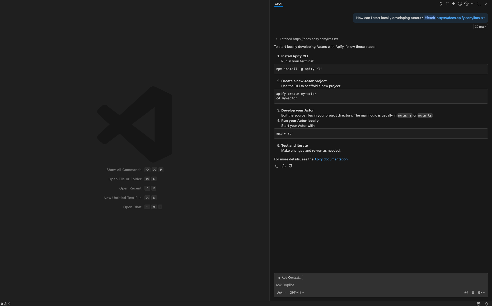
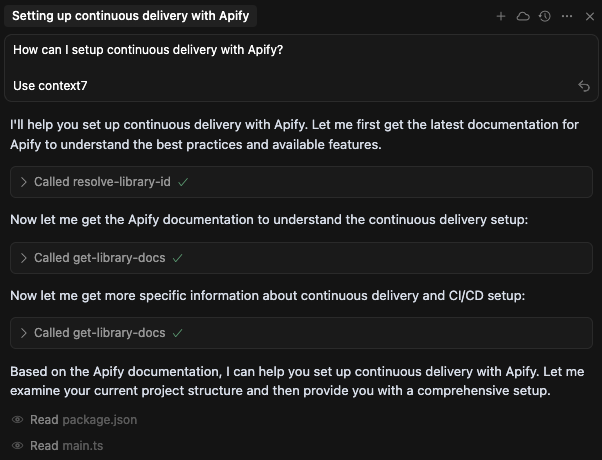

**Set up your environment, choose tools, and build workflows for effective AI assistant coding.**

---

### Documentation for LLMs: llms.txt and llms-full.txt

Search engines weren't built for Large Language Modals (LLMs). But AI needs context. That's why we created `llms.txt` and `llms-full.txt` for our documentation. These files follow the [growing standard](https://llmstxt.org/) for LLMs consumption.

Find them here:

- [llms.txt](/llms.txt)
- [llms-full.txt](/llms-full.txt)

:::info LLMs.txt vs sitemap.xml vs robots.txt

`/sitemap.xml` lists pages but doesn't help with content. LLMs systems still need to parse complex HTML and handle extra info. This clutters the context window.

`/robots.txt` tells crawlers where to go. It doesn't help with content understanding.

`/llms.txt` solves LLMs problems. It overcomes context window limits. It removes markup and scripts. It presents content optimized for LLMs processing.

:::

### Use llms.txt and llms-full.txt

LLMs don't automatically discover llms.txt files. You need to add the link manually. Some tools like Cursor provide settings for this.

#### Cursor

Go to: Settings -> Cursor Settings -> Indexing & Docs -> Add Doc.

Now, you can just provide the link to Apify `llms-full.txt`. 


#### Windsurf

- TODO...

#### Visual Studio Code and Copilot

Open Copilot Chat mode, and add context via `#fetch`:



:::note Copilot and llms.txt / llms-full.txt

Copilot's official documentation doesn't cover llms.txt usage. If something doesn't work, check the official Apify documentation.

:::

#### Ask AI

New to Apify? Ask questions and provide the `llms.txt` link. Popular AI models can search the web. With the right context, you get better answers:


### Use Modal Context Protocol (MCP)

Context is everything with LLMs. You can add `llms.txt` and `llms-full.txt`. But there are limitations, as we mentioned with Copilot. Another way to provide context is through Modal Context Protocol (MCP) and Context7.

#### Context7

Context7 MCP pulls up-to-date documentation and code examples from the source. It places them directly into your prompt. Find more information on the [Context7](https://context7.com/) website.

#### Install Context7

Go to: Settings -> Cursor Settings -> Tools & Integrations -> New MCP Server

Add this configuration to your `mcp.json` file:

```json
{
  "mcpServers": {
    "context7": {
      "url": "https://mcp.context7.com/mcp"
    }
  }
}
```

:::tip Check official guides for other IDEs

Find a guide for your favorite IDE on the [official installation page](https://github.com/upstash/context7?tab=readme-ov-file#%EF%B8%8F-installation).

:::

#### Use Context7

Context7 fetches up-to-date code examples and documentation into your LLM's context.

- Write your prompt naturally
- Tell the LLM to use context7
- Get working code answers



### Add rules

To get the most from AI IDEs, add rules or instructions. 

See how to set up rules for your AI IDEs:

- [Cursor Rules](https://docs.cursor.com/en/context/rules)
- [Windsurf Rules](https://docs.windsurf.com/windsurf/cascade/memories#rules)
- [GitHub Copilot instructions](https://docs.github.com/en/copilot/how-tos/configure-custom-instructions/add-repository-instructions)

#### Apify rules and instructions

Use these rules and instructions for your Actors development:

- [Rules and instructions](./rules_and_instructions.md)

### Best practices

- **Small tasks**: Don't ask AI for many tasks at once. Break complex problems into smaller pieces. Solve them step by step.

- **Iterative approach**: Work iteratively with clear steps. Start with a basic implementation. Improve it based on feedback and testing.

- **Versioning**: Version your changes often using git. This lets you track changes, roll back if needed, and maintain a clear history.

- **Security**: Don't expose API keys, secrets, or sensitive information in your code or conversations with AI assistants.