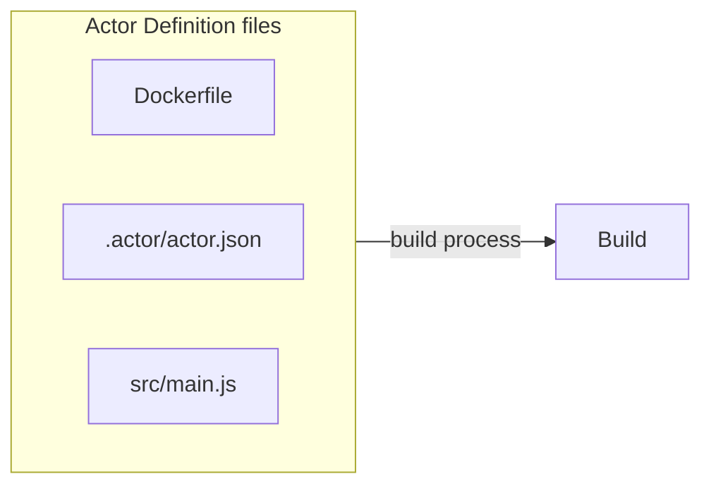
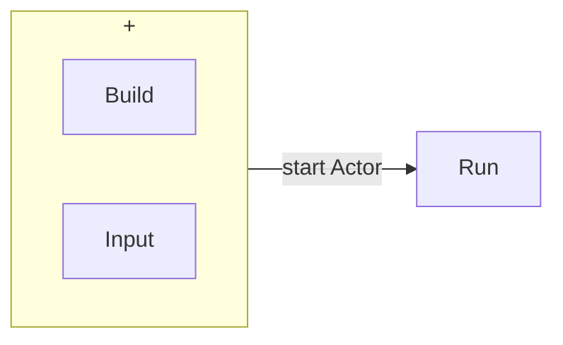
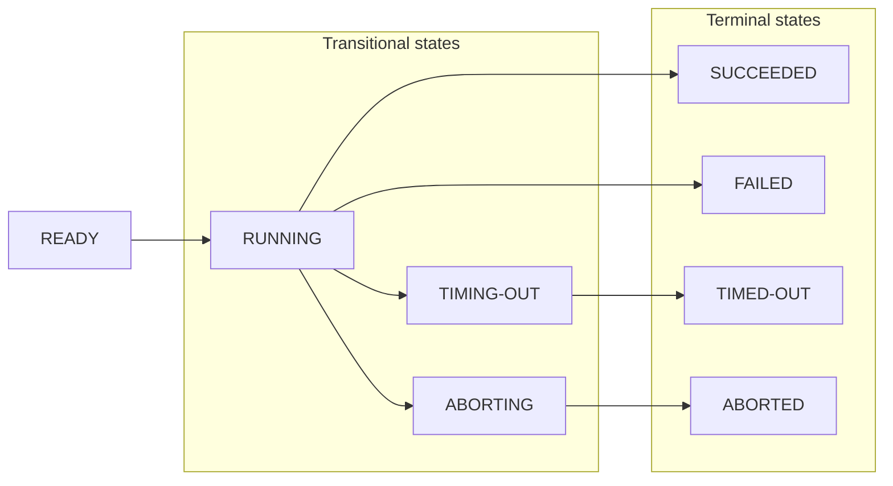

**Learn about Actor builds and runs, their lifecycle, versioning, and other properties.**

---

Actor **builds** and actor **runs** are two main primitives you need to know when your work with the Apify platform. If you take your source code and start building your Actor, you are creating a build. The build is a Docker image containing the source code and required dependencies needed to run the Actor:

If you take your build and start running with some input it then you are creating a run:

## Lifecycle

Actor builds, and runs share their lifecycle. Each build and run starts with the initial status **READY** and goes through one or more transitional statuses to one of the terminal statuses.

---

| Status     | Type         | Description                                 |
|------------|--------------|---------------------------------------------|
| READY      | initial      | Started but not allocated to any worker yet |
| RUNNING    | transitional | Executing on a worker machine               |
| SUCCEEDED  | terminal     | Finished successfully                       |
| FAILED     | terminal     | Run failed                                  |
| TIMING-OUT | transitional | Timing out now                              |
| TIMED-OUT  | terminal     | Timed out                                   |
| ABORTING   | transitional | Being aborted by user                       |
| ABORTED    | terminal     | Aborted by user                             |

  