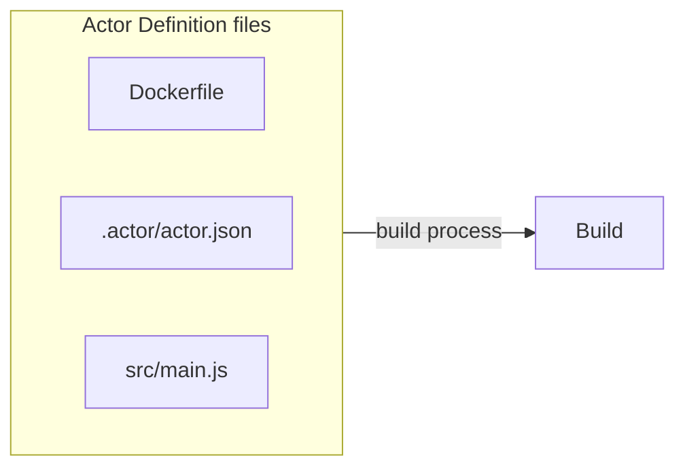
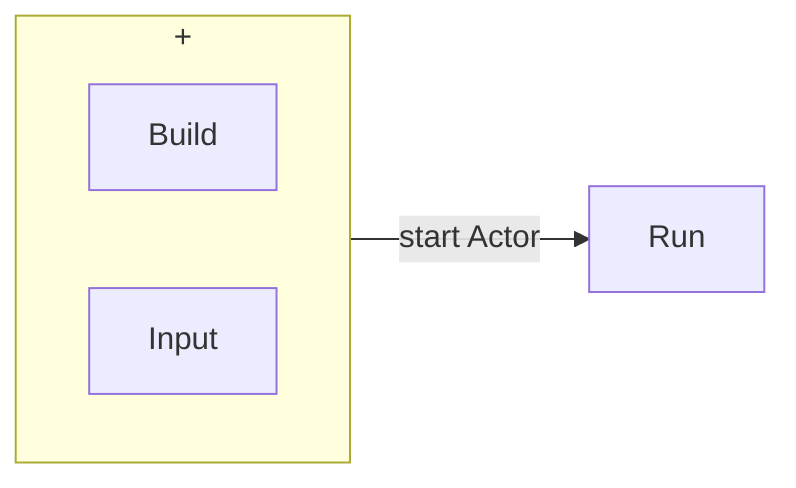
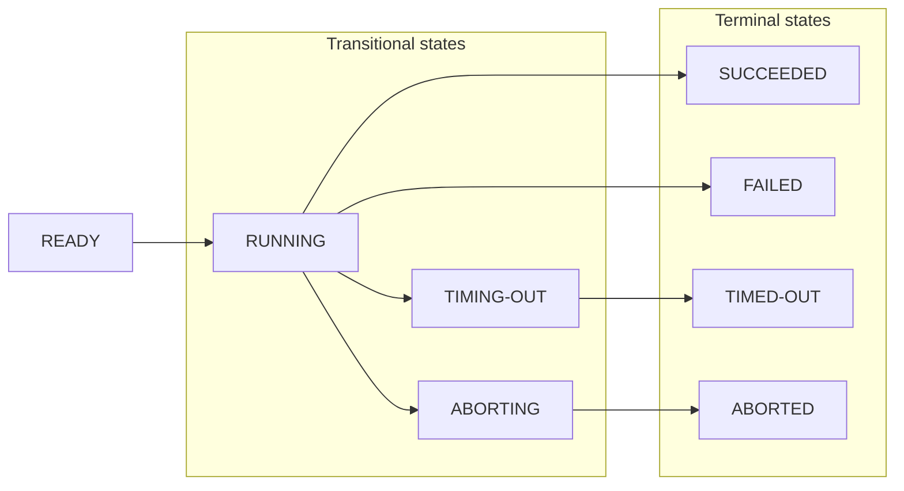

**Learn about Actor builds and runs, their lifecycle, versioning, and other properties.**

---

Actor **builds** and **runs** are fundamental concepts within the Apify platform. Understanding them is crucial for effective use of the platform.

## Building an Actor

When you start the build process for your Actor, you create a _build_. A build is a Docker image containing your source code and the required dependencies needed to run the Actor:

## Running an Actor

To create a _run_, you take your _build_ and start it with some input:

## Lifecycle

Actor builds and runs share a common lifecycle. Each build and run begins with the initial status **READY** and progress through one or more transitional statuses to reach a terminal status.

---

| Status     | Type         | Description                                 |
|------------|--------------|---------------------------------------------|
| READY      | initial      | Started but not allocated to any worker yet |
| RUNNING    | transitional | Executing on a worker machine               |
| SUCCEEDED  | terminal     | Finished successfully                       |
| FAILED     | terminal     | Run failed                                  |
| TIMING-OUT | transitional | Timing out now                              |
| TIMED-OUT  | terminal     | Timed out                                   |
| ABORTING   | transitional | Being aborted by user                       |
| ABORTED    | terminal     | Aborted by user                             |
