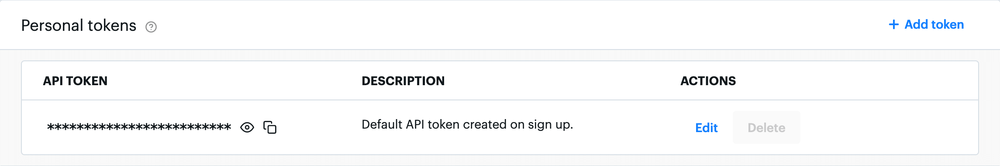
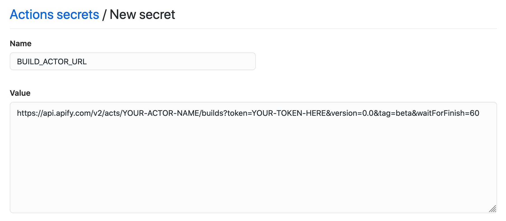
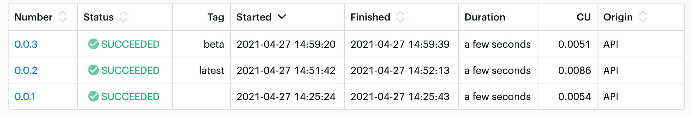

import Tabs from '@theme/Tabs';
import TabItem from '@theme/TabItem';

# Continuous integration for actors

**Learn how to integrate your actors by setting up automated builds, deploys, and testing for your actors using GitHub Actions or Bitbucket Pipelines.**

---

If you have a project consisting of several actors, or even one actor that requires frequent updates, you may want to automate some part of the development process. Instead of manually pushing your code, building each actor, then testing it, you could perform the whole process whenever you run `git push`.

You can automate actor builds and tests using your Git repository's automated workflows like [GitHub Actions](https://github.com/features/actions) or [Bitbucket Pipelines](https://bitbucket.org/product/features/pipelines).

This article will focus on GitHub, but [we also have a guide for Bitbucket](https://help.apify.com/en/articles/1861038-setting-up-continuous-integration-for-apify-actors-on-bitbucket).

## TL;DR

Below is an example GitHub Actions workflow that will run your tests and build your actor every time you push your code to GitHub. This workflow supports both **latest** and **beta** builds. Copy the code into **separate files** in your actor repo's **.github/workflows** directory: e.g. **.github/workflows/latest.yml** and **.github/workflows/beta.yml**.

Each time you push to the **main/master** branch, a new **latest** version of your actor will be built. When you push to **develop**, a **beta** version will be built.

<Tabs groupId="main">
<TabItem value="latest.yml" label="latest.yml">

```yaml
name: Test and build latest version
on:
  push:
    branches:
      - master
      - main
jobs:
  test:
    runs-on: ubuntu-latest
    steps:
      # Install dependencies and run tests
      - uses: actions/checkout@v2
      - run: npm install && npm run test
      # Build latest version
      - uses: distributhor/workflow-webhook@v1
        env:
          webhook_url: ${{ secrets.LATEST_BUILD_URL }}
          webhook_secret: ${{ secrets.APIFY_TOKEN }}

```

</TabItem>


<TabItem value="beta.yml" label="beta.yml">

```yaml
name: Test and build beta version
on:
  push:
    branches:
      - develop
jobs:
  test:
    runs-on: ubuntu-latest
    steps:
      # Install dependencies and run tests
      - uses: actions/checkout@v2
      - run: npm install && npm run test
      # Build latest version
      - uses: distributhor/workflow-webhook@v1
        env:
          webhook_url: ${{ secrets.BETA_BUILD_URL }}
          webhook_secret: ${{ secrets.APIFY_TOKEN }}

```

</TabItem>
</Tabs>

[Find the Bitbucket version here](https://help.apify.com/en/articles/1861038-setting-up-continuous-integration-for-apify-actors-on-bitbucket).

## Prerequisites

To follow along, you will need a GitHub repository containing your [Actor](../../index.mdx) code and your Apify API token.

[Find your Apify token in the Apify Console](https://console.apify.com/account#/integrations).



[Add the token to GitHub secrets](https://docs.github.com/en/actions/reference/encrypted-secrets#creating-encrypted-secrets-for-a-repository). Go to **your repo > Settings > Secrets > New repository secret**.

Add the [**build actor** API endpoint URL](/api/v2#/reference/actors/build-collection/build-actor) to GitHub secrets. Configure it to use your actor's ID and your API token.

```cURL
https://api.apify.com/v2/acts/YOUR-ACTOR-NAME/builds?token=YOUR-TOKEN-HERE&version=0.0&tag=beta&waitForFinish=60
```



## Set up automatic builds

Once you have your [prerequisites](#prerequisites), you can start automating your builds. You can use [webhooks](https://en.wikipedia.org/wiki/Webhook) or the [Apify CLI](/cli/) ([described in our Bitbucket guide](https://help.apify.com/en/articles/1861038-setting-up-continuous-integration-for-apify-actors-on-bitbucket)) in your Git workflow.

To use webhooks, you can use the [distributhor/workflow-webhook](https://github.com/distributhor/workflow-webhook) action, which uses the secrets described in the [prerequisites](#prerequisites) section.

```yaml
name: Build actor
  - uses: distributhor/workflow-webhook@v1
    env:
      webhook_url: ${{ secrets.[VERSION]_BUILD_URL }}
      webhook_secret: ${{ secrets.APIFY_TOKEN }}
```

You can find your builds under the actor's **Builds** section.



## Automate tests

Depending on your needs, you can test your actors [on push to Git](#run-tests-on-push-to-git) (using frameworks like [Jest](https://jestjs.io/) or [Mocha](https://mochajs.org/)) or [set up ongoing monitoring](#monitoring) of your actors' performance.

### Run tests on push to Git

[See our Bitbucket guide](https://help.apify.com/en/articles/1861038-setting-up-continuous-integration-for-apify-actors-on-bitbucket) for an outline of running tests in a Git workflow. It works the same for GitHub and Bitbucket.

In brief, you need to write your tests using your tool of choice, add a script that executes the tests to the **package.json** file, and add the command to your Git workflow.

```yaml
# Install dependencies and run tests
- uses: actions/checkout@v2
- run: npm install && npm run test
```

### Monitoring

For most ongoing monitoring scenarios, we recommend using the [Apify monitoring suite](https://apify.com/apify/monitoring). It allows you to check your actor's run statuses, validate your results, and [receive notifications via email or Slack](https://apify.com/apify/monitoring#notifications).

[Check out our text and video tutorials](../../monitoring/index.md) for various monitoring use cases.

### Ongoing testing

If you have advanced and specific requirements, you can create your own test actors, which you can [schedule](../../schedules.md) to regularly run and validate your actors' results. For this, you can use our **Actor Testing** ([pocesar/actor-testing](https://apify.com/pocesar/actor-testing)) actor ([see the guide](./testing_and_maintenance.md)).

If using this approach, you can set up notifications using the **Send Mail** ([apify/send-mail](https://apify.com/apify/send-mail)) and **Send Slack Message** ([katerinahronik/slack-message](https://apify.com/katerinahronik/slack-message)) actors.

