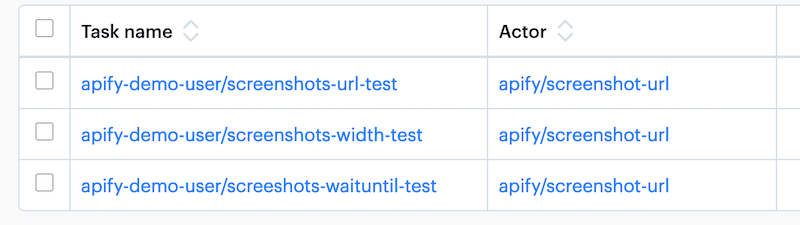

**Learn how to automate ongoing testing and make sure your actors perform over time. See code examples for configuring the Actor Testing actor.**

---

You should make sure your [Actors](../../index.md)  are well-maintained. You might not always get feedback from your users. Therefore it is crucial that you periodically check if your Actors work as expected. You can do this using our [monitoring suite](https://apify.com/apify/monitoring) or by setting up daily runs of the **Actor Testing** ([pocesar/actor-testing](https://apify.com/pocesar/actor-testing)) tool.

The monitoring suite is sufficient for most scenarios and includes automated alerts. [See more information](https://apify.com/apify/monitoring) on the suite's page or [check out our tutorials](../../../monitoring/index.md).

We recommend using the Actor Testing actor for specific and advanced use cases. This guide will help you set it up.

## Step-by-step guide

1. Prepare 1-5 separate testing tasks for your actor. ([See below](#set-up-tasks-you-will-test)).
2. Set up a task from the Actor Testing actor. ([See below](#set-up-a-task-from-the-actor-testing-actor)).
3. Run the test task until all tests succeed (a few times).
4. Schedule the test to run at the frequency of your choice (recommended daily) and choose a communication channel receiving info about it ([Slack](https://apify.com/katerinahronik/slack-message) or [email](https://apify.com/apify/send-mail)).
5. Ensure you review and fix any issues on a weekly basis.

## Set up tasks you will test




We also advise to test your actor's default run – one that uses the pre-filled inputs. It is often the first task your users run and they may be put off if it doesn't work.

Set a low `maxItem` value for your testing tasks, so that you don't burn your credit. If you need to test your actor with a large amount of data, set the scheduler to run less frequently.

## Set up a task from the Actor Testing actor

You can [find the setup guide](https://apify.com/pocesar/actor-testing) in the actor's README. We recommend testing for the following scenarios.

Run status:

```js
await expectAsync(runResult).toHaveStatus('SUCCEEDED');
```

Crash information from the log:

```js
await expectAsync(runResult).withLog((log) => {
    // Neither ReferenceError or TypeErrors should ever occur
    // in production code – they mean the code is over-optimistic
    // The errors must be dealt with gracefully and displayed with a helpful message to the user
    expect(log)
        .withContext(runResult.format('ReferenceError'))
        .not.toContain('ReferenceError');

    expect(log)
        .withContext(runResult.format('TypeError'))
        .not.toContain('TypeError');
});
```

Information from statistics (runtime, retries):

```js
await expectAsync(runResult).withStatistics((stats) => {
    // In most cases, you want it to be as close to zero as possible
    expect(stats.requestsRetries)
        .withContext(runResult.format('Request retries'))
        .toBeLessThan(3);

    // What is the expected run time for the number of items?
    expect(stats.crawlerRuntimeMillis)
        .withContext(runResult.format('Run time'))
        .toBeWithinRange(1 * 60000, 10 * 60000);
});
```

Information about and from within the [dataset](../../../storage/dataset.md):

```js
await expectAsync(runResult).withDataset(({ dataset, info }) => {
    // If you're sure, always set this number to be your exact maxItems
    expect(info.cleanItemCount)
        .withContext(runResult.format('Dataset cleanItemCount'))
        .toBe(3); //or toBeGreaterThan(1) or toBeWithinRange(1,3)

    // Make sure the dataset isn't empty
    expect(dataset.items)
        .withContext(runResult.format('Dataset items array'))
        .toBeNonEmptyArray();

    const results = dataset.items;

    // Check dataset items to have the expected data format
    for (let r in results) {
        expect(results[r].directUrl)
            .withContext(runResult.format('Direct url'))
            .toStartWith('https://www.yelp.com/biz/');

        expect(results[r].bizId)
            .withContext(runResult.format('Biz ID'))
            .toBeNonEmptyString();
    }
});
```

Information about the [key-value store](../../../storage/key_value_store.md):

```js
await expectAsync(runResult).withKeyValueStore(({ contentType }) => {
   // Check for the proper content type of the saved key-value item
     expect(contentType)
         .withContext(runResult.format('KVS contentType'))
         .toBe('image/gif');
    },

    // This also checks for existence of the key-value key
    { keyName: 'apify.com-scroll_losless-comp' }
);
```
