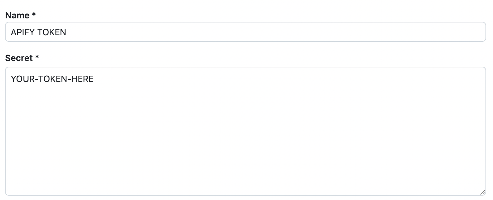

# Continuous integration for Actors

**Learn how to set up automated builds, deploys, and testing for your Actors.**

import Tabs from '@theme/Tabs';
import TabItem from '@theme/TabItem';

---

Automating your Actor development process can save time and reduce errors, especially for projects  with multiple Actors or frequent updates. Instead of manually pushing code, building Actors, and running tests, you can automate these steps to run whenever you push code to your repository.

You can automate Actor builds and tests using your Git repository's automated workflows like [GitHub Actions](https://github.com/features/actions) or [Bitbucket Pipelines](https://www.atlassian.com/software/bitbucket/features/pipelines).


:::tip Using Bitbucket?
Follow our step-by-step guide to set up continuous integration for your Actors with Bitbucket Pipelines: [Read the Bitbucket CI guide](https://help.apify.com/en/articles/6988586-setting-up-continuous-integration-for-apify-actors-on-bitbucket).
:::

There are two main ways to set up continuous integration for your Actors: [Trigger builds with a Webhook](#option-1-trigger-builds-with-a-webhook), or [Set up automated builds and tests with GitHub Actions](#option-2-set-up-automated-builds-and-tests-with-github-actions). Choose the method that best fits your workflow.

## Option 1: Trigger builds with a Webhook

To set up triggered builds with a webhook:

1. Go to your Actor's detail page in Apify Console, click on the API tab in the top right, then select API Endpoints. Copy the **Build Actor** API endpoint URL. The format is as follows:

      ```cURL
      https://api.apify.com/v2/acts/YOUR-ACTOR-NAME/builds?token=YOUR-TOKEN-HERE&version=0.0&tag=beta&waitForFinish=60
      ```

   :::note API token
   Make sure you select the correct API token from the dropdown.
   :::
1. In your GitHub repository, go to Settings > Webhooks > Add webhook.
1. Paste the API URL into the Payload URL field and add the webhook.


Now your Actor will automatically rebuild on every push to the GitHub repository.

## Option 2: Set up automated builds and tests with GitHub Actions

To set up automated builds and tests with GitHub Actions, you need to:

1. You need to push your Actor to a GitHub repository.
1. Get your Apify API token from the [Apify Console](https://console.apify.com/settings/integrations)

    

1. Add your Apify token to GitHub secrets
   1. Go to your repository > Settings > Secrets and variables > Actions > New repository secret
   1. Name the secret & paste in your token

     

1. Add the Build Actor API endpoint URL to GitHub secrets
   1. Go to your repository > Settings > Secrets and variables > Actions > New repository secret
   1. In Apify Console, go to your Actor's detail page, click the API tab in the top right, and then select API Endpoints. Copy the **Build Actor** API endpoint URL. The format is as follows:
      :::note API token
      Make sure you select the correct API token from the dropdown.
      :::

      ```cURL
      https://api.apify.com/v2/acts/YOUR-ACTOR-NAME/builds?token=YOUR-TOKEN-HERE&version=0.0&tag=beta&waitForFinish=60
      ```
   1. Name the secret & paste in your API endpoint
      
      

1. Create GitHub Actions workflow files:
   1. In your repository, create the `.github/workflows` directory
   1. Add `latest.yml`. If you want, you can also add `beta.yml` to build actors from the develop branch (or other branches).

    <Tabs groupId="main">
    <TabItem value="latest.yml" label="latest.yml">

    :::note Use your secret names
    Make sure to use the exact secret names you set in the previous step.
    :::

    ```yaml
    name: Test and build latest version
    on:
      push:
        branches:
          - master
          - main
    jobs:
      test-and-build:
        runs-on: ubuntu-latest
        steps:
          # Install dependencies and run tests
          - uses: actions/checkout@v2
          - run: npm install && npm run test
          # Build latest version
          - uses: distributhor/workflow-webhook@v1
            env:
              webhook_url: ${{ secrets.BUILD_ACTOR_URL }}
              webhook_secret: ${{ secrets.APIFY_TOKEN }}

    ```

    With this setup, pushing to the `main` or `master` branch tests the code and builds a new latest version.

    </TabItem>
    <TabItem value="beta.yml" label="beta.yml">

    :::note Use your secret names
    Make sure to use the exact secret names you set in the previous step.
    :::

    ```yaml
    name: Test and build beta version
    on:
      push:
        branches:
          - develop
    jobs:
      test-and-build:
        runs-on: ubuntu-latest
        steps:
          # Install dependencies and run tests
          - uses: actions/checkout@v2
          - run: npm install && npm run test
          # Build latest version
          - uses: distributhor/workflow-webhook@v1
            env:
              webhook_url: ${{ secrets.BUILD_ACTOR_URL }}
              webhook_secret: ${{ secrets.APIFY_TOKEN }}

    ```

    With this setup, pushing to the `develop` branch tests the code and builds a new beta version.

    </TabItem>
    </Tabs>

## Conclusion

Setting up continuous integration (CI) for your Apify actors ensures that your code is always tested and built automatically whenever you push changes to your repository. This helps catch issues early and streamlines your deployment process, whether you're releasing to production or maintaining a beta branch.

You can also integrate directly with GitHub, check out the [official Apify GitHub integration documentation](/platform/integrations/github).