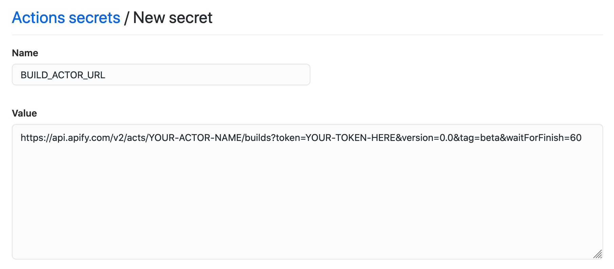
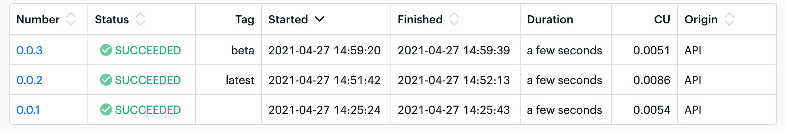
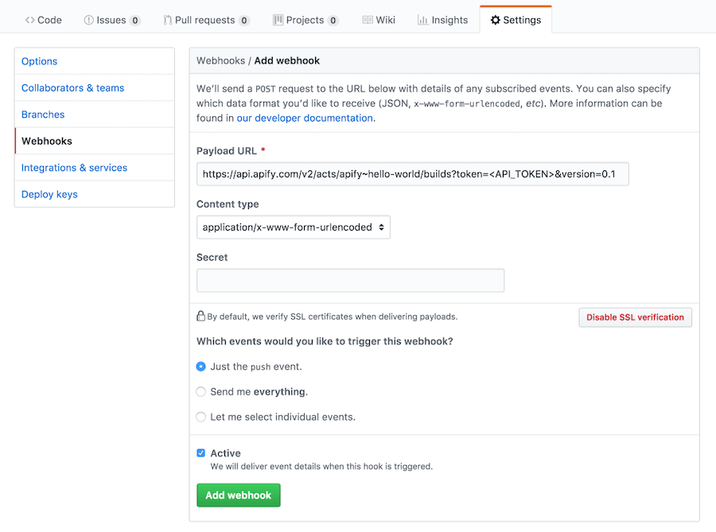

# Continuous integration for Actors

**Learn how to set up automated builds, deploys, and testing for your Actors using GitHub Actions or Bitbucket Pipelines.**

import Tabs from '@theme/Tabs';
import TabItem from '@theme/TabItem';

---

Automating your Actor development process can save time and reduce errors, especially for projects  with multiple Actors or frequent updates. Instead of manually pushing code, building Actors, and running tests, you can automate these steps to run whenever you push code to your repository.

You can automate Actor builds and tests using your Git repository's automated workflows like [GitHub Actions](https://github.com/features/actions) or [Bitbucket Pipelines](https://www.atlassian.com/software/bitbucket/features/pipelines).

This article focuses on GitHub, but [we also have a guide for Bitbucket](https://help.apify.com/en/articles/6988586-setting-up-continuous-integration-for-apify-actors-on-bitbucket).

## Set up automated builds and tests

To set up automated builds and tests for your Actors you need to:

1. Create a GitHub repository for your Actor code.
1. Get your Apify API token from the [Apify Console](https://console.apify.com/account#/integrations)

    

1. Add your Apify token to GitHub secrets
   1. Go to your repo > Settings > Secrets > New repository secret
   1. Name the secret & paste in your token
1. Add the Builds Actor API endpoint URL to GitHub secrets
   1. Use this format:

      ```cURL
      https://api.apify.com/v2/acts/YOUR-ACTOR-NAME/builds?token=YOUR-TOKEN-HERE&version=0.0&tag=beta&waitForFinish=60
      ```

      

   1. Name the secret
1. Create GitHub Actions workflow files:
   1. In your repo, create the `.github/workflows` directory
   2. Add `latest.yml` and `beta.yml` files with the following content

    <Tabs groupId="main">
    <TabItem value="latest.yml" label="latest.yml">

    ```yaml
    name: Test and build latest version
    on:
      push:
        branches:
          - master
          - main
    jobs:
      test:
        runs-on: ubuntu-latest
        steps:
          # Install dependencies and run tests
          - uses: actions/checkout@v2
          - run: npm install && npm run test
          # Build latest version
          - uses: distributhor/workflow-webhook@v1
            env:
              webhook_url: ${{ secrets.LATEST_BUILD_URL }}
              webhook_secret: ${{ secrets.APIFY_TOKEN }}

    ```

    With this setup, pushing to the `main` or `master` branch builds a new latest version.

    </TabItem>

<<<<<<< HEAD
    <TabItem value="beta.yml" label="beta.yml">
=======
[Find the Bitbucket version here](https://help.apify.com/en/articles/6988586-setting-up-continuous-integration-for-apify-actors-on-bitbucket).
>>>>>>> 3aee8e01 (fix: avoid permanent redirects)

    ```yaml
    name: Test and build beta version
    on:
      push:
        branches:
          - develop
    jobs:
      test:
        runs-on: ubuntu-latest
        steps:
          # Install dependencies and run tests
          - uses: actions/checkout@v2
          - run: npm install && npm run test
          # Build latest version
          - uses: distributhor/workflow-webhook@v1
            env:
              webhook_url: ${{ secrets.BETA_BUILD_URL }}
              webhook_secret: ${{ secrets.APIFY_TOKEN }}

    ```

    With this setup, pushing to the `develop` branch builds a new beta version.

    </TabItem>
    </Tabs>

<<<<<<< HEAD
## GitHub integration
=======
[Add the token to GitHub secrets](https://docs.github.com/en/actions/security-guides/using-secrets-in-github-actions#creating-encrypted-secrets-for-a-repository). Go to **your repo > Settings > Secrets > New repository secret**.
>>>>>>> 3aee8e01 (fix: avoid permanent redirects)

To set up automatic builds from GitHub:

<<<<<<< HEAD
1. Go to your Actor's detail page and coy the Build Actor API endpoint URL from the API tab.
1. In your GitHub repository, go to Settings > Webhooks > Add webhook.
1. Paste the API URL into the Payload URL field.
=======
```cURL
https://api.apify.com/v2/acts/YOUR-ACTOR-NAME/builds?token=YOUR-TOKEN-HERE&version=0.0&tag=beta&waitForFinish=60
```


## Set up automatic builds

[//]: # (TODO: This duplicates somehow the above part)

Once you have your [prerequisites](#prerequisites), you can start automating your builds. You can use [webhooks](https://en.wikipedia.org/wiki/Webhook) or the [Apify CLI](/cli/) ([described in our Bitbucket guide](https://help.apify.com/en/articles/6988586-setting-up-continuous-integration-for-apify-actors-on-bitbucket)) in your Git workflow.

To use webhooks, you can use the [distributhor/workflow-webhook](https://github.com/distributhor/workflow-webhook) action, which uses the secrets described in the [prerequisites](#prerequisites) section.

```yaml
name: Build Actor
  - uses: distributhor/workflow-webhook@v1
    env:
      webhook_url: ${{ secrets.[VERSION]_BUILD_URL }}
      webhook_secret: ${{ secrets.APIFY_TOKEN }}
```

You can find your builds under the Actor's **Builds** section.



## [](#github-integration) Automatic builds from GitHub

<iframe width="560" height="315" src="https://www.youtube-nocookie.com/embed/2I3DM8Nvu1M" title="YouTube video player" frameborder="0" allow="accelerometer; autoplay; clipboard-write; encrypted-media; gyroscope; picture-in-picture; web-share" allowfullscreen></iframe>

If the source code of an Actor is hosted in a [Git repository](#git-repository), it is possible to set up an integration so that the Actor is automatically rebuilt on every push to the Git repository. For that, you only need to set up a webhook in your Git source control system that will invoke the [Build Actor](/api/v2/#/reference/actors/build-collection/build-actor) API endpoint on every push.

For repositories on GitHub, you can use the following steps. First, go to the Actor detail page, open the **API** tab, and copy the **Build Actor** API endpoint URL. It should look something like this:

```text
https://api.apify.com/v2/acts/apify~hello-world/builds?token=<API_TOKEN>&version=0.1
```

Then go to your GitHub repository, click **Settings**, select **Webhooks** tab and click **Add webhook**. Paste the API URL to the **Payload URL** as follows:
>>>>>>> 3aee8e01 (fix: avoid permanent redirects)



Now your Actor will automatically rebuild on every push to the GitHub repository.
