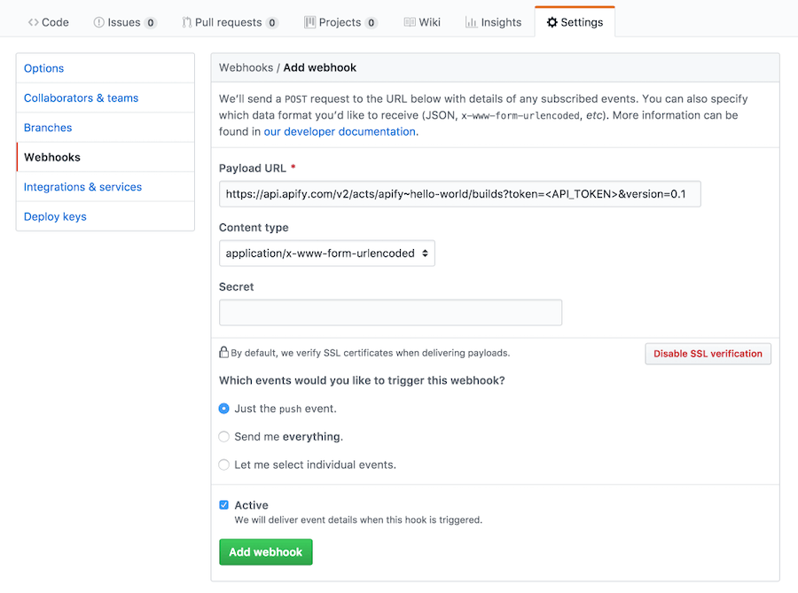

import Tabs from '@theme/Tabs';
import TabItem from '@theme/TabItem';

---

Automating your Actor development process can save time and reduce errors, especially for projects with multiple Actors or frequent updates. Instead of manually pushing code, building Actors, and running tests, you can automate these steps to run whenever you push code to your repository.

Set up continuous integration for your Actors using one of these methods:

- [GitHub Actions](#github-actions) - the most flexible approach, with support for tests, multi-branch builds, and custom workflows.
- [API webhook](#api-webhook) - works with Bitbucket, GitLab, and other Git hosting providers that support webhooks.
- [GitHub integration](#github-integration) - the quickest setup with no workflow files needed, but less flexible than GitHub Actions.

## Set up automated builds with GitHub Actions {#github-actions}

To push your Actor source code to the Apify platform and build it on every push, use the official [`apify/push-actor-action`](https://github.com/apify/push-actor-action) GitHub Action. It works similarly to running `apify push` with the Apify CLI, and gives you full control over your CI pipeline: you can run tests, manage multiple branches, and customize the workflow.

### Prerequisites

- Your Actor source code in a GitHub repository with a valid `.actor/actor.json` file.
- An Apify API token. Find yours in [Apify Console](https://console.apify.com/settings/integrations) under **Settings** > **Integrations**.

### Step 1: Add your Apify token to GitHub secrets

1. Go to your GitHub repository.
1. Select **Settings** > **Security and quality**  > **Secrets and variables** > **Actions**.
1. In the **Secrets** tab, go to **Repository secrets** and select **New repository secret**.
1. Complete the following fields:

    - **Name**: use `APIFY_TOKEN` as a name for your secret.
    - **Secret**: paste your Apify API token.

### Step 2: Create a GitHub Actions workflow

In your repository, create a `.github/workflows` directory and add a workflow file. The following examples show common setups for production and beta branches.

<Tabs groupId="main">
<TabItem value="latest.yml" label="latest.yml">

Push to the Apify platform and build the Actor on every push to `main` or `master`:

```yaml
name: Push and build latest version
on:
  push:
    branches:
      - master
      - main
jobs:
  push-actor:
    runs-on: ubuntu-latest
    steps:
      - uses: actions/checkout@v4

      - name: Push Actor to Apify
        uses: apify/push-actor-action@v1
        with:
          token: ${{ secrets.APIFY_TOKEN }}
```

</TabItem>
<TabItem value="beta.yml" label="beta.yml">

Push to the Apify platform and build a beta version on every push to `develop`:

```yaml
name: Push and build beta version
on:
  push:
    branches:
      - develop
jobs:
  push-actor:
    runs-on: ubuntu-latest
    steps:
      - uses: actions/checkout@v4

      - name: Push Actor to Apify
        uses: apify/push-actor-action@v1
        with:
          token: ${{ secrets.APIFY_TOKEN }}
          build-tag: beta
```

</TabItem>
<TabItem value="test-and-push.yml" label="With tests">

Run tests before pushing the Actor to the Apify platform:

```yaml
name: Test and push latest version
on:
  push:
    branches:
      - master
      - main
jobs:
  test-and-push:
    runs-on: ubuntu-latest
    steps:
      - uses: actions/checkout@v4

      - name: Set up Node.js
        uses: actions/setup-node@v4
        with:
          node-version: 22

      - name: Install dependencies and run tests
        run: npm install && npm run test

      - name: Push Actor to Apify
        id: push
        uses: apify/push-actor-action@v1
        with:
          token: ${{ secrets.APIFY_TOKEN }}

      - name: Print build details
        run: |
          echo "Build ${{ steps.push.outputs.build-id }} finished with status ${{ steps.push.outputs.build-status }}"
```

</TabItem>
</Tabs>

For the full list of inputs (such as `actor-id`, `version`, and `working-directory`) and outputs, see the [`apify/push-actor-action` README](https://github.com/apify/push-actor-action).

## Trigger builds with a webhook {#api-webhook}

If you use Bitbucket, GitLab, or another Git hosting provider that supports webhooks, you can trigger Actor builds by calling the Apify build API on every push. This approach only triggers a build, it doesn't push your source code to the platform.

:::note Source code

When using the webhook approach, the Actor must have its source set to a Git repository in Apify Console. The webhook only triggers a build using the source already configured on the platform.

:::

1. Go to your Actor's detail page in Apify Console.
1. Go to the **API** tab.
1. Select **API Endpoints** and copy the **Build Actor** API endpoint URL:

   ```text
   https://api.apify.com/v2/actors/YOUR-ACTOR-NAME/builds?token=YOUR-TOKEN-HERE&version=0.0&tag=latest&waitForFinish=60
   ```

1. In your repository hosting provider, add a webhook that fires on push events and set the URL to the build API endpoint you copied.

For example, in GitHub, go to **Settings** > **Webhooks** > **Add webhook** and paste the URL into the **Payload URL** field.



:::tip Bitbucket Pipelines

For a more complete Bitbucket setup with automated tests, see the [Bitbucket CI guide](https://help.apify.com/en/articles/6988586-setting-up-continuous-integration-for-apify-actors-on-bitbucket).

:::

## Use the Apify GitHub integration {#github-integration}

Apify Console includes a built-in [GitHub integration](/platform/integrations/github) that links an Actor directly to a GitHub repository. When you connect a repository, Apify automatically rebuilds the Actor on every push - no workflow files or webhook configuration needed.

This is the quickest way to get automated builds running, but it's less flexible than the GitHub Actions approach. It doesn't support running tests before building, managing multiple version tags from different branches, or customizing the build pipeline.

To set it up, see the [GitHub integration](/platform/integrations/github) documentation.
