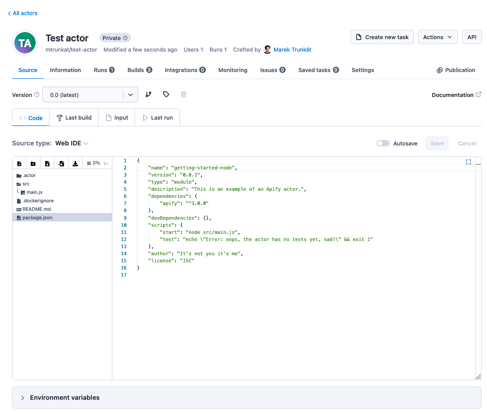
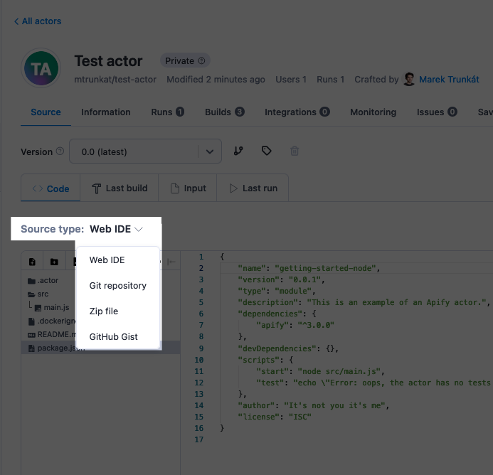

**Learn how to deploy your Actor to Apify platform and build them.**

---

The deployment of your Actor is the process of uploading your Actor [source code](../actor_definition/index.md) and [building](../builds_and_runs/builds.md) at it the Apify platform. After that, you can easily [run](../builds_and_runs/runs.md) and scale your Actor in the cloud.

## Apify CLI

The easiest and fastest way to get your Actor deployed and built is to use [Apify CLI](/cli). If you followed one of the [tutorials](/academy), you should already have it installed. If you do not have Apify CLI installed, then follow the instructions at [Apify CLI documentation](/cli/docs/installation) to install it. Then you can simply log in to your Apify account by running:

```
apify login
```

and then deploy your Actor by running:

```
apify push
```

When you deploy an Actor using the CLI, the code gets deployed as "multiple source files" Actor source type and so the code is visible and editable via web IDE:


> This works only until a certain size; after that, Apify CLI deploys the code as a Zip file.

## Other ways (Zip, Git, Gist)

There are more ways how to deploy your Actor to Apify platform. But in this case, you need to first manually create the Actor in [Apify Console](https://my.apify.com/actors), and then you can switch its source type:



This enables you to link a Git repository, Gist, or Zip file to your Actor. You will find more information on all source types in the following chapter.


