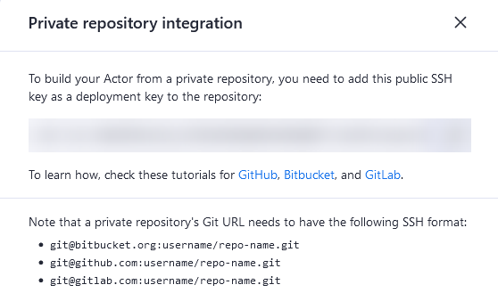

**Learn about Apify Actor source types and how to deploy an Actor from GitHub using CLI or Gist.**

---

This section explains the various sources types available for Apify Actors and how to deploy an Actor from Github using CLI or Gist. Apify Actors supporst four source types:

- [Web IDE](#web-ide)
- [Git repository](#git-repository)
- [Zip file](#zip-file)
- [GitHub Gist](#github-gist)

## Web IDE

This is the default option when your Actor's source code is hosted on the Apify platform. It offers quick previews and updates to your source code, easy file and directory browsing, and direct testing of the [`INPUT_SCHEMA.json`](/platform/actors/development/actor-definition/input-schema) on the Apify platform.

A `Dockerfile` is mandatory for all Actors. When using the default NodeJS Dockerfile, you'll typically need `main.js` for your source code and `package.json` for [NPM](https://www.npmjs.com/) package configurations.

For more information on creating custom Dockersfiles or using Apify's base images, refer to the [Dockerfile](platform/actors/development/actor-definition/dockerfile#custom-dockerfile) and [base Docker images](platform/actors/development/actor-definition/dockerfile#base-docker-images) documentation.

## Git repository

<iframe width="560" height="315" src="https://www.youtube-nocookie.com/embed/NEzT_p_RE1Q" title="YouTube video player" frameborder="0" allow="accelerometer; autoplay; clipboard-write; encrypted-media; gyroscope; picture-in-picture; web-share" allowfullscreen></iframe>

Hosting your Actor's source code in a Git repository allows for multiple files and directories, a custom `Dockerfile` for build process control, and a user description fetched from `README.md`. Specify the repository location using the **Git URL** setting with `https`, `git`, or `ssh` protocols.

To deploy an Actor from GitHub, set the **Source Type** to **Git repository** and enter the GitHub repository URL in the **Git URL** field. You can optionally specify a branch or tag by adding a URL fragmend (e.g., `#develop`).

To use a specific directory, add it after the branch/tag, separated by a colon (e.g., `#develop:some/dir`)

:::note GitHub integration

You can easily set up an integration where the Actor is automatically rebuilt on every commit to the Git repository. For more details, see [GitHub integration](platform/integrations/github).

:::

### Private repositories

When using a private Git repository for your Actor's source code, you need to configure a deployment key. This key grants Apify secure, read-only access to your repository.

:::note What are deployment keys

Deployment keys are unique SSH keys that allow Apify to clone and build your Actor from a private repository.

:::

#### How to configure deployment keys

To configure the deployment key for your Actor's source code you need to:

1. In your Actor's settings, find the **Git URL** input field
1. Click the **deployment key** link below the input field
1. Follow the instruction to add the key to your Git hosting service.

By using deployment keys, you enable secure, automated builds of your Actor from private repositories.

:::info Key usage limitations

Remember that each key can only be used once per Git hosting service (GitHub, Bitbucket, GitLab)

:::

### Actor monorepos

To manage multiple Actors in a single repository, use the `dockerContextDix` property in the [Actor definition](platform/actors/development/actor-definition/actor-json) to set the Docker context directory (if not provided then the repository root is used). In the Dockerfile, copy both the Actor's source and any shared code into the Docker image.

To enable sharing Dockerfiles between multiple Actors, the Actor build process passes the `ACTOR_PATH_IN_DOCKER_CONTEXT` build arg to the Docker build.
It contains the relative path from `dockerContextDir` to the directory selected as the root of the Actor in the Apify Console (the "directory" part of the Actor's git URL).

For an example, see the [`apify/actor-monorepo-example`](https://github.com/apify/actor-monorepo-example) repository. To build Actors from this monorepo, you would set the source URL (including branch name and folder) as `https://github.com/apify/actor-monorepo-example#main:actors/javascript-actor` and `https://github.com/apify/actor-monorepo-example#main:actors/typescript-actor` respectively.

## Zip file

Actors can also use source code from a Zip archive hosted on an external URL. This option supports multiple files and directories, allows for custom `Dockerfile`, and uses `README.md` for the Actor description. If not using a [custom Dockerfile](../actor_definition/docker.md#custom-dockerfile), ensure your main applicat file is named `main.js`.

:::note Automatic use of ZIP file

This source type is used automatically when you are using Apify-CLI and the source size exceeds `3MB`.

:::

## GitHub Gist

For smaller projects, GitHub Gist offers a simpler alternative to full Git repositories or hosted Zip files. To use a GitHub Gist, create your Gist at [https://gist.github.com/](https://gist.github.com/), set the **Source type** to **GitHub Gist**, and paste the Gist URL in the provided field.

Like other source types, Gists can include multiple files, directories, and a custom Dockersfile. The Actor description is taken from `README.md`.

By understanding these source types, you can choose the most appropriate option for hosting and deploying your Apify Actors. Each type offers unique advantages, allowing you to select the best fit for your project's size, complexity, and collaboration needs.
