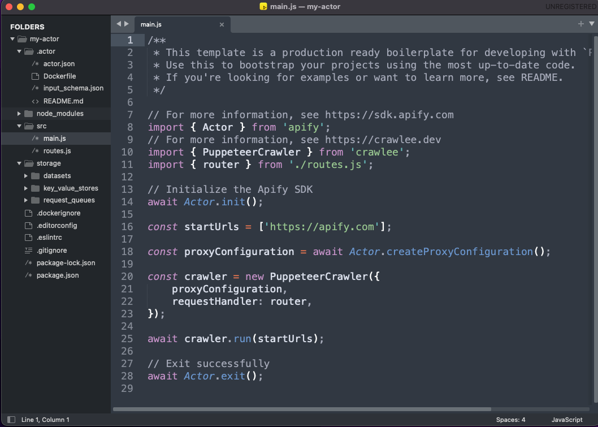

# Development

**Read about the technical part of building Apify actors. Learn to define actor inputs, build new versions, persist actor state, and choose base Docker images.**

---

There are two ways how to create an actor:
- Using the **Web IDE** in the [Apify Console](https://console.apify.com). This is the fastest way to kick-start your Actor development and try out the Apify Platform.
- Develop your Actor **locally** and only deploy to the Apify Platform when it is production ready. This way, you benefit from your local setup for a better development and debugging experience.

> Before you start building your own Actor, try out a couple of existing Actors from [Apify Store](https://apify.com/store). See the [running actors](./running) section for more information on running existing actors.

## Build Actor at Apify Console

### 1. Create the Actor

> You will need an Apify account to complete this tutorial. If you don't have one, [complete the sign-up process](https://console.apify.com/sign-up) first. Don't worry about the price - it's free.

After you sign in to [Apify Console](https://console.apify.com), navigate to the [Actors](https://console.apify.com/actors). Click the Create button at the right top:


And you will be offered various templates covering the JavaScript, TypeScript, and Python languages. Let's choose the "PuppeteerCrawler in Javascript".


You will be prompted to give your actor a name and redirected to the actor detail.

### 2. Explore the source code

Now it's time to look around the source code. You can see the boilerplate code that uses [Apify SDK](https://docs.apify.com/sdk/js/) combined with [Crawlee](https://crawlee.dev/), Apify's popular web scraping library for JavaScript. The code does a recursive crawl of the whole [apify.com](https://apify.com) website.

> Crawlee is a web scraping and browser automation library. <br />
> It helps you build reliable crawlers. Fast.

Let's run it! To run your Actor, you need to build it first, so let's press the "Build" button below the source code.


### 3. Build it

After you press the "Build" button, the UI transitions to the "Build" tab, and you can see the progress of the build, including the Docker build log.


Notice that the UI includes four tabs - (1) Code, (2) Build, (3) Input, and (4) Run. This represents the Actor creation flow where you need first to take the source code and build it. Once you have a build, you give it input which results in an Actor run.

### 4. Run it

Once the Actor is built, you can look at its input, which consists of one field - Start URL, the URL where crawling starts. Below the input, you can adjust the run options consisting of build, timeout, and memory limit.


After pressing a run button, the actor run gets created, and you can view its log and other details. Results will shortly start popping up in the output tab. You can always stop the run using the "Abort" button.


### 5. Iterate

Now you can get back to the source code and modify the actor to match your needs. To learn about all the Apify Platform features and best practices, continue to the following chapter of this section or visit [Apify Academy](/academy).

## Build Actor locally

> Prerequisite - You need to have [Node.js](https://nodejs.org/en/) version 16 or higher with NPM installed on your computer.

### 1. Install Apify CLI

On macOS (or Linux), you can install the Apify CLI via the Homebrew package manager.

```bash
brew install apify/tap/apify-cli
```

Otherwise, use [NPM](https://www.npmjs.com/) to install the Apify CLI.

```bash
npm -g install apify-cli
```

For more installation and advanced usage information, see the [Apify CLI documentation](https://docs.apify.com/cli/).

### 2. Create your Actor

Use the

```bash
apify create
```

Command to create your actor. We choose `my-actor` as a name, JavaScript as the language, and "PuppeteerCrawler in JavaScript" as a template. CLI will then:
- Create a `my-actor` directory containing boilerplate code.
- Install all the NPM dependencies.


Now switch to the actor directory:

```
cd my-actor
```

### 3. Explore the source code

Now it's time to explore the source code. The important parts are:
- `src` directory and, namely, the `src/main.js` file, which is the actual code of an actor.
- `actor` directory containing actor's definition files such as `actor.json` and `Dockerfile`. These are important once you deploy your code to the Apify Platform.
- `storage` directory containing the local emulation of [Apify Storage](../storage), namely [key-value store](../storage/key-value-store), [dataset](../storage/dataset), and [request queue](../storage/request-queue).



> The following chapters will teach you more about an actor's structure and files.

### 4. Run it

To run the actor, call:

```bash
apify run
```

Shortly after that, you will see the log of the actor. The results will be stored in the local dataset under the `storage/dataset/default` directory.


### 5. Deploy it to Apify Platform

In order to push your actor to Apify Platform, you need to first sign in to Apify with the CLI tool:

```bash
apify login
```

And then, you can push your actor under your Apify account with the following:

```bash
apify push
```


> If you successfully finished your first actor, you may consider [sharing it with other users and monetizing it](./publishing).


