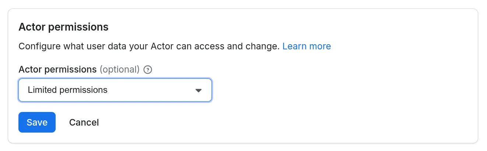

**Learn how to declare and manage permissions for your Actor, what permission levels mean, and how to build secure, trusted Actors for Apify users.**

---

Every time a user runs your Actor, it runs under their Apify account. **Actor Permissions** is an Actor level setting that defines the level of access your Actor needs to be able to run. This gives users transparency and control over what data your Actor can access, building trust in your tools.

There are two levels of access your Actors can request:

- **Limited permissions (default):**  Actors with this permission level have restricted access, primarily to their own storages and the data they generate. They cannot access other user data on the Apify platform.
- **Full permissions:** This level grants an Actor access to all of a user's Apify account data.

Most Actors should use limited permissions to request only the specific access they need and reserve full permissions for exceptional cases where the Actor cannot function otherwise.

## How Actor permissions work

When a user runs an Actor, it receives an Apify API token. This token is injected to the Actor's runtime and has a scope of access as requested by the Actor's permission level.

Actors with **full permissions** receive a token that grants complete access to the user's Apify account via the Apify API.

Actors with **limited permissions** receive [a restricted scoped token](../../../integrations/programming/api.md#api-tokens-with-limited-permissions). This token only allows the Actor to perform a specific set of actions, which covers the vast majority of common use cases.

 A limited-permission Actor can:

- Read and write to its default storages.
- Update the current run’s status, abort the run, or [metamorph](../programming_interface/metamorph.md) to another Actor (as long as it also has limited permissions).
- Read basic user information (whether the user is paying, their proxy password or public profile) from the environment.
- Read and/or write to storages provided via Actor input (sample scenario: the user provides the Actor with a dataset that the Actor should write into).
- Run any other Actor with limited permissions.
- Create any additional storage, and write to that storage.
- Read and write to storages created in previous runs.

This approach ensures your Actor has everything it needs to function while protecting user data from unnecessary exposure.

:::info

To learn how to migrate your Actors to run under limited permissions, see the [Migration guide](./migration_guide.md)

:::

### Declaring permissions

You can set the permission level for your Actor in the Apify Console under its **Settings** tab. All the existing Actors are configured to use full permissions, but the plan is to make limited permissions the default for all new Actors.



### End-user experience

Currently, users will see a visible permission badge on your Actor's detail page indicating whether it requires "Limited permissions" or "Full permissions". At this stage, the experience of running an Actor will not change for the user.


:::warning

Whenever possible, design your Actors to use limited permissions and request only access they truly need. Actors requiring full permissions may receive a lower [Actor Quality score](../../publishing/quality_score.mdx), which can reduce their ranking in the store.

:::


### Accessing user provided storages

By default, limited-permissions Actors can't access users storages. However, they can access storages that users explicitly provide via the Actor input. To do so, use the input schema to add a storage picker and declare exactly which operations your Actor needs.

- Add a field with `editor: "resourcePicker"`.
- Set `resourceType` to one of `dataset`, `keyValueStore`, or `requestQueue`.
- Specify `resourcePermissions` with the minimal required scope: `"READ"` or `"READ", "WRITE"`.

Actors running under full permissions are assumed to have full (i.e. read/write/manage) access to user storages, in that case the `resourcePermissions` field does not have to be set.

Example input schema field (single resource):

```json
{
  "title": "Output dataset",
  "type": "string",
  "editor": "resourcePicker",
  "resourceType": "dataset",
  "resourcePermissions": ["READ", "WRITE"]
}
```

Selecting multiple resources:

- Use `type: "array"` to let users choose more than one storage.
- The same `resourcePermissions` apply to each selected resource.

```json
{
  "title": "Source datasets",
  "type": "array",
  "editor": "resourcePicker",
  "resourceType": "dataset",
  "resourcePermissions": ["READ"],
  "minItems": 1
}
```

Behavior at run time:

- The user’s selection is injected into the run input, and the run token is expanded to allow only the requested operations on the selected storages.
- If your code attempts an operation not covered by `resourcePermissions` (for example, writing with only `READ`), the platform returns an insufficient-permissions error.

See the full [input schema reference for details.](../actor_definition/input_schema/specification.md).

### Requesting full permissions

Designing your Actors to work under limited permissions is the recommended approach, it helps improve your Actor’s [Actor Quality score](../../publishing/quality_score.mdx#trustworthiness) and increases user trust and adoption. However, some use cases do legitimately require broader access to user data (e.g., to perform administrative tasks or orchestrate other Actors). If your Actor falls in this category or cannot function with limited permissions for another reason:

- Explain why you need full permissions in your Actor's README. This will help keep user trust and set correct user expectations.
- Set the permission level in the Actor’s **Settings** in Console to **Full permissions**.
- Be aware of the [UX implications](#end-user-experience) and impact on [Actor Quality score](../../publishing/quality_score.mdx) for full-permission Actors.


:::info

Actor permissions are a new feature. If something is preventing you from migrating to limited permissions or you have a use case that you think should work under limited permissions and it does not, please reach out to support or talk to us on [the community forum](https://discord.gg/eN73Xdhtqc).

:::
