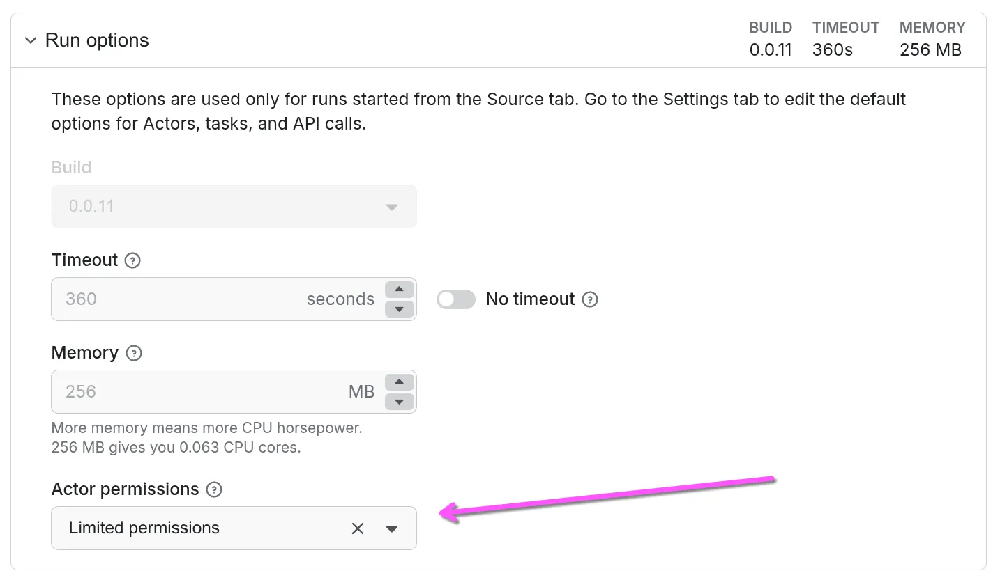

**Migrate your Actor to limited permissions, review common migration paths, code examples, and solutions to common issues.**

---

Use this guide to migrate existing Actors to use [limited permissions](index.md#how-actor-permissions-work). The general prerequisite is to update to the latest [Apify SDK](https://docs.apify.com/sdk).

Recommended minimum SDK versions:

- JavaScript SDK: [apify@3.4.4](https://github.com/apify/apify-sdk-js/releases/tag/apify%403.4.4)
- Python SDK: [v3.0.0](https://github.com/apify/apify-sdk-python/releases/tag/v3.0.0)

Before you start it's helpful to understand [what access restrictions limited permissions impose](index.md#how-actor-permissions-work).

## How to test your Actor with limited permissions before migrating

You can override permission level for a single run using run options under Actor Source tab in Console:



You can do the same using the Apify Client as well:

```tsx
await apifyClient.actor(actorId).call(input, {
    forcePermissionLevel: ACTOR_PERMISSION_LEVEL.LIMITED_PERMISSIONS,
});
```

Or just using the API:

```tsx
 POST https://api.apify.com/v2/acts/<actor_id>/runs?**forcePermissionLevel=LIMITED_PERMISSIONS**
```


## Common migration paths

We expect that most public Actors can be migrated to limited permissions with minor, if any, adjustments. The general prerequisite is to **update the Actor to use the latest [Apify SDK](https://docs.apify.com/sdk)**. To assess what, if anything, needs to change in your Actor, review the following:

- How your Actor uses storages: if it only writes to default storages, no changes needed.
- Whether it calls other Actors: targets must also use limited permissions.
- Whether it accesses user-provided storages: declare `resourceType` and `resourcePermissions` in `input_schema.json`.
- Whether it uses named storages: rename/recreate and migrate data to retain access under limited permissions.
- Whether it needs to know if the user is paying: use `APIFY_USER_IS_PAYING` or the SDK.
- Whether it needs the user's proxy password: use `APIFY_PROXY_PASSWORD` or the SDK.

Once you have updated and [tested](#how-to-test-your-actor-with-limited-permissions-before-migrating) your Actor, you can change the permissions in the Actor settings. The setting will take immediate effect.

Below you can read a guide covering common migration paths for more advanced cases in greater detail.

### The Actor only pushes data to default storages

This is the most common and simplest use case. If your Actor only reads its input and writes results to its default dataset, key-value store, or request queue, **no changes are needed**. Limited permissions fully support this behavior out of the box.

### The Actor calls other Actors

An Actor with limited permissions can only call other Actors that also have limited permissions. If your Actor calls another one, you will need to ensure the target Actor has been migrated first.

### The Actor accesses storages provided by the user

If your Actor is designed to read from or write to a storage that the user provides via an input field, you must explicitly declare what access you need in Actor’s schema.

1. Populate `resourceType` property on the field to enable the native resource picker.
2. Populate `resourcePermissions` with permissions you need for the resource.

Let’s say your Actor allows the user to provide a custom dataset that your Actor should output its result to. Your `input_schema.json` might contain something like this:

```json
{
    "title": "Output",
    "type": "string",
    "description": "Select a dataset for the Actor results",
}
```

To support limited permissions, change it to this:

```json
{
    "title": "Output",
    "type": "string",
        "description": "Select a dataset for the Actor results",
    "resourceType": "dataset",
    "resourcePermissions": ["READ", "WRITE"],
    "editor": "textfield", // If you want to preserve the plain "string" input UI, instead of rich resource picker.
}
```

Now when the platform runs your Actor, it’ll automatically add the user provided storage to the Actor’s scope so that it can access it.

:::info Backward compatibility

The user can provide the resource both via its name and its ID. If you have existing users with existing inputs that specify the resource via its name, this change to the input schema won’t break it.

:::

### The Actor accesses named storages

Actors sometimes use named storages for caching or persisting state across runs. With limited permissions, an Actor can create a named storage on its first run and will automatically retain access to it in all subsequent runs by the same user.

If your Actor previously relied on accessing a pre-existing named storage, you will need to rename it in your code. This will cause the Actor to recreate the storage under the new system on its next run.

In order to achieve a smooth migration without disrupting your Actor’s users, you will need to make sure that your Actor can handle the transition. The suggested approach is the following:

1. Adjust the code of the Actor so that it can run with both limited and full permissions.
2. Change the Actor setting to limited permissions.
3. Clean up the migration code.

```ts
const OLD_CACHE_STORE_NAME = 'my-actor-cache';
const NEW_CACHE_STORE_NAME = 'my-actor-cache-updated';

let store;

if (process.env.ACTOR_PERMISSION_LEVEL === 'LIMITED_PERMISSIONS') {
    // If the Actor is running with limited permissions and we need to create
    // a new store. The platform will remember that the store was created by this Actor
    // and will allow access in all follow-up runs.
    store = await Actor.openKeyValueStore(NEW_CACHE_STORE_NAME);
} else {
  // If the Actor is still running with full permissions and we should use
    // the existing store.
    store = await Actor.openKeyValueStore(OLD_CACHE_STORE_NAME);
}
```

:::info Re-create cache only under limited permissions.

The goal here is to create the new storage **only once the Actor runs with limited permissions**. Only that way the access is retained in follow-up runs.

:::

If the existing contents of the named storage are critical for your Actor to keep functioning for the existing users and it is impossible, costly or highly impractical to migrate, contact support or reach out to us on the community forum. We can discuss the available options.

### The Actor needs to know whether the user is paying

Some Actors have different logic for free and paying users. Previously you could retrieve this information by calling the `/users/me` API endpoint. However, Actors running under limited permissions don't have access to that endpoint, to get this information, your Actor should read the `APIFY_USER_IS_PAYING` environment variable, or directly use the SDK to obtain the value:

```ts
const { userIsPaying } = Actor.getEnv();
```

### The Actor uses Proxy

Similarly, if your Actor uses [Proxy](../../../proxy/index.md) and needs to retrieve the user's proxy password, it should get it from the `APIFY_PROXY_PASSWORD` environment variable instead of calling the `/users/me` endpoint or, preferably, rely directly on the SDK to handle proxy configuration automatically.
