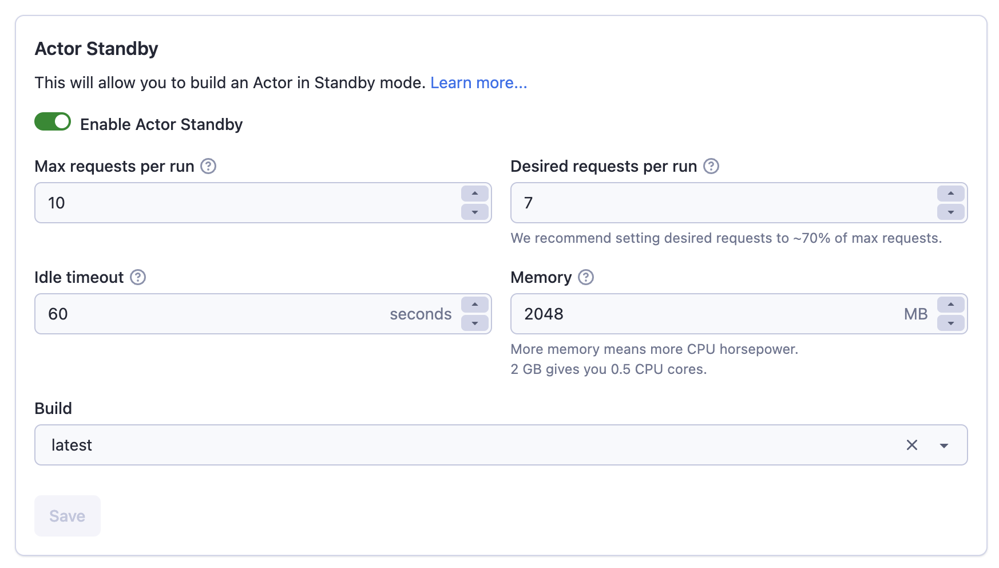

**Use Actors in lightweight mode as a blazingly fast API server.**

---

Traditional Actors are designed to run a single task and then stop. They're mostly intended for batch jobs, such as when you need to perform a large scrape or data processing task.
However, in some applications, waiting for an Actor to start is not an option. Actor Standby mode solves this problem by letting you have the Actor ready
in the background, waiting for the incoming HTTP requests. In a sense, the Actor behaves like a real-time web server or standard API server.

#### How can I develop Actors using Standby mode

import Tabs from '@theme/Tabs';
import TabItem from '@theme/TabItem';

You can head to the Settings tab of your Actor, enable Standby mode, and set the default configuration.


Actors using Standby mode must run a HTTP server listening on a specific port. The user requests will then be proxied to the HTTP server.
You can get the port using the Actor configuration available in Apify SDK.

If you need to override the port, you can do it via the `ACTOR_STANDBY_PORT` environment variable.
See example below with a simple Actor using Standby mode.

<Tabs groupId="main">
<TabItem value="JavaScript" label="JavaScript">

```js
import http from 'http';
import { Actor } from 'apify';

await Actor.init();

const server = http.createServer((req, res) => {
    res.writeHead(200, { 'Content-Type': 'text/plain' });
    res.end('Hello from Actor Standby!\n');
});

server.listen(Actor.config.get('standbyPort'));
```

</TabItem>
<TabItem value="Python" label="Python">

```python
from http.server import HTTPServer, SimpleHTTPRequestHandler
from apify import Actor

class GetHandler(SimpleHTTPRequestHandler):
    def do_GET(self):
        self.send_response(200)
        self.end_headers()
        self.wfile.write(b'Hello from Actor Standby!')

async def main() -> None:
    async with Actor:
        with HTTPServer(('', Actor.config.standby_port), GetHandler) as http_server:
            http_server.serve_forever()
```

</TabItem>
</Tabs>

Please make sure to describe your Actors, their endpoints, and the schema for their
inputs and ouputs in your README.

#### Can I monetize my Actor in the Standby mode

No, Standby mode is in Beta, and monetization is not supported.
