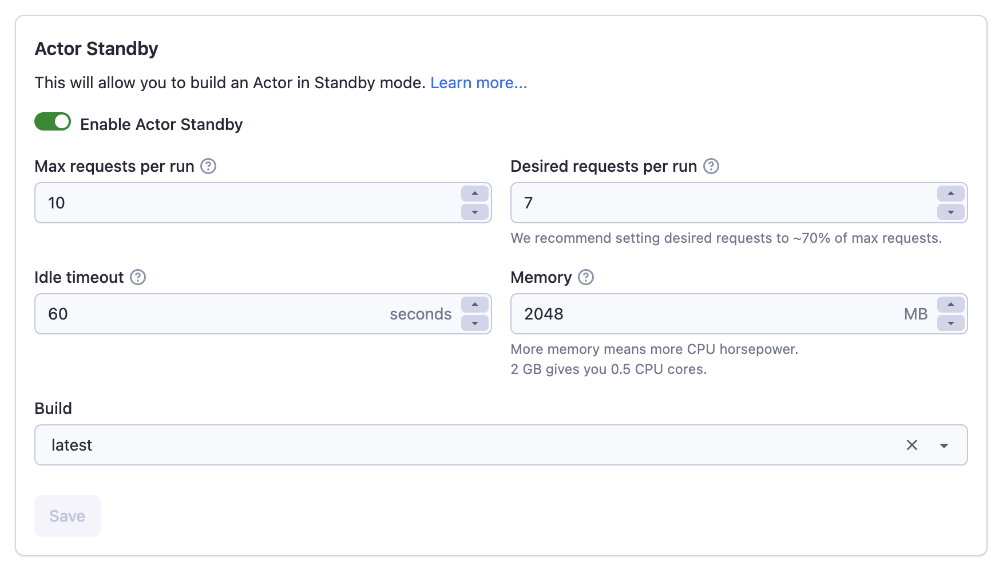

Traditional Actors are designed to run a single task and then stop. They're mostly intended for batch jobs, such as when you need to perform a large scrape or data processing task.
However, in some applications, waiting for an Actor to start is not an option. Actor Standby mode solves this problem by letting you have the Actor ready
in the background, waiting for the incoming HTTP requests. In a sense, the Actor behaves like a real-time web server or standard API server.

## Developing Actors using Standby mode

import Tabs from '@theme/Tabs';
import TabItem from '@theme/TabItem';

The best way to start developing Standby Actors is to use the predefined templates in the [Console UI](https://console.apify.com/actors/templates) or in [CLI](https://docs.apify.com/cli/) via `apify create`. The templates contain minimal code to get you up to speed for development in JavaScript, TypeScript or Python. Standby mode will automatically be enabled with default settings.

If you already have an existing Actor, or you just want to tweak the configuration of Standby mode, you can head to the Settings tab of your Actor, where the Actor Standby settings are located.


Actors using Standby mode must run a HTTP server listening on a specific port. The user requests will then be proxied to the HTTP server. You can use any of the existing [HTTP request methods](https://developer.mozilla.org/en-US/docs/Web/HTTP/Methods) like GET, POST, PUT, DELETE, etc. You can pass the input via [HTTP request query string](https://en.wikipedia.org/wiki/Query_string) or via [HTTP request body](https://developer.mozilla.org/en-US/docs/Web/HTTP/Messages#body).

Sometimes, you want the HTTP server to listen on a specific port and cannot change it yourself. You can use `ACTOR_WEB_SERVER_PORT` environment variable to override the port so that Actor Standby will work with your code.

You can get the port using the Actor configuration available in Apify SDK.
See example below with a simple Actor using Standby mode.

<Tabs groupId="main">
<TabItem value="JavaScript" label="JavaScript">

```js
import http from 'http';
import { Actor } from 'apify';

await Actor.init();

const server = http.createServer((req, res) => {
    res.writeHead(200, { 'Content-Type': 'text/plain' });
    res.end('Hello from Actor Standby!\n');
});

server.listen(Actor.config.get('containerPort'));
```

</TabItem>
<TabItem value="Python" label="Python">

```python
from http.server import HTTPServer, SimpleHTTPRequestHandler
from apify import Actor

class GetHandler(SimpleHTTPRequestHandler):
    def do_GET(self):
        self.send_response(200)
        self.end_headers()
        self.wfile.write(b'Hello from Actor Standby!')

async def main() -> None:
    async with Actor:
        with HTTPServer(('', Actor.configuration.web_server_port), GetHandler) as http_server:
            http_server.serve_forever()
```

</TabItem>
</Tabs>

Describe your Actor's endpoints, their parameters, and responses with a [web server schema](../actor_definition/web_server_schema/index.md) defined in the [`.actor/actor.json`](../actor_definition/actor_json.md) file. Apify Console then renders an interactive **Endpoints** tab on the Actor's detail page, where users can browse the endpoints and send requests directly from the browser. Describe the endpoints in your Actor's README as well.

### Readiness probe

Before Actor standby runs are ready to serve requests, the Apify platform checks the web server's readiness using a readiness probe.
The platform sends a GET request to the path `/` with a header `x-apify-container-server-readiness-probe`. If the header is present in the request, you can perform an early return with a simple response to prevent wasting resources.

:::note Return a response

You must return a response; otherwise, the Actor run will never be marked as ready and won't process requests.

:::

See example code below that distinguishes between "normal" and "readiness probe" requests.

<Tabs groupId="main">
<TabItem value="JavaScript" label="JavaScript">

```js
import http from 'http';
import { Actor } from 'apify';

await Actor.init();

const server = http.createServer((req, res) => {
    res.writeHead(200, { 'Content-Type': 'text/plain' });
    if (req.headers['x-apify-container-server-readiness-probe']) {
        console.log('Readiness probe');
        res.end('Hello, readiness probe!\n');
    } else {
        console.log('Normal request');
        res.end('Hello from Actor Standby!\n');
    }
});

server.listen(Actor.config.get('standbyPort'));
```

</TabItem>
<TabItem value="Python" label="Python">

```python
from http.server import HTTPServer, SimpleHTTPRequestHandler
from apify import Actor

class GetHandler(SimpleHTTPRequestHandler):
    def do_GET(self) -> None:
        self.send_response(200)
        self.end_headers()
        if self.headers['x-apify-container-server-readiness-probe']:
            print('Readiness probe')
            self.wfile.write(b'Hello, readiness probe!')
        else:
            print('Normal request')
            self.wfile.write(b'Hello, normal request!')

async def main() -> None:
    async with Actor:
        with HTTPServer(('', Actor.configuration.standby_port), GetHandler) as http_server:
            http_server.serve_forever()
```

</TabItem>
</Tabs>

## Determining an Actor is started in Standby

Actors that support Actor Standby can still be started in standard mode, for example from the Console or via the API.
To find out in which mode was the Actor started, you can read the `metaOrigin` option in `Actor.config`, or the `APIFY_META_ORIGIN` environment variable in case you're not using the Apify SDK.
If it is equal to `STANDBY`, the Actor was started in Standby mode, otherwise it was started in standard mode.

<Tabs groupId="main">
<TabItem value="JavaScript" label="JavaScript">

```js
import { Actor } from 'apify';

await Actor.init();

if (Actor.config.get('metaOrigin') === 'STANDBY') {
    // Start your Standby server here
} else {
    // Perform the standard Actor operations here
}
```

</TabItem>
<TabItem value="Python" label="Python">

```python
from apify import Actor

async def main() -> None:
    async with Actor:
        if Actor.configuration.meta_origin == 'STANDBY':
            # Start your Standby server here
        else:
            # Perform the standard Actor operations here
```

</TabItem>
</Tabs>

## Run lifecycle in Standby mode

The platform starts and stops Standby runs automatically based on the incoming request load. It stops a run that receives no requests within the configured idle timeout and starts a new run when requests arrive again. Don't keep data only in the run's memory: persist anything you need to a [dataset or key-value store](../../../storage/index.md). See [how Standby scaling works](../../running/actor_standby.md#is-there-any-scaling-to-accommodate-the-incoming-requests) and [how to customize the Standby configuration](../../running/actor_standby.md#how-do-i-customize-standby-configuration).

Apart from the [readiness probe](#readiness-probe), the platform doesn't check your server's health while the run is alive. A run ends when its process exits, when it migrates to another machine, or when it stays idle for longer than the idle timeout. A server that stays up but stops responding keeps receiving requests, so on an unrecoverable error, exit the process instead of swallowing the error.

## Timeouts

When you send a request to an Actor in Standby mode, the total timeout for receiving the first response is _5 minutes_. Before the platform forwards the request to a specific Actor run, it performs a _run selection_ process to determine the specific Actor run that will handle it. This process has internal timeout of _2 minutes_.

## Get the URL of the Standby Actor

The URL is exposed as an environment variable `ACTOR_STANDBY_URL`. You can also use `Actor.config`, where the `standbyUrl` option is available.

The URL typically combines the Actor owner's username and the Actor name, for example:

```text
https://jane-doe--my-actor.apify.actor
```

The Actor also responds on a URL built from its ID, which keeps working if the Actor or its owner is renamed:

```text
https://92c4oi4fpzy7rprlf.apify.actor
```

Unlike the [container web server](./container_web_server.md) URL, which changes with every run, the Standby URL stays the same for all runs of the Actor. You can share it publicly or hardcode it in applications that call the Actor: copy it from the **Endpoints** tab on the Actor's detail page rather than building it from the username and Actor name, because some Actors use a different hostname format.

If the Actor exposes an MCP server, its endpoint is the Standby URL followed by the path defined in the [`webServerMcpPath`](../actor_definition/actor_json.md) property.

Requests to the Standby URL require an Apify API token. See [how to authenticate your requests](../../running/actor_standby.md#how-do-i-authenticate-my-requests).

## Monetization of Actors in Standby mode

You can monetize Standby Actors just like any other Actor.

For best results with Standby workflows, use the [pay-per-event pricing model](/actors/publishing/monetize/pay-per-event). In this model, users cover both the platform usage costs of their runs, as well as the event costs.
