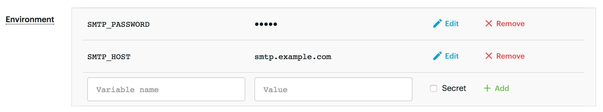

# Environment variables {#environment-variables}

**Learn how to provide your Actor with context that determines its behavior through a plethora of pre-defined environment variables offered by the Apify SDK.**

import Tabs from '@theme/Tabs';
import TabItem from '@theme/TabItem';

---

## System environment variables

The Actor's process has several environment variables set to provide it with context:

| Environment Variable               | Description                                                                                                                                                                                                                                            |
|------------------------------------|--------------------------------------------------------------------------------------------------------------------------------------------------------------------------------------------------------------------------------------------------------|
| `ACTOR_ID`                         | ID of the Actor.                                                                                                                                                                                                                                       |
| `ACTOR_RUN_ID`                     | ID of the Actor run.                                                                                                                                                                                                                                   |
| `ACTOR_BUILD_ID`                   | ID of the Actor build used in the run.                                                                                                                                                                                                                 |
| `ACTOR_BUILD_NUMBER`               | Build number of the Actor build used in the run.                                                                                                                                                                                                       |
| `ACTOR_TASK_ID`                    | ID of the Actor task. It's empty if Actor is run outside of any task, e.g. directly using the API.                                                                                                                                                     |
| `ACTOR_EVENTS_WEBSOCKET_URL`       | Websocket URL where Actor may listen for events from Actor platform. See [documentation](/sdk/js/api/apify/class/PlatformEventManager) for more information.                                                                                           |
| `ACTOR_DEFAULT_DATASET_ID`         | ID of the dataset where you can push the data.                                                                                                                                                                                                         |
| `ACTOR_DEFAULT_KEY_VALUE_STORE_ID` | ID of the key-value store where the Actor's input and output data are stored.                                                                                                                                                                          |
| `ACTOR_DEFAULT_REQUEST_QUEUE_ID`   | ID of the request queue that stores and handles requests that you enqueue.                                                                                                                                                                             |
| `ACTOR_INPUT_KEY`                  | The key of the record in the default key-value store that holds the Actor input. Typically it's **INPUT**, but it might be something else.                                                                                                             |
| `ACTOR_MAX_PAID_DATASET_ITEMS`     | If the Actor is paid per result, this will contain the limit set by the user on how many results they want to return. Do not return them more results because they will be only charged for the limit they set, and you might start accumulating loss. |
| `APIFY_HEADLESS`                   | If set to **1**, the web browsers inside the Actor should run in headless mode because there is no windowing system available.                                                                                                                         |
| `APIFY_IS_AT_HOME`                 | Is set to **1** if the Actor is running on Apify servers.                                                                                                                                                                                              |
| `ACTOR_MEMORY_MBYTES`              | Indicates the size of memory allocated for the Actor run, in megabytes. It can be used by Actors to optimize their memory usage.                                                                                                                       |
| `APIFY_PROXY_PASSWORD`             | The [Apify Proxy](../../../proxy/index.md) password of the user who started the Actor.                                                                                                                                                                 |
| `ACTOR_STANDBY_PORT`               | TCP port on which the Actor can start an HTTP server to receive messages from [Actor Standby](./actor_standby.md). |
| `ACTOR_STARTED_AT`                 | Date when the Actor was started.                                                                                                                                                                                                                       |
| `ACTOR_TIMEOUT_AT`                 | Date when the Actor will time out.                                                                                                                                                                                                                     |
| `APIFY_TOKEN`                      | The API token of the user who started the Actor.                                                                                                                                                                                                       |
| `APIFY_USER_ID`                    | ID of the user who started the Actor. Note that it might be different than the owner of the Actor.                                                                                                                                                     |
| `ACTOR_WEB_SERVER_PORT`            | TCP port on which the Actor can start an HTTP server to receive messages from the outside world.                                                                                                                                                       |
| `ACTOR_WEB_SERVER_URL`             | A unique public URL under which the Actor run web server is accessible from the outside world.                                                                                                                                                         |

<!-- vale Microsoft.RangeFormat = NO -->
Dates are always in the UTC timezone and are represented in simplified extended ISO format ([ISO 8601](https://en.wikipedia.org/wiki/ISO_8601)), e.g. **2022-07-13T14:23:37.281Z**.
<!-- vale Microsoft.RangeFormat = YES -->

<Tabs groupId="main">
<TabItem value="JavaScript" label="JavaScript">

```js
// To access environment variables in Node.js, use the process.env object
console.log(process.env.APIFY_USER_ID);
```

</TabItem>
<TabItem value="Python" label="Python">

```python
# To access environment variables in Python, use the os.environ dictionary:
import os
print(os.environ['APIFY_USER_ID'])
```

</TabItem>
</Tabs>

For convenience, rather than using environment vars directly, we provide a `Configuration` class
that allows reading and updating the Actor configuration.

<Tabs groupId="main">
<TabItem value="JavaScript" label="JavaScript">

```js
import { Actor } from 'apify';

await Actor.init();

// get current token
const token = Actor.config.get('token');
// use different token
Actor.config.set('token', 's0m3n3wt0k3n');

await Actor.exit();
```

</TabItem>
<TabItem value="Python" label="Python">

```python
from apify import Actor

async def main():
    async with Actor:
        old_token = Actor.config.token
        Actor.log.info(f'old_token = {old_token}')

        # use different token
        Actor.config.token = 's0m3n3wt0k3n'

        new_token = Actor.config.token
        Actor.log.info(f'new_token = {new_token}')
```

</TabItem>
</Tabs>

## [](#custom-environment-variables)Custom environment variables

The Actor owner can specify custom environment variables that are set to the Actor's process during the run. Sensitive environment variables such as passwords or API tokens can be protected by setting the **Secret** option. With this option enabled, the value of the environment variable is encrypted, and it will not be visible in the app or APIs. In addition, the value is redacted from Actor logs to avoid the accidental leakage of sensitive data.



Note that the custom environment variables are fixed during the build of the Actor and cannot be changed later. See the [Builds](../builds_and_runs/builds.md) section for details.

The Actor runtime sets additional environment variables for the Actor process during the run. See [Environment variables](./environment_variables.md) for details.

The environment variables can also be used for the build process. In this case, the variables are treated as [Docker build arguments](https://docs.docker.com/engine/reference/builder/#arg). This means that they should not be used for secrets and, in order to access them in Dockerfile, you have to use the `ARG variable_name` instruction.
