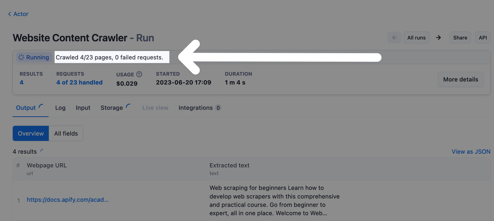

**Learn how to use custom status messages to inform users about the progress of an Actor.**

import Tabs from '@theme/Tabs';
import TabItem from '@theme/TabItem';

---

Each Actor run has a status (the `status` field), which can be one of the following values:

|Status|Type|Description|
|--- |--- |--- |
|`READY`|initial|Started but not allocated to any worker yet|
|`RUNNING`|transitional|Executing on a worker|
|`SUCCEEDED`|terminal|Finished successfully|
|`FAILED`|terminal|Run failed|
|`TIMING-OUT`|transitional|Timing out now|
|`TIMED-OUT`|terminal|Timed out|
|`ABORTING`|transitional|Being aborted by user|
|`ABORTED`|terminal|Aborted by user|

Additionally, the Actor run has a status message (the `statusMessage` field), which contains a text for users informing them what the Actor is currently doing, and thus greatly improve their user experience.



When an Actor exits, the status message is either automatically set to some default text (e.g. "Actor finished with exit code 1"), or to a custom message - see [exit](./basic_commands.md#exit-actor) method for details.

When the Actor is running, it should periodically update the status message as follows to keep users informed and happy. The function can be called as often as necessary, and the SDK only invokes API if the status changes. This is to simplify the usage.

<Tabs groupId="main">
<TabItem value="JavaScript" label="JavaScript">

```js
import { Actor } from 'apify';

await Actor.init();

// ...
await Actor.setStatusMessage('Crawled 45 of 100 pages');

await Actor.exit();
```

</TabItem>
<TabItem value="Python" label="Python">

```python
from apify import Actor

async def main():
    async with Actor:
        await Actor.set_status_message('Crawled 45 of 100 pages')
        # INFO  [Status message]: Crawled 45 of 100 pages
```

</TabItem>
</Tabs>
