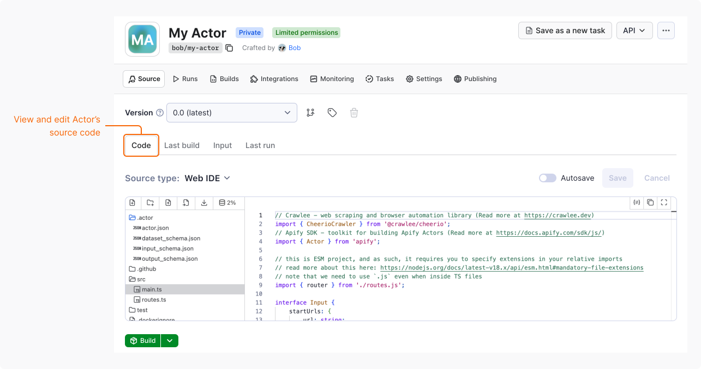
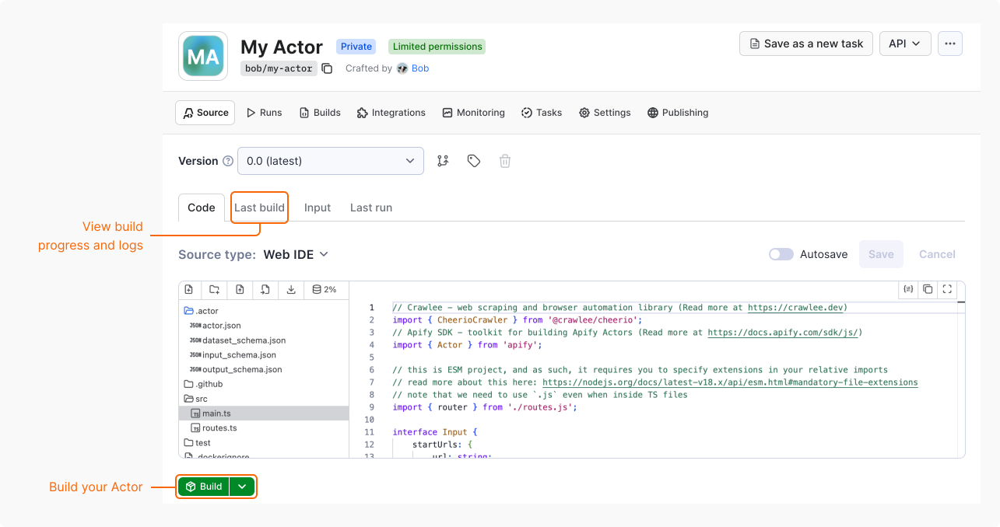
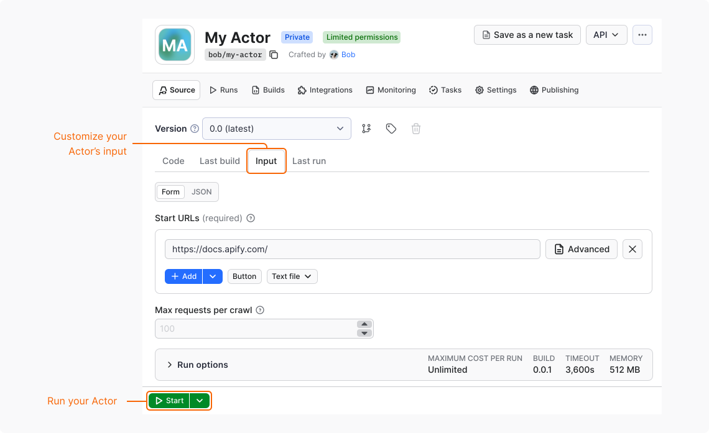

import Tabs from '@theme/Tabs';
import TabItem from '@theme/TabItem';

With the web IDE in Apify Console, you can write, build, and run your code entirely in a
browser. This guide explains the full lifecycle of an Actor: how to start with a template for a working crawler, build it, configure its input, and run it in the cloud.

## Before you start

To complete this tutorial, you need an Apify account. [Sign up for free](https://console.apify.com/sign-up).

## 1. Create your Actor

To create an Actor from a code template:

1. Log in to [Apify Console](https://console.apify.com).
1. In the left-side panel, go to **Development** > **My Actors**.
1. Select **Develop new**, then **Get started**.
1. In the first step, choose a type of Actor you want to create: web scraper, AI agent, API and data pipeline, or browser automation. Let's select **web scraper**.
1. In the second step, choose the programming language: TypeScript, JavaScript, or Python. Let's select **JavaScript**.
1. Based on your choice, Apify suggests Actor templates. For this tutorial, let's use the recommended **Crawlee + Cheerio**.

    :::tip Explore Actor templates

    To find a template that best suits your needs, browse the [full list of templates](https://apify.com/templates).

    :::

1. In the last step, choose where to host your Actor code. Let's select **Host on Apify**.

Once done, your Actor is automatically named and you're redirected to its page.

## 2. Explore the Actor

The **Crawlee + Cheerio** template that you selected uses the [Apify SDK](https://docs.apify.com/sdk/js/) combined with [Crawlee](https://crawlee.dev/), Apify's popular open-source Node.js web scraping library. By default, the code crawls the [apify.com](https://apify.com) website.

To explore the structure and contents of the template, go to the **Source** tab > **Code**.

:::info Crawlee

[Crawlee](https://crawlee.dev/) is an open-source Node.js library designed for web scraping and browser automation. It helps you build reliable crawlers quickly and efficiently.

:::

## 3. Build the Actor

By building the Actor, you package the code and its dependencies into a Docker image that the Apify platform can run. Each build is versioned.

To build the Actor:

1. Go to **Source** tab > **Code**.
1. Select **Build**.

When the build starts, you're redirected to the **Last build** tab. Here, you can check the build progress and view Docker build logs.

## 4. Run the Actor

Once your Actor is built, run it:
<!-- vale off -->
1. Go to **Source** tab > **Input**.
1. Set the **Start URL** to the URL you want to crawl or use the default value.
1. _(Optional)_ To customize the run, expand the **Run options** section. You can adjust the following options:
   - **Build** – select the build version to run.
   - **Timeout** – set the timeout for the run in seconds.
   - **Memory limit** – allocate the memory for the run. For details, see [Usage and resources](/actors/running/usage-and-resources).
   - **Maximum cost per run**.
1. Select **Start**.
<!-- vale on -->
When the run starts, you can monitor its progress and view the logs in real time. To view the results of the Actor's execution, go to the **Output** tab.

## 5. Iterate

Now it's time to iterate. Each change follows the same cycle: edit the code, build a new version of the Actor, and run it to check the result.

## Next steps

- If you need inspiration, see [Find ideas for new Actors](/academy/build-and-publish/actor-ideas/find-actor-ideas).
- To understand Actors in detail, read the [Actor Whitepaper](https://whitepaper.actor/).
- When your first Actor is ready, you can [publish](/actors/publishing) it on Apify Store and [monetize](/actors/publishing/monetize) it to earn revenue.
