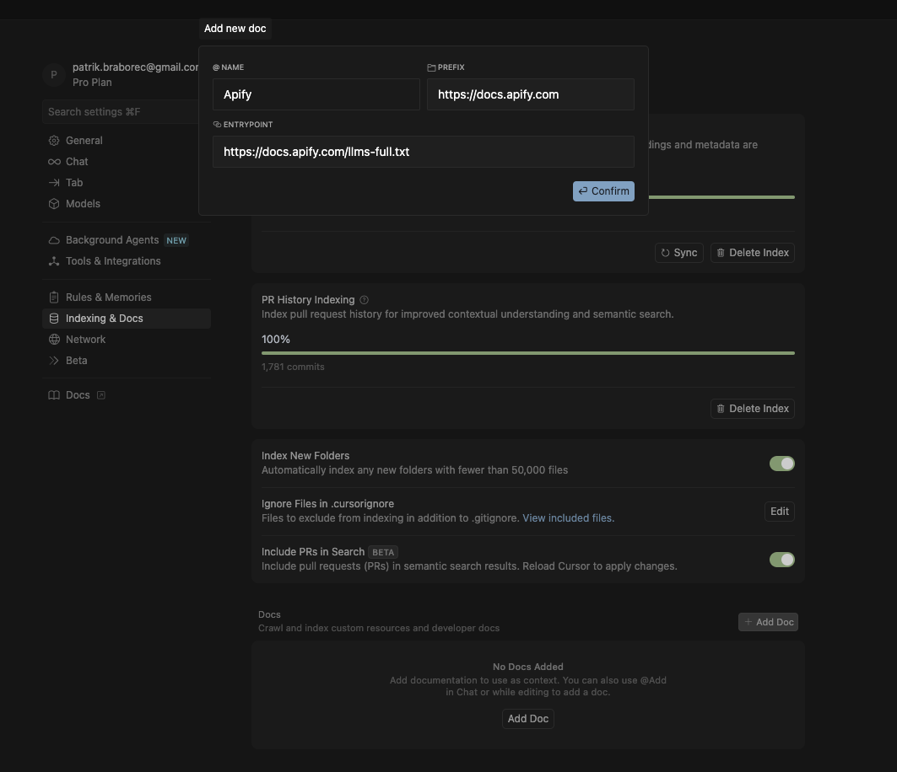
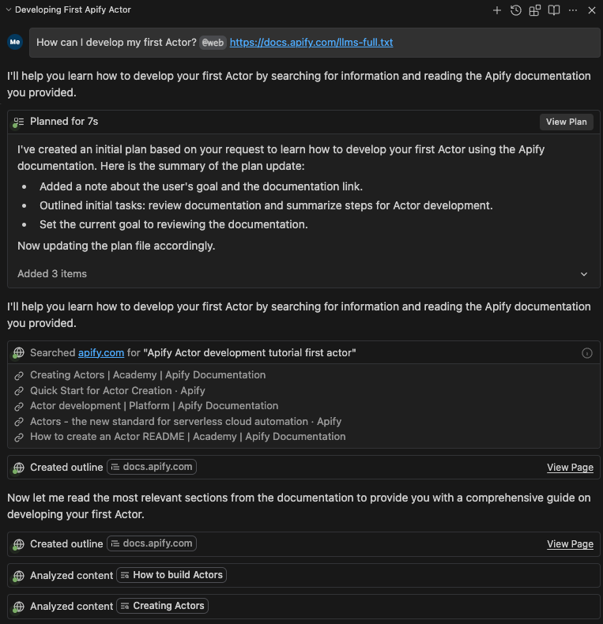
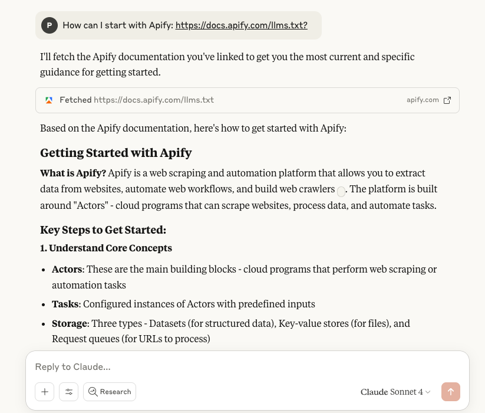

**Set up your environment, choose tools, and build workflows for effective AI development.**

---

import { RULES_AND_INSTRUCTIONS_PROMPT } from "@site/src/utils/ai-prompts";
import PromptButton from "@site/src/components/PromptButton";

This guide explains how to enhance your development workflow by leveraging `llms.txt` and `llms-full.txt` with an AI assistant. You will learn how to provide foundational context and further refine AI's behavior with specific rules and instruction files.

## `llms.txt` and `llms-full.txt`

Search engines weren't built for Large Language Models (LLMs), but they needs context. That's why we've created [`llms.txt`](https://docs.apify.com/llms.txt) and [`llms-full.txt`](https://docs.apify.com/llms-full.txt) for our documentation. These files follow the [growing standard](https://llmstxt.org/) for LLMs consumption.

<table>
  <thead>
    <tr>
      <th>File</th>
      <th>Purpose</th>
    </tr>
  </thead>
  <tbody>
    <tr>
      <td><code>llms.txt</code></td>
      <td>Contains index of the docs page in Markdown, with links to all subpages in Markdown.</td>
    </tr>
    <tr>
      <td>
        <code style={{ whiteSpace: 'nowrap' }}>llms-full.txt</code>
      </td>
      <td>Contains a full dump of documentation in Markdown.</td>
    </tr>
  </tbody>
</table>

### Use llms.txt and llms-full.txt

LLMs don't automatically discover `llms.txt` files, you need to add the link manually. Some tools like [Cursor](https://www.cursor.com/) provide settings for this.

#### Cursor

Go to: **Settings -> Cursor Settings -> Indexing & Docs -> Add Doc**.

Now, you can just provide the link to Apify `llms-full.txt`:

```markdown
https://docs.apify.com/llms-full.txt
```



#### Windsurf

Open Windsurf Cascade, and add context via `@web`:



:::note Windsurf @docs

Windsurf provides the `@docs` command, but you cannot customize it. It means that you cannot add your own documentation.

:::

#### GitHub Copilot

Open Copilot Chat mode, and add context via `#fetch`:


:::note GitHub Copilot and documentation

Similar to Windsurf, GitHub Copilot does not provide an option for adding your own documentation.

:::

#### Ask AI

New to Apify? Ask questions and provide the `llms.txt` link. Popular AI models can search the web. With the right context, you get better answers:



## View pages as markdown

Every page in Apify documentation is available in markdown format. Simply add `.md` to any documentation URL to access the raw markdown content.

For example:
- [https://docs.apify.com/platform](https://docs.apify.com/platform) → [https://docs.apify.com/platform.md](https://docs.apify.com/platform.md)
- [https://docs.apify.com/api](https://docs.apify.com/api) → [https://docs.apify.com/api.md](https://docs.apify.com/api.md)

This is useful when you want to:
- Copy documentation content for AI prompts
- Reference exact markdown syntax
- Access content programmatically

## Add rules

To get the most from AI Code Editors, add rules or instructions.

See how to set up rules for your AI Code Editors:

- [Cursor Rules](https://docs.cursor.com/en/context/rules)
- [Windsurf Rules](https://docs.windsurf.com/windsurf/cascade/memories#rules)
- [GitHub Copilot instructions](https://docs.github.com/en/copilot/how-tos/configure-custom-instructions/add-repository-instructions)

### Apify rules and instructions

The best rules and instructions are specific for individual use cases, but we provide a prompt to help you get start with creating rules and instructions:

<PromptButton prompt={RULES_AND_INSTRUCTIONS_PROMPT}/>

:::info Keep your rules and instructions up to date

As the project evolves, you might introduce new things. Always make sure that your rules and instructions are up to date.

:::

## Best practices

- _Small tasks_: Don't ask AI for many tasks at once. Break complex problems into smaller pieces. Solve them step by step.

- _Iterative approach_: Work iteratively with clear steps. Start with a basic implementation and gradually add complexity.

- _Versioning_: Version your changes often using git. This lets you track changes, roll back if needed, and maintain a clear history.

- _Security_: Don't expose API keys, secrets, or sensitive information in your code or conversations with LLM assistants.
