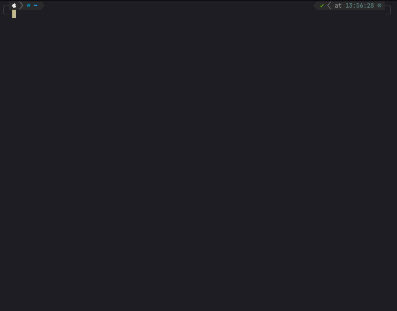
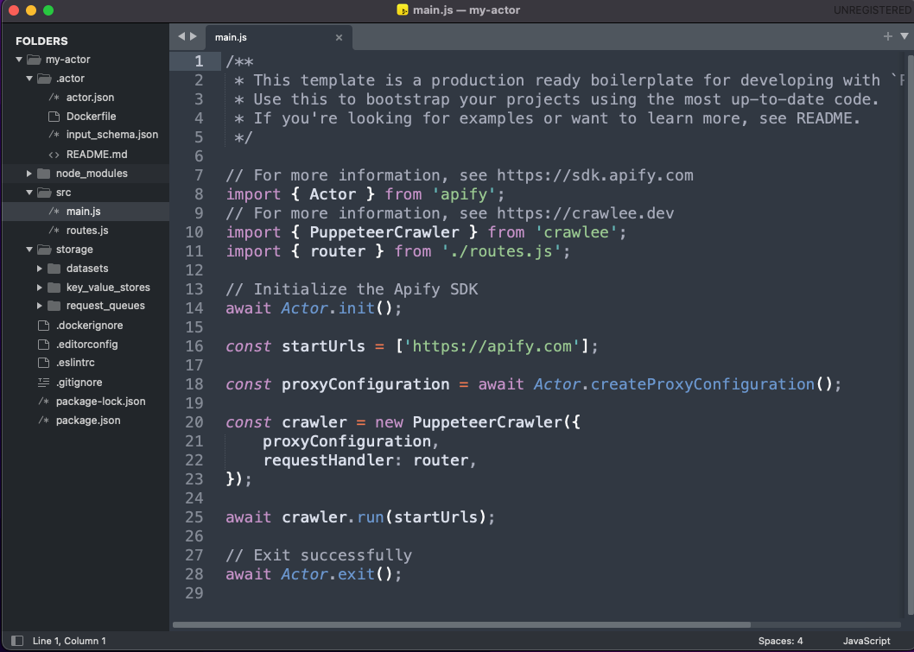
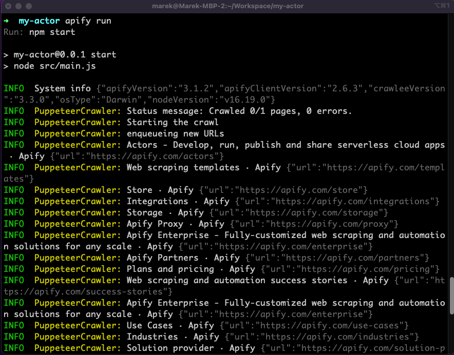

**Create you first Actor locally on your machine and then deploy it to Apify platform and run it in the cloud.**

---

> Prerequisite - You need to have [Node.js](https://nodejs.org/en/) version 16 or higher with NPM installed on your computer.

## 1. Install Apify CLI

On macOS (or Linux), you can install the Apify CLI via the Homebrew package manager.

```bash
brew install apify/tap/apify-cli
```

Otherwise, use [NPM](https://www.npmjs.com/) to install the Apify CLI.

```bash
npm -g install apify-cli
```

For more installation and advanced usage information, see the [Apify CLI documentation](https://docs.apify.com/cli/).

## 2. Create your Actor

You can use the following command to create an Actor:

```bash
apify create
```

You will be prompted to name your Actor (e.g, my-actor), and choose the programming language you would like to use (JavaScript, TypeScript, or Python). Next, you will be presented with a list of Actor development templates. After choosing your preferred template the CLI will:

- Create a `my-actor` directory containing boilerplate code.
- Install all the project dependencies.



Finally, switch to your newly created Actor directory:

```bash
cd my-actor
```

## 3. Explore the source code in your editor

Next, let's explore the Actor's source code. We will use the "PuppeteerCrawler in JavaScript" template code as an example, but all Actor templates follow a similar organizational pattern. The important parts are:

- `src` directory and, namely, the `src/main.js` file, which is the actual code of an actor.
- `actor` directory containing actor's definition files such as `actor.json` and `Dockerfile`. These are important once you deploy your code to the Apify platform.
- `storage` directory containing the local emulation of [Apify Storage](../../../storage), namely [key-value store](../../../storage/key-value-store), [dataset](../../../storage/dataset), and [request queue](../../../storage/request-queue).



> The following chapters will teach you more about an actor's structure and files.

## 4. Run it locally

To run the Actor, call:

```bash
apify run
```

Shortly after that, you will see the log of the Actor. The results will be stored in the local dataset under the `storage/dataset/default` directory.




## 5. Deploy it to Apify Platform

In order to push your Actor to the Apify platform, you need to first sign in to Apify with the CLI tool:

```bash
apify login
```

And then, you can push your Actor under your Apify account with the following:

```bash
apify push
```


> If you successfully finished your first actor, you may consider [sharing it with other users and monetizing it](../../publishing/index.mdx).

