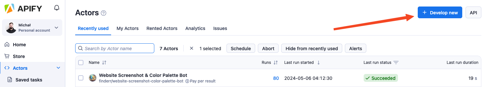
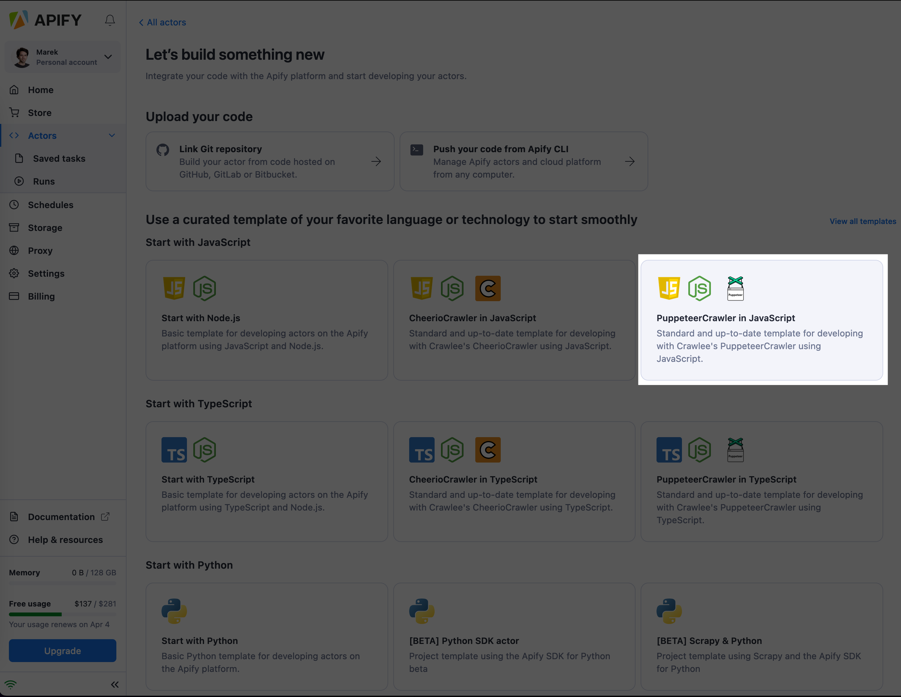
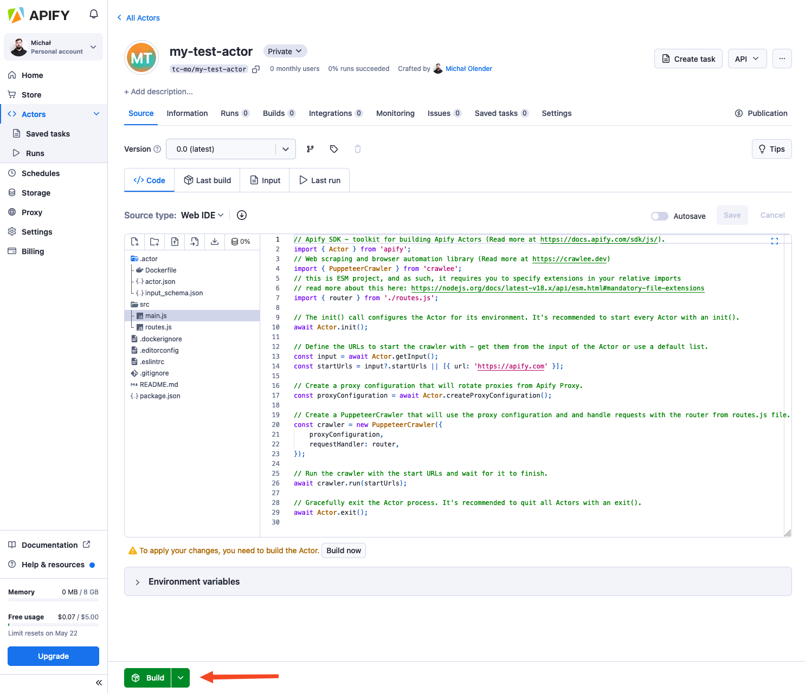
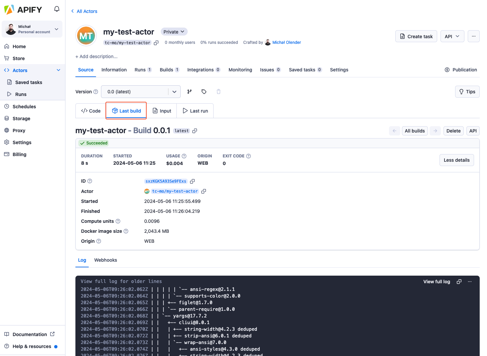
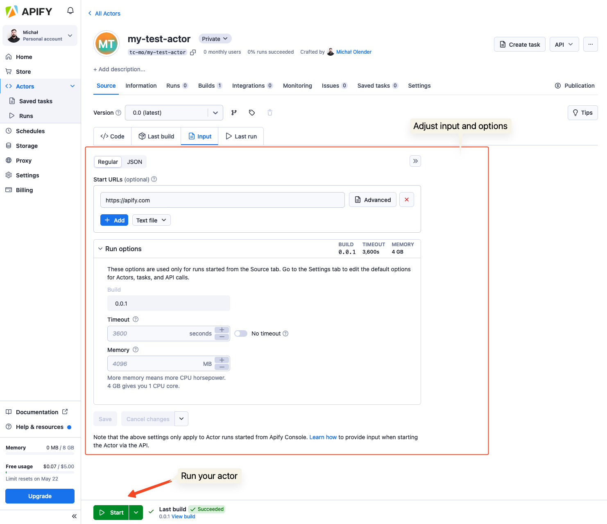
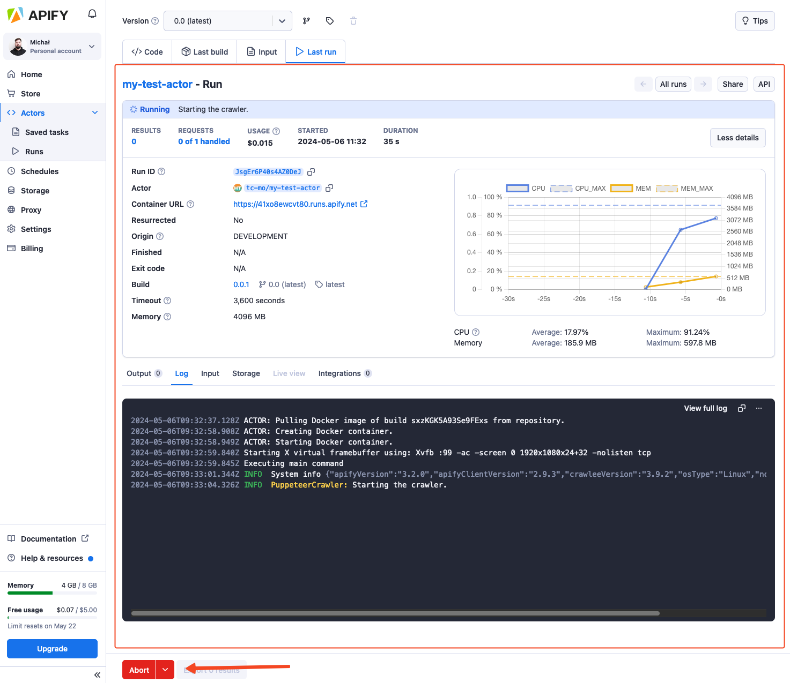

# Development in web IDE

**Create you first Actor using the web IDE in Apify Console.**

---

## 1. Create the Actor

> You will need an Apify account to complete this tutorial. If you don't have one, you can [sign-up for a free account](https://console.apify.com/sign-up) on the Apify website.

After you sign in to [Apify Console](https://console.apify.com), navigate to the [Actors](https://console.apify.com/actors) section on your left panel. Then, click the **Create new** button at the top right corner of the page.

You will be redirected to a page containing various Actor development templates for popular languages such as JavaScript, TypeScript, and Python. You can choose the template that best suits your technology stack. For demonstration purposes, let's choose "PuppeteerCrawler in Javascript".

You will be prompted to give your Actor a name and then redirected to your Actor configuration page.

## 2. Explore the source code

Now it's time to take a peek at the source code. You can see the boilerplate code that uses the [Apify SDK](https://docs.apify.com/sdk/js/) combined with [Crawlee](https://crawlee.dev/), Apify's popular open-source Node.js web scraping library. The code does a recursive crawl of the whole [apify.com](https://apify.com) website.

> [Crawlee](https://crawlee.dev/) is an open-source Node.js web scraping and browser automation library.  
> It helps you build reliable crawlers. Fast.

Let's run it! To run your Actor, you need to build it first, so let's press the "Build" button below the source code.

## 3. Build it

After you press the "Build" button, the UI transitions to the "Build" tab, and you can see the progress of the build, including the Docker build log.

Notice that the UI includes four tabs - (1) Code, (2) Build, (3) Input, and (4) Run. This represents the Actor creation flow where you need first to take the source code and build it. Once you have a build, you give it input which results in an Actor run.

## 4. Run it

Once the Actor is built, you can look at its input, which consists of one field - Start URL, the URL where the crawling starts. Below the input, you can adjust the run options consisting of build, timeout, and memory limit.

You can start an Actor run by pressing the **Start** button at the bottom of the page. Once the run is created, you can view its log and other details, including the **Results** which will shortly start popping up in the output tab. You can always stop the run using the **Abort** button.

## 5. Iterate

Now you can get back to the source code and modify the Actor to match your needs. To learn about all the Apify platform features and best practices, continue to the following chapter of this section or visit the [Apify Academy](/academy).
