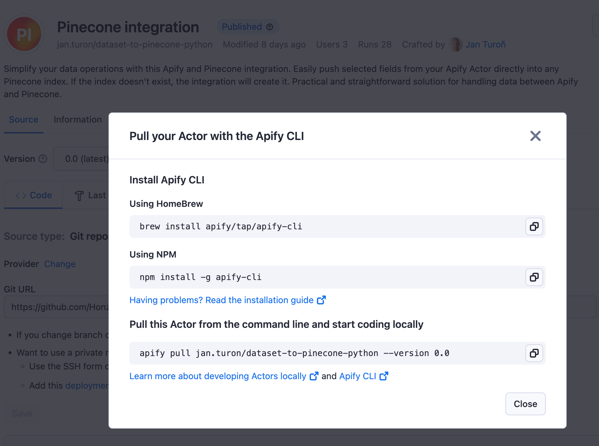

import Tabs from '@theme/Tabs';
import TabItem from '@theme/TabItem';

# Development in web IDE

**Create your first Actor using the web IDE in Apify Console.**

---

## Create the Actor

:::note Prerequisites

To use Web IDE, you will need an Apify account. You can [sign-up for a free account](https://console.apify.com/sign-up) on the Apify website.

:::

After you sign in to [Apify Console](https://console.apify.com), navigate to the [**Actors**](https://console.apify.com/actors) section. Then, click the **Develop new** button at the top right corner of the page.


You will be redirected to a page containing various Actor development templates for popular languages such as `JavaScript`, `TypeScript`, and `Python`. These templates provide boilerplate code and a preconfigured environment tailored to specific use cases. You can choose the template that best suits your technology stack. For demonstration purposes, let's choose **Crawlee + Puppeteer + Chrome**.


You will be prompted to give your Actor a name and then redirected to your Actor configuration page.

### Explore the source code

The provided boilerplate code utilizes the [Apify SDK](https://docs.apify.com/sdk/js/) combined with [Crawlee](https://crawlee.dev/), Apify's popular open-source Node.js web scraping library. The code performs a recursive crawl of the [apify.com](https://apify.com) website.

:::info Crawlee

[Crawlee](https://crawlee.dev/) is an open-source Node.js library designed for web scraping and browser automation. It helps you build reliable crawlers quickly and efficiently.

:::

To run you Actor, you need to build it first. Click the **Build** button below the source code to initiate the build process.


### Build the Actor

Once the build has been initiated, the UI will transition to the **Last build** tab, displaying the progress of the build and the Docker build log.


:::note Actor creation flow

The UI includes four tabs:

- **Code**
- **Last build**
- **Input**
- **Last Run**

This represents the Actor creation flow, where you first build the Actor from the source code. Once the build is successful, you can provide input parameters and initiate an Actor run.

:::

### Run the Actor

Once the Actor is built, you can look at its input, which consists of one field - **Start URL**, the URL where the crawling starts. Below the input, you can adjust the **Run options**:

- **Build**
- **Timeout**
- **Memory limit**


To initiate an Actor run, click the **Start** button at the bottom of the page. Once the run is created, you can monitor its progress and view the log in real-time. The **Output** tab will display the results of the Actor's execution, which will be populated as the run progresses. You can abort the run at any time using the **Abort** button.


### Pull the Actor

To continue development locally, you can pull the Actor's source code to your local machine. Instructions for pulling your Actor are available on the Actor detail page.



:::note Prerequisites

Install `apify-cli`:

<Tabs>
  <TabItem value="macOS/Linux" label="macOS/Linux">

  ```bash
  brew install apify-cli
  ```

  </TabItem>
  <TabItem value="other platforms" label="Other platforms">

  ```bash
  npm -g install apify-cli
  ```

  </TabItem>
</Tabs>

:::

To pull your Actor, you need to:

1. Log in to the Apify platform

    ```bash
    apify login
    ```

2. Pull your Actor using the following command:

    ```bash
    apify pull [actor_name]
    ```

    Or with a specific version:

    ```bash
    apify pull [actor_name] --version [version_number]
    ```

## Iterate & customize

After pulling the Actor's source code to your local machine, you can modify and customize it to match your specific requirements.
Leverage your preferred code editor or development environment to make the necessary changes and enhancements.

Once you've made the desired changes, you can push the updated code back to the Apify platform for deployment & execution, leveraging the platform's scalability and reliability.

To learn more about the Apify platform's features and best practices for Actor development:

- Continue to the next chapter of this section for in-depth guidance and examples
- Visit the [Apify Academy](/academy) to access a comprehensive collection of tutorials, documentation, and learning resources.
