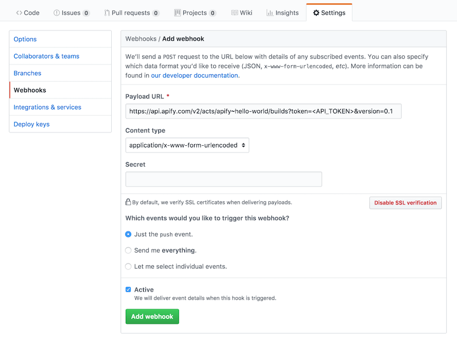
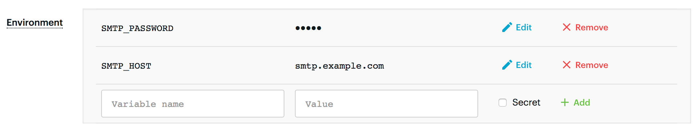

# [](#source-code)Source code

**Learn all about an Apify actor's code. Compare deployment options, create a custom Dockerfile, set environment variables and metamorph your actor.**

---

The **Source type** setting determines the location of the source code for the actor. It can have one of the following values: [WEb IDE](#web-ide), [Git repository](#git-repository), [Zip file](#zip-file) or [GitHub Gist](#github-gist).

## Web IDE {#web-ide}

This option is used by default when your actor's source code is hosted on Apify platform. You can use our Web IDE to preview and update your actor's source code and browse its files and directories. This is especially helpful when you need to make fast updates to your source code or README, or when you want to directly test [**INPUT_SCHEMA.json**](./source_code.md) on the Apify platform.

The only required file is **Dockerfile**, and all other files depend on your Dockerfile settings. By default, Apify's custom NodeJS Dockerfile is used, which requires a **main.js** file containing your source code and a **package.json** file containing package configurations for [NPM](https://www.npmjs.com/).

See [Custom Dockerfile](./source_code.md) and [base Docker images](./base_docker_images.md) for more information about creating your own Dockerfile and using Apify's prepared base images.

## [](#git-repository)Git repository

<iframe width="560" height="315" src="https://www.youtube-nocookie.com/embed/NEzT_p_RE1Q" title="YouTube video player" frameborder="0" allow="accelerometer; autoplay; clipboard-write; encrypted-media; gyroscope; picture-in-picture; web-share" allowfullscreen></iframe>

If the actor's source code is hosted externally in a Git repository, it can consist of multiple files and directories, use its own **Dockerfile** to control the build process (see [Custom Dockerfile](./source_code.md) for details) and have a user description in store fetched from the **README.md** file. The location of the repository is specified by the **Git URL** setting, which can be an **https**, **git** or **ssh** URL.

[//]: # (TODO: It's pretty outdated, we should probably update the actor too)
To help you get started quickly, you can use the [apify/quick-start](https://apify.com/apify/quick-start) actor which contains all the boilerplate necessary when creating a new actor hosted on Git. The source code is available on [GitHub](https://github.com/apify/actor-quick-start).

To specify a Git branch or tag to check out, add a URL fragment to the URL. For example, to check out the **develop** branch, specify a URL such as `https://github.com/jancurn/some-actor.git#develop`.

Optionally, the second part of the fragment in the Git URL (separated by a colon) specifies the context directory for the Docker build. For example, `https://github.com/jancurn/some-actor.git#develop:some/dir` will check out the **develop** branch and set **some/dir** as a context directory for the Docker build.

Note that you can easily set up an integration where the actor is automatically rebuilt on every commit to the Git repository. For more details, see [GitHub integration](./source_code.md).

### [](#private-repositories)Private repositories

If your source code is hosted in a private Git repository then you need to configure deployment key. Deployment key is different for each actor and might be used only once at Git hosting of your choice (GitHub, Bitbucket, GitLab, etc.).

To obtain the key click at the **deployment key** link under the **Git URL** text input and follow the instructions there.

## [](#zip-file)Zip file

The source code for the actor can also be located in a Zip archive hosted on an external URL. This option enables integration with arbitrary source code or continuous integration systems. Similarly, as with the [Git repository](#git-repository), the source code can consist of multiple files and directories, can contain a custom **Dockerfile** and the actor description is taken from **README.md**. If you don't use a [custom Dockerfile](#custom-dockerfile), the root file of your application must be named `main.js`.

## [](#github-gist)GitHub Gist

Sometimes having a full Git repository or a hosted Zip file might be overly complicated for your small project, but you still want to have the source code in multiple files. In this case, you can simply put your source code into a [GitHub Gist](https://gist.github.com/). For example:

[//]: # (TODO: It's pretty outdated, we should probably update the actor too)
[https://gist.github.com/jancurn/2dbe83fea77c439b1119fb3f118513e7](https://gist.github.com/jancurn/2dbe83fea77c439b1119fb3f118513e7)

Then set the **Source Type** to **GitHub Gist** and paste the Gist URL as follows:


Note that the example actor is available in the Apify Store as [apify/example-github-gist](https://apify.com/apify/example-github-gist).

Similarly, as with the [Git repository](./source_code.md), the source code can consist of multiple files and directories, it can contain a custom **Dockerfile** and the actor description is taken from **README.md**. If you don't use a [custom Dockerfile](#custom-dockerfile), the root file of your application must be named `main.js`.

## [](#custom-dockerfile)Custom Dockerfile

Internally, Apify uses Docker to build and run actors. To control the build of the actor, you can create a custom **Dockerfile** and either reference from the `dockerfile` field in the actor's config in **.actor/actor.json**, or store it in **.actor/Dockerfile** or **Dockerfile** in the actor's root directory. These three sites are searched for in this order of preference. If the **Dockerfile** is missing, the system uses the following default:

```dockerfile
FROM apify/actor-node:16

COPY package*.json ./

RUN npm --quiet set progress=false \
 && npm install --only=prod --no-optional \
 && echo "Installed NPM packages:" \
 && (npm list --only=prod --no-optional --all || true) \
 && echo "Node.js version:" \
 && node --version \
 && echo "NPM version:" \
 && npm --version

COPY . ./
```

For more information about Dockerfile syntax and commands, see the [Dockerfile reference](https://docs.docker.com/engine/reference/builder/).

Note that `apify/actor-node` is a base Docker image provided by Apify. There are other base images with other features available. However, you can use arbitrary Docker images as the base for your actors, although using the Apify images has some performance advantages. See [base Docker images](./base_docker_images.md) for details.

By default, all Apify base Docker images with the Apify SDK and Crawlee start your Node.js application the same way as **npm start** does, i.e. by running the command specified in the **package.json** file under the **scripts** - **start** key. The default **package.json** file is similar to the following.

```json
{
    "description": "Anonymous actor on the Apify platform",
    "version": "0.0.1",
    "license": "UNLICENSED",
    "main": "main.js",
    "scripts": {
        "start": "node main.js"
    },
    "dependencies": {
        "apify": "^3.0.0",
        "crawlee": "^3.0.0"
    },
    "repository": {}
}
```

*This means that by default the system expects the source code to be in the **main.js** file.* If you want to override this behavior, use a custom **package.json** and/or **Dockerfile**.


## [](#github-integration) Automatic builds from GitHub

<iframe width="560" height="315" src="https://www.youtube-nocookie.com/embed/2I3DM8Nvu1M" title="YouTube video player" frameborder="0" allow="accelerometer; autoplay; clipboard-write; encrypted-media; gyroscope; picture-in-picture; web-share" allowfullscreen></iframe>

If the source code of an actor is hosted in a [Git repository](#git-repository), it is possible to set up integration so that on every push to the Git repository the actor is automatically rebuilt. For that, you only need to set up a webhook in your Git source control system that will invoke the [Build actor](/api/v2/#/reference/actors/build-collection/build-actor) API endpoint on every push to Git repository.

For example, for repositories on GitHub it can be done using the following steps. First, go to the actor detail page, open the **API** tab and copy the **Build actor** API endpoint URL. It should look something like this:

```text
https://api.apify.com/v2/acts/apify~hello-world/builds?token=<API_TOKEN>&version=0.1
```

Then go to your GitHub repository, click **Settings**, select **Webhooks** tab and click **Add webhook**. Paste the API URL to the **Payload URL** as follows:



And that's it! Now your actor should automatically rebuild on every push to the GitHub repository.

## [](#custom-environment-variables)Custom environment variables

The actor owner can specify custom environment variables that are set to the actor's process during the run. Sensitive environment variables such as passwords or API tokens can be protected by setting the **Secret** option. With this option enabled, the value of the environment variable is encrypted and it will not be visible in the app or APIs. In addition, the value is redacted from actor logs to avoid the accidental leakage of sensitive data.



Note that the custom environment variables are fixed during the build of the actor and cannot be changed later. See the [Builds](./builds.md) section for details.

To access environment variables in Node.js, use the `process.env` object, for example:

```js
console.log(process.env.SMTP_HOST);
```

The actor runtime sets additional environment variables for the actor process during the run. See [Environment variables](./environment_variables.md) for details.

The environment variables can also be used for the build process. In this case, the variables are treated as [Docker build arguments](https://docs.docker.com/engine/reference/builder/#arg). This means that they should not be used for secrets and, in order to access them in Dockerfile, you have to use the `ARG variable_name` instruction.

## [](#versioning)Versioning

In order to enable active development, the actor can have multiple versions of the source code and associated settings, such as the **Base image** and **Environment**. Each version is denoted by a version number of the form `MAJOR.MINOR`; the version numbers should adhere to the [Semantic Versioning](http://semver.org/) logic.

For example, the actor can have a production version **1.1**, a beta version **1.2** that contains new features but is still backwards compatible, and a development version **2.0** that contains breaking changes.

The versions of the actors are built and run separately. For details, see [Build](./builds.md) and [Running](../running/index.md).

## [](#local-development)Local development

[//]: # (TODO: It's pretty outdated, we should probably update the actor too)
It is possible to develop actors locally on your computer and then only deploy them to the Apify cloud when they are ready. This is especially useful if you're using Git integration. See [Git repository](#git-repository) for more details. The boilerplate for creating an actor in a Git repository is available on [GitHub](https://github.com/apify/actor-quick-start).

Unfortunately, not all features of the Apify platform can be emulated locally, therefore you might still need to let the [`apify`](/api/client/js) NPM package use your API token in order to interact with the Apify platform. The simplest way to achieve that is by setting the `APIFY_TOKEN` environment variable on your local development machine.

## [](#input-schema)Input schema

Actor source files may contain an input schema defining the input that actor accepts and the UI components used for input at Apify platform. Using input schema you can provide UI to actor users that is easy to use and also ensure that input of your actor is valid.

For more information on this topic see [input schema documentation](./input_schema.md) on a separate page.

## [](#metamorph)Metamorph

The metamorph operation transforms an actor run into a run of another actor with a new input. This feature is useful if you want to use another actor to finish the work of your current actor, instead of internally starting a new actor run and waiting for its finish. With metamorph, you can easily create new actors on top of existing ones, and give your users nicer input structure and user-interface for the final actor. For the users of your actors, the metamorph operation is completely transparent, they will just see your actor got the work done.

Internally, the system stops the Docker container corresponding to the actor run and starts a new container using a different Docker image. All the default storages are preserved and the new input is stored under the **INPUT-METAMORPH-1** key in the same default key-value store.

To make you actor compatible with metamorph operation use `Actor.getInput()` instead of `Actor.getValue('INPUT')`. This method will fetch the input using the right key **INPUT-METAMORPH-1** in a case of metamorphed run.

For example, imagine you have an actor that accepts a hotel URL on input and then internally uses the [apify/web-scraper](https://www.apify.com/apify/web-scraper) actor to scrape all the hotel reviews. The metamorphing code would look as follows:

```js
import { Actor } from 'apify';

await Actor.init();

// Get input of your actor.
const { hotelUrl } = await Actor.getInput();

// Create input for apify/web-scraper
const newInput = {
    startUrls: [{ url: hotelUrl }],
    pageFunction: () => {
        // Here you pass the page function that
        // scrapes all the reviews ...
    },
    // ... and here would be all the additional
    // input parameters.
};

// Transform the actor run to apify/web-scraper
// with the new input.
await Actor.metamorph('apify/web-scraper', newInput);

// The line here will never be reached, because the
// actor run will be interrupted.

await Actor.exit();
```
