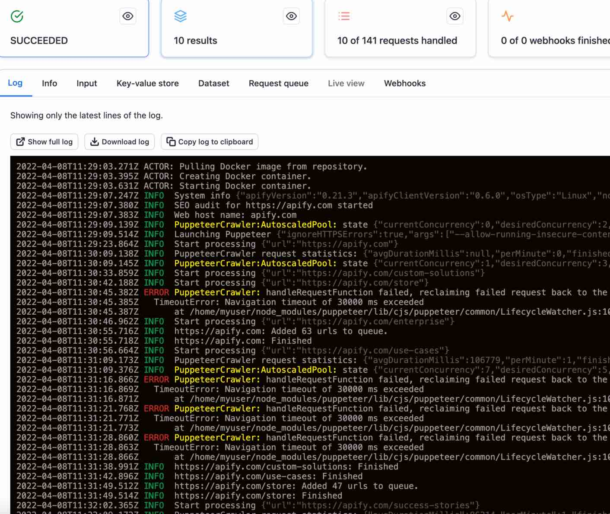
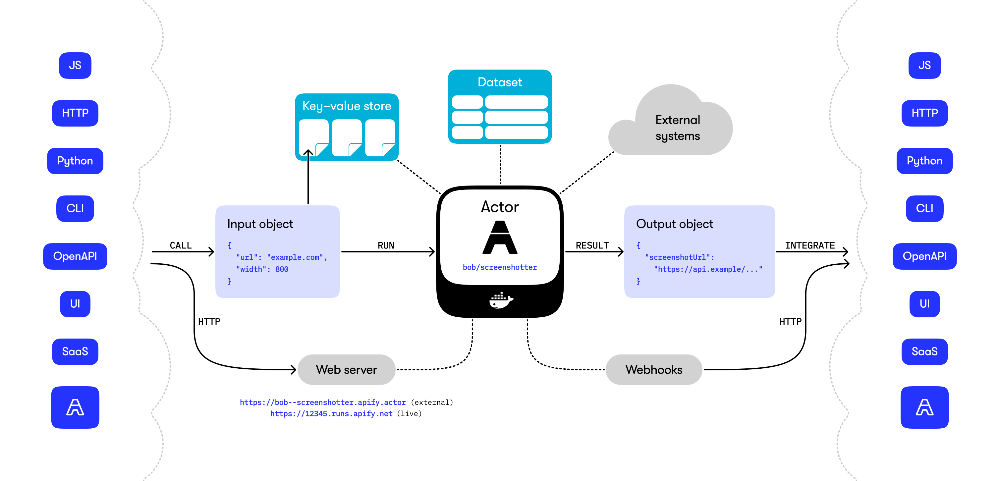

import Card from '@site/src/components/Card';
import CardGrid from '@site/src/components/CardGrid';

**Learn what Actors are and how to develop, run, and share these serverless cloud programs. Create your own web scraping and automation tools and publish them on the Apify platform.**

---

## What's an Actor

When you deploy your code to the Apify platform, it becomes an **Actor**. An Actor is a serverless cloud program that accepts an input and produces an output. They can run for a few seconds, hours, or even indefinitely.

Actors can perform anything from a basic action, such as filling out a web form or sending an email, to complex operations like crawling an entire website and removing duplicates from a large dataset. Though most Actors on the Apify platform are used for web scraping and automation, they are not limited to these tasks. An Actor can be any program running in a Docker container.

Once an Actor has been pushed to the Apify platform, it can be shared with the world through the [Apify Store](https://apify.com/store) and even monetized.

    
Try an Actor

To see what a published Actor looks like and how it works, let's run an SEO audit of **apify.com** using the [SEO Audit Actor](https://apify.com/misceres/seo-audit-tool).

1. On the Actor's page, click the **Try for free** button. If you're logged into your Apify account, you'll be taken to Apify Console.
1. You will be prompted to provide input to the Actor. The default settings are fine, so click the **Start** button to run it.
1. While the Actor is running, you'll see it log information about its progress.
1. Once the Actor has finished, you can view the results by clicking on the **Results** tab.

## Actor components

Actors consist of these elements:

- A _Dockerfile_ that specifies where the Actor's source code is, how to build it, and how to run it.
- I in the form of a README.md file.
- _Input and output schemas_ that describe the Actor's required input and the results it produces.
- Access to an out-of-the-box _storage system_ for Actor data, results, and files.
- _Metadata_ such as the Actor's name, description, author, and version.

The documentation and input/output schemas help people understand what the Actor does, provide the required inputs, and integrate its results into other workflows. Actors can also call and interact with each other to build more complex systems from simple ones.

:::info Additional context

For more context, read the [Actor whitepaper](https://whitepaper.actor/).

:::

## What can you do with Actors?

<CardGrid>
    <Card
        title="Running Actors"
        desc="Learn how to run Actors, configure their settings, manage versions, and understand their usage and pricing."
        to="/platform/actors/running"
    />
    <Card
        title="Actor development"
        desc="Dive into the technical side of building Actors. Learn to define inputs, build new versions, persist state, and choose base Docker images."
        to="/platform/actors/development"
    />
    <Card
        title="Publishing and monetization"
        desc="Find out how to publish your Actors on the Apify platform, share them with others, and even monetize your work."
        to="/platform/actors/publishing"
    />
</CardGrid>

## Public and private Actors

Actors can be public or private. Private Actors are only accessible to you and your team. Public Actors are available to everyone in the [Apify Store](https://apify.com/store). You can make them free to use, or you can [charge for them](https://blog.apify.com/make-regular-passive-income-developing-web-automation-actors-b0392278d085/).
