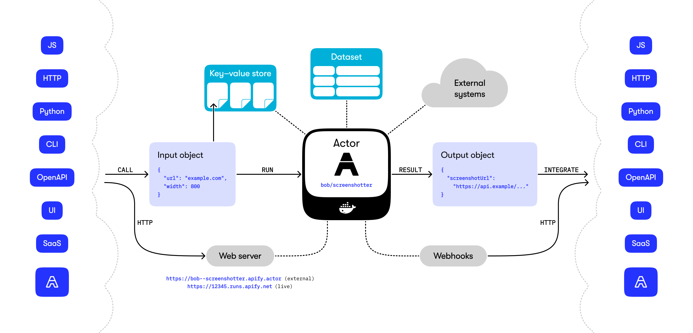

import Card from "@site/src/components/Card";
import CardGrid from "@site/src/components/CardGrid";

Actors are serverless cloud programs that take structured JSON input, perform a task (web scraping, browser automation, data processing), and produce output. Run them manually, via API, or on a schedule, and combine them into larger automations. For more information on Actors, read the [Actor whitepaper](https://whitepaper.actor/).

<CardGrid>
    <Card
        title="Run and manage"
        desc="Run Actors, configure tasks, set up schedules, and monitor execution."
        to="/platform/actors/running"
    />
    <Card
        title="Develop"
        desc="Build Actors: define inputs, write code, test, and deploy."
        to="/platform/actors/development"
    />
    <Card
        title="Publish and monetize"
        desc="Publish Actors to Apify Store and set up pricing."
        to="/platform/actors/publishing"
    />
</CardGrid>

## Actor components

Actors consist of these elements:

- _Dockerfile_ which specifies where the Actor's source code is, how to build it, and run it.
- _Documentation_ in a form of a README.md file.
- _Input and output schemas_ that describe what input the Actor requires, and what results it produces.
- Access to an out-of-the-box _storage system_ for Actor data, results, and files.
- _Metadata_ such as the Actor name, description, author, and version.

The documentation and input/output schemas help people understand what the Actor does, enter required inputs in the user interface or API, and integrate results into other workflows. Actors can call and interact with each other to build more complex systems from simple ones.

## Run Actors

Run Actors manually in [Apify Console](https://console.apify.com/actors), using the [API](/api/v2), [CLI](https://docs.apify.com/cli/docs), or [schedules](./running/schedules.md). [Integrate Actors](../integrations/index.mdx) with external apps, or [share](../account/collaboration/access_rights.md) them with other users in your organization.

Browse [Apify Store](https://apify.com/store) to find thousands of ready-made Actors for common use cases.

## Build Actors

Build custom Actors to automate tasks, scrape data, or process information. See the [development documentation](/platform/actors/development) for Actor definition, input/output schemas, deployment, and the programming interface.

## Public and private Actors

Actors can be public or private. Private Actors are only visible to you. Public Actors are available in [Apify Store](https://apify.com/store) for anyone to use. You can [publish](./publishing/index.mdx) your Actors and [set up pricing](./publishing/monetize/index.mdx) for them.
