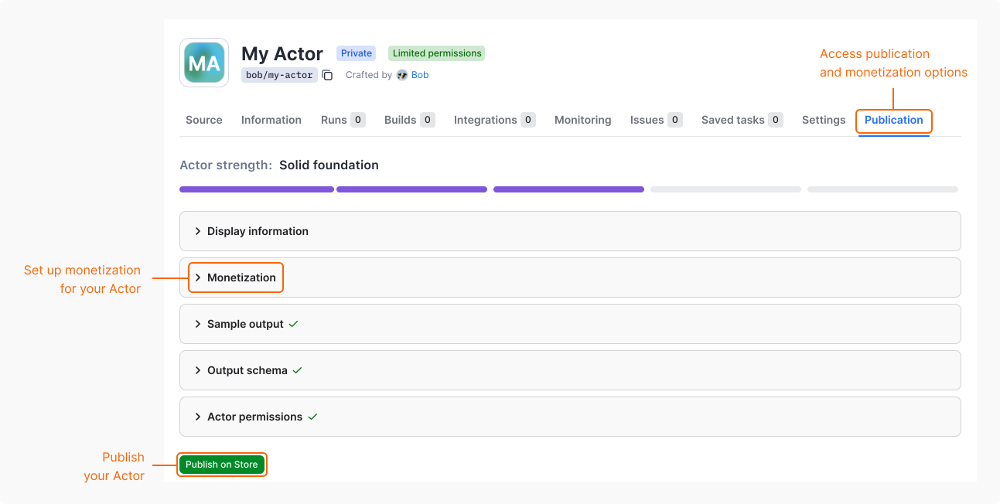

Set up monetization to earn revenue every time users run your Actors on the Apify platform.

## Monetize your Actor

To set up monetization for your Actor, first complete your billing and payment details. Then, you can define the pricing for your Actor:

1. Log in to [Apify Console](https://console.apify.com).
1. In the left-side panel, go to **Development** > **My Actors**.
1. From the table, select the Actor you want to monetize.
1. Go to the **Publishing** tab.
1. In **Monetization** section, select **Set up monetization**.

The monetization setup consists of three steps:

1. In the **Actor pricing** step, you can:
    - Modify or delete the [`apify-actor-start`](/actors/publishing/monetize/pay-per-event#synthetic-start-event) event.
    - Modify or delete the [`apify-default-dataset-item`](/actors/publishing/monetize/pay-per-event#synthetic-default-dataset-item-event) event.
    - Define [custom events](/actors/publishing/monetize/pay-per-event#actor-events) and their prices.
    - [Transfer the platform usage costs on to users](/actors/publishing/monetize/pay-per-event#platform-usage-costs).
    - Set the minimal cost that users can choose as max cost per run.
1. In the **Primary event** step, select the event that best represents the main value of your Actor. By default, the dataset event or the only existing event is used.
1. In the **Review** step, verify the final pricing for your Actor before confirming.

## Change monetization

To update the monetization of your Actor, follow the same steps as in the [Monetize your Actor](#monetize-your-actor) section.

### Significant changes

The following changes are considered significant:

- Changing the pricing model. For example, from rental to pay per event.
- Increasing prices.
- Adding a new paid event.

When you submit a significant change, users of your Actor are notified and the change is scheduled to take effect after 14 days. During this notice period, the current pricing remains active.

:::caution You can't cancel a planned change

Once you submit a significant change, you can't cancel or modify it. To revert a planned change, [contact support](https://apify.com/contact).

:::

You can submit significant changes once per month per Actor, so plan your pricing strategy carefully. A pending change blocks submitting new ones. Wait for the significant change to take effect before submitting another one.

Note that if your Actor has no paying users, the waiting period doesn't apply and the change takes effect immediately.

For details, see [Apify Store publishing terms and conditions](/legal/store-publishing-terms-and-conditions).

### Non-significant changes

The following changes take effect immediately and don't have any restrictions:

- Decreasing prices.
- Removing events.
- Updating event descriptions.
- Adjusting settings that aren't related to pricing.
