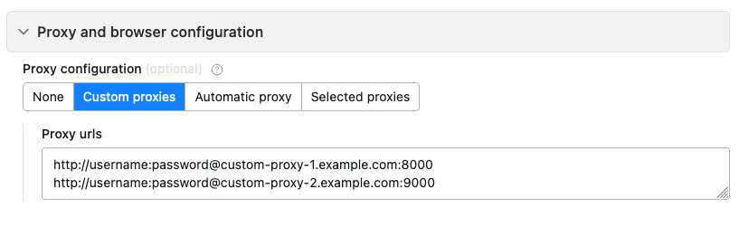

In addition to Apify Proxy, you can use your own proxies both in Apify Console and the SDK.

## Custom proxies in console

To use your own proxies with Apify Console, in your Actor's **Input and options** tab, scroll down and open the **Proxy and browser configuration** section. Enter your proxy URLs, and you're good to go.

## Custom proxies in SDK

In the Apify SDK, use the `proxyConfiguration.newUrl(sessionId)` (JavaScript) or `proxy_configuration.new_url(session_id)` (Python) command to add your custom proxy URLs to the proxy configuration. See the [JavaScript](/sdk/js/api/apify/class/ProxyConfiguration#newUrl) or [Python](/sdk/python/reference/class/ProxyConfiguration#new_url) SDK docs for more details.
