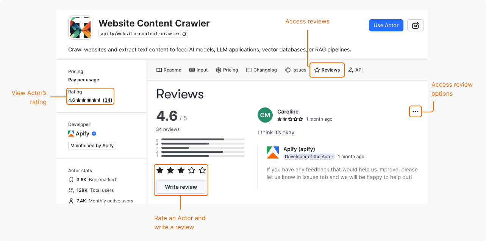

Users can review your Actor in Apify Store. Their ratings impact your Actor's [quality score](/platform/actors/publishing/quality-score) and help it rank higher in search results. User reviews are also a great source of feedback that you can use to improve your Actor.

## About the Actor rating

Your Actor's rating isn't a pure average of all reviews. Instead, it's a weighted average that includes the following factors:

- More recent reviews have a higher weight than the older ones.
- Reviews from trusted users have a higher weight.
- Reviews from users who often run your Actor have a higher weight.

## View your Actor's rating and reviews

To view your Actor's rating:

1. Navigate to your Actor's page in Apify Store.
1. Select the **Reviews** tab.

## Respond to a review

You can leave a public reply to a user's review on your Actor. Use this option to address the user's concerns, help them better understand the Actor, or provide additional information.

To respond, on a user's review, select **Options** > **Reply**.

### Edit your reply

To edit your response, on your reply, select **Options** > **Edit**.

## Report a review

If you believe that a review doesn't follow the community standards, you can report it. For details, see [Report a review](/platform/actors/running/reviews#report-a-review).

Note that the support team verifies all reports and only deletes the reviews that violate Apify policies. Users can share their experience even if it's negative. Here are some invalid reasons for reporting a review:

- The review isn't a favorable opinion of the Actor.
- The problems indicated in the review could be resolved by opening an issue.
- The review describes an edge case or an issue that has since been resolved.
